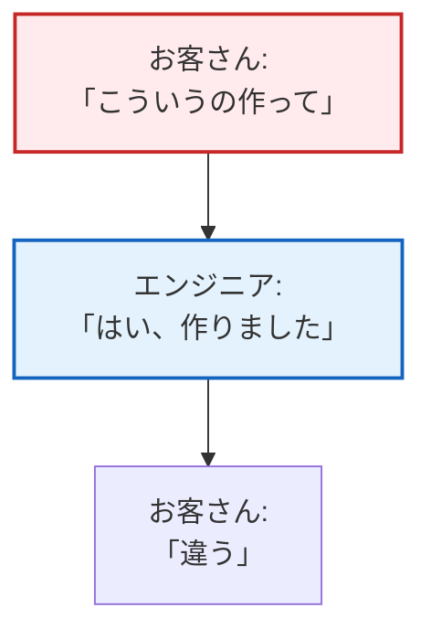
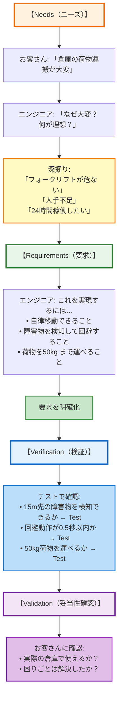

# 第1回: なぜ要求分析は面倒なのか - エンジニアが直面する5つの壁

## この記事を読んでほしい人

- 「また仕様変更か…」とため息をついたことがある開発者
- お客さんの「使いやすくして」に困惑したことがあるエンジニア
- 「テストは通ったのに、お客さんがOKしてくれない」を経験した人

## はじめに: 「要求分析は面倒」の正体

プロジェクトキックオフの日。お客さんからの一言。

「使いやすいシステムにしてください。あと、速くて、安くて、早くできるやつで」

その場では「承知しました！」と答えたものの、会議室を出た瞬間、あなたの頭には疑問が渦巻きます。

- 「使いやすい」って、具体的に何？
- 「速い」って、何秒以内？
- そもそも、このシステムで何がしたいの？

でも、お客さんに聞き返すのも気が引けるし、とりあえず開発を始めてしまう。

そして3ヶ月後。

「いや、こういうのじゃないんだよね…」

**これが、要求分析をサボったときの典型的な結末です。**

この記事では、なぜ要求分析が面倒に感じるのか、そしてその「面倒」を避けるために何が必要なのかを、エンジニア目線で解説します。

---

## 1. 要求分析が面倒な5つの理由

### 理由1: 「お客さん自身も、何が欲しいか分かっていない」

**よくある会話**:

```
エンジニア: 「どんな機能が必要ですか？」
お客さん: 「うーん、とりあえず今のシステムと同じで…でももっと便利にして」
エンジニア: 「…（具体的に何も決まってない）」
```

お客さんは「困っていること」は分かっているけれど、「どう解決したいか」は明確になっていません。

**なぜ起きるか**:
- お客さんは技術的な制約を知らない
- 頭の中にあるイメージを言語化できない
- 部署ごとに「欲しいもの」が違う

**エンジニアが感じること**:
「結局、俺たちがエスパーになるしかないのか…」

### 理由2: 「仕様書に書いてあることが曖昧すぎる」

**ダメな要求の例**:

| 要求ID | 要求内容 | 問題点 |
|--------|---------|--------|
| REQ-001 | システムは使いやすいこと | 「使いやすい」の基準が不明 |
| REQ-002 | 応答速度は速いこと | 「速い」が何秒か不明 |
| REQ-003 | データは安全に保存すること | 「安全」の定義が不明 |

これでは、開発者は実装できません。テストもできません。

**なぜ起きるか**:
- 「とりあえず書いた」要求が承認される
- レビューで誰も「これ、曖昧じゃない？」と指摘しない
- 「後で詳細を決めよう」が放置される

**エンジニアが感じること**:
「これ、実装する前にもう一度聞かないとダメだな…でも面倒だし、とりあえず適当に作るか」

### 理由3: 「途中で仕様が変わる」

**典型的な流れ**:

```
1週目: 「ユーザー登録機能を作ってください」
  → 実装開始

4週目: 「やっぱりSNS連携も追加で」
  → 設計変更

8週目: 「最初の要件、やっぱり不要でした」
  → （白目）
```

**なぜ起きるか**:
- 最初に要求を固めていない
- お客さんが「作りながら考える」スタイル
- 競合他社が新機能を出して、急遽追従

**エンジニアが感じること**:
「最初にちゃんと決めてくれよ…」

でも、実は**最初に100%完璧な要求を固めるのは不可能**です。これについては後で説明します。

### 理由4: 「お客さんと開発チームで言葉の定義が違う」

**例: 「リアルタイム」の解釈**

| 人 | 「リアルタイム」の意味 |
|----|---------------------|
| お客さん | 「1秒以内に画面が更新される」 |
| エンジニア | 「100ミリ秒以内に処理が完了する」 |
| PM | 「遅延が目立たない程度」 |

全員が違うことを想像しています。

**他の例**:
- 「安全」= セキュリティ？ 冗長化？ バックアップ？
- 「簡単」= 操作ステップが少ない？ マニュアル不要？
- 「大量」= 100件？ 10万件？ 1億件？

**エンジニアが感じること**:
「後から『そういう意味じゃない』って言われるのが怖い」

### 理由5: 「結局、手戻りが発生してコスト爆増」

**NASA の研究結果**:

> 設計段階での決定は、プロジェクト全体のコストの75%を決める。
> しかし、実際に使われる予算は設計段階ではわずか15%である。

つまり、**最初の要求定義をミスると、後で取り返しがつかない**ということです。

**コスト増加の実例**:

| フェーズ | バグ修正コスト（相対値） |
|---------|---------------------|
| 要求定義段階 | **1倍** |
| 設計段階 | 3-6倍 |
| 実装段階 | 10倍 |
| テスト段階 | 20-100倍 |
| 運用開始後 | **500-1000倍** |

**エンジニアが感じること**:
「最初にちゃんとやっておけば良かった…」（手遅れ）

---

## 2. 「要求分析をサボる」と何が起きるか

### ケーススタディ: 倉庫用AGV（自動搬送ロボット）の失敗例

**お客さんの最初の依頼**:
「倉庫で荷物を自動で運ぶロボットを作ってほしい」

**エンジニアチームの対応**:
「了解です！ 移動ロボット作ります！」

**3ヶ月後、納品時**:

```
お客さん: 「あれ、このロボット、障害物があると止まっちゃうね」
エンジニア: 「はい、安全のため停止する仕様です」
お客さん: 「いや、倉庫には常にフォークリフトが動いてるから、止まってたら仕事にならないよ」
エンジニア: 「…（そんなこと聞いてない）」
```

**何が問題だったか**:
- **運用環境を確認していなかった** → 倉庫の状況を知らなかった
- **「自動で運ぶ」の定義が曖昧** → 障害物回避が必要とは思わなかった
- **お客さんの期待値を確認していなかった** → 「止まらないこと」が重要だった

**結果**:
- 追加開発で2ヶ月遅延
- 予算オーバー
- お客さんの信頼低下

**もし要求分析をしていたら**:

```
【ニーズ分析の段階で確認すべきだったこと】
1. 倉庫の運用状況は？
   → フォークリフトが常時走行、人も歩いている
   → 障害物回避機能が必須

2. 「自動で運ぶ」の定義は？
   → 荷物を指定場所に運ぶ（正常時）
   → 障害物があっても回避して運ぶ（異常時）

3. 許容できる遅延は？
   → 回避動作で30秒遅れてもOK
   → ただし完全停止はNG
```

これを最初に確認していれば、設計段階で障害物回避機能を組み込めました。

---

## 3. 「じゃあ、どうすればいいの？」- INCOSE NRVVフレームワーク

ここで登場するのが、**INCOSE NRVV**という考え方です。

**NRVVとは**:
- **N**eeds（ニーズ）: お客さんが困っていること
- **R**equirements（要求）: システムが満たすべき条件
- **V**erification（検証）: 作ったものが要求を満たすか確認
- **V**alidation（妥当性確認）: お客さんの困りごとが解決したか確認

### NRVVを使うと何が変わるか

**従来のやり方**:




```
【Validation（妥当性確認）】
お客さんに確認:
- 実際の倉庫で使えるか？
- 困りごとは解決したか？
```

**ポイント**:
最初に「困りごと（Needs）」をしっかり聞くことで、後の手戻りを防ぐ

---

## 4. 「でも現実的には時間がない」への回答

**よくある反論**:

> 「理想は分かるけど、ウチは納期がタイトで、要求分析に時間かけられないんだよね」

**答え**:
要求分析を**サボる時間**はないが、**最小限やる時間**は作れる。

### 最小限の要求分析: 3つのステップ（1日版）

#### ステップ1: お客さんに30分インタビュー（午前）

**質問リスト（7つだけ）**:

1. 今、何に困っていますか？
2. それはなぜ困るのですか？（影響は？）
3. 理想は、どうなっていることですか？
4. 誰が使いますか？（1日何回？）
5. どんな環境で使いますか？（場所、時間帯）
6. 絶対に必要な機能は何ですか？（3つまで）
7. 逆に、なくてもいい機能は？

#### ステップ2: 要求リストを作成（午後1時間）

**Excelテンプレート（最小版）**:

| 要求ID | 要求内容 | 理由 | 検証方法 | 優先度 |
|--------|---------|------|---------|--------|
| REQ-001 | AGVは前方15m以内の障害物を検知すること | フォークリフトとの衝突回避 | センサーテスト | 必須 |
| REQ-002 | AGVは50kgまでの荷物を運搬できること | 倉庫の荷物の平均重量 | 重量テスト | 必須 |
| REQ-003 | AGVは8時間連続稼働できること | 作業シフトが8時間 | 連続稼働テスト | 必須 |

#### ステップ3: お客さんに確認（30分）

「この要求リストで合ってますか？」

**ここで確認すべきこと**:
- 優先度は正しいか
- 抜けている要求はないか
- 誤解している要求はないか

**所要時間**: 合計2時間

**効果**:
- 手戻りの70%を防げる（NASA調査）
- お客さんとの認識齐を早期に発見
- チーム内で「何を作るか」の共通理解

---

## 5. 実践ポイント: 明日から使える「最小限チェックリスト」

### プロジェクト開始時にこれだけは確認する（10項目）

```
□ 1. お客さんの「困りごと」を3つ挙げられるか？
□ 2. その困りごとの「優先順位」を確認したか？
□ 3. 誰が使うか明確か？（ユーザー像が具体的か）
□ 4. どこで使うか明確か？（環境・場所）
□ 5. 「絶対に必要な機能」を3つに絞れたか？
□ 6. 各要求に「なぜ必要か」の理由を書けるか？
□ 7. 「使いやすい」「速い」などの曖昧な言葉を数値化したか？
□ 8. 「これがあればOK」の合格基準を確認したか？
□ 9. 要求リストをお客さんに見せて確認したか？
□ 10. 「これ以外は後回し」という合意を取れたか？
```

**使い方**:
キックオフ後1週間以内に、このチェックリストを埋める。
埋められない項目があったら、お客さんに確認する。

---

## 6. まとめ: 「面倒」を避けるために、最小限の「手間」をかける

要求分析が面倒なのは事実です。でも、**サボると後でもっと面倒**になります。

**この記事のポイント**:

1. **お客さん自身も、欲しいものが分かっていない**
   → だから、エンジニアが質問して引き出す必要がある

2. **曖昧な要求は、後で必ず問題になる**
   → 最初に数値化・具体化する

3. **要求定義のミスは、後で500倍のコストになる**
   → 最初の1日を惜しまない

4. **完璧は目指さない。最小限でいい**
   → 7つの質問 + Excel 1枚 + 2時間の確認

**次回予告**:

第2回では、「お客さんの本音を引き出すニーズ分析」の具体的なテクニックを解説します。

- 効果的なインタビューの質問パターン
- ユースケースの作り方（最小限版）
- 1日で終わらせるニーズ抽出ワークショップ

「お客さんが何を望んでいるか分からない」を解決します。

---

## 参考資料

- INCOSE Needs and Requirements Manual (NRM)
- NASA Systems Engineering Handbook Rev 2 (Figure 2.5-1: Cost to Change)
- Guide to Writing Requirements (INCOSE GtWR)

---

**執筆者より**:

この記事は、INCOSE（国際システムズエンジニアリング協議会）のNRVVフレームワークを基に、現場のエンジニアが実践できるレベルに落とし込んだものです。理論の詳細よりも、「明日から使える」ことを重視しています。

ご意見・ご質問は、コメント欄またはTwitter（@your_account）までお寄せください。
