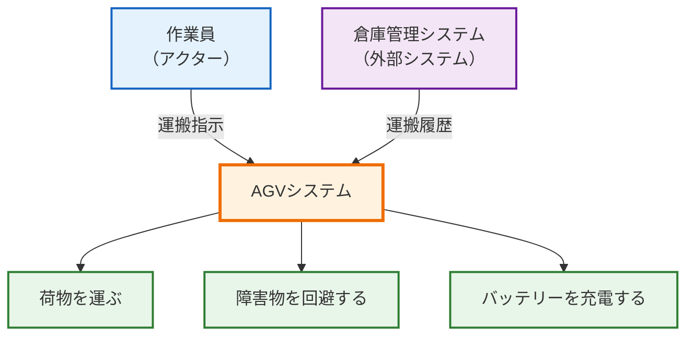

# 第2回: ステークホルダーの本音を引き出す - ニーズ分析の実践テクニック

## この記事を読んでほしい人

- 「お客さんが何を望んでいるか分からない」と困っている人
- インタビューしても「とりあえず今のシステムと同じで」としか言われない人
- ユースケース図を書けと言われて困っている人

## はじめに: 「何が欲しいですか？」は悪い質問

前回、要求分析の重要性を説明しました。でも、実際に始めようとすると、こんな壁にぶつかります。

**よくある失敗会話**:

```
エンジニア: 「どんなシステムが欲しいですか？」
お客さん: 「うーん…今のシステムと同じような感じで…」
エンジニア: 「具体的には？」
お客さん: 「いや、だから…普通の感じ？」
エンジニア: 「…（何も分からなかった）」
```

なぜこうなるのか？

答えは簡単です。**お客さんは「システム」について語れない**からです。

お客さんが語れるのは:
- ✅ 今、困っていること
- ✅ 理想の業務フロー
- ✅ 実際に使う場面

つまり、**「何が欲しいか」ではなく「何に困っているか」を聞く**のが正解です。

---

## 1. ニーズとは何か - 「欲しいもの」と「困りごと」の違い

### ニーズ vs 要求 vs 仕様

まず、言葉を整理します。

| 言葉 | 意味 | 誰が語る | 例 |
|------|------|---------|---|
| **ニーズ** | 困っていること、理想の状態 | お客さん | 「倉庫の荷物運搬が重労働で困っている」 |
| **要求** | システムが満たすべき条件 | エンジニア | 「AGVは50kgまでの荷物を運べること」 |
| **仕様** | 具体的な実装方法 | 開発者 | 「モーターは200W、4輪駆動、リチウム電池」 |

**ニーズ分析のゴール**:
お客さんの「困りごと」を引き出し、それを解決するための「要求」に変換する準備をする。

### なぜニーズから始めるのか

**失敗例: いきなり要求から始める**

```
お客さん: 「搬送ロボットが欲しい」
エンジニア: 「了解、作ります」
  ↓ 3ヶ月後
お客さん: 「荷物を持ち上げる機能がないと使えないんだけど」
エンジニア: 「…聞いてない」
```

**成功例: ニーズから始める**

```
エンジニア: 「なぜ搬送ロボットが欲しいんですか？」
お客さん: 「倉庫の荷物を棚から取って、出荷場所まで運ぶのが大変で」
エンジニア: 「棚から取る、ということは持ち上げる機能も必要ですね」
お客さん: 「そうそう！ それができないと意味がない」
```

**ポイント**:
「なぜ欲しいか」を聞くことで、**本当に必要な機能**が見えてくる。

---

## 2. 効果的なインタビューの7つの質問パターン

ニーズ分析の中心は、**お客さんへのインタビュー**です。

でも、「何でも聞いてください」と言われても困りますよね。

ここでは、実際に使える**7つの質問パターン**を紹介します。

### 質問1: 「今、何に困っていますか？」（現状の課題）

**目的**: 問題の本質を掴む

**深掘りの質問**:
- それはなぜ困るのですか？
- どれくらいの頻度で発生しますか？
- それが解決しないと、どんな影響がありますか？

**AGVの例**:

```
エンジニア: 「今、何に困っていますか？」
お客さん: 「倉庫の荷物運搬が大変です」

エンジニア: 「なぜ大変なんですか？」
お客さん: 「重い荷物を1日50回も運ぶので、腰を痛める人が多くて」

エンジニア: 「どれくらいの重さですか？」
お客さん: 「平均で30kgくらい。重いと50kgを超えます」
```

**引き出せたニーズ**:
- 重労働の軽減（30-50kg）
- 安全性の向上（腰痛防止）
- 高頻度の作業（1日50回）

### 質問2: 「理想は、どうなっていることですか？」（ゴール）

**目的**: 成功の定義を明確にする

**AGVの例**:

```
エンジニア: 「理想は、どうなっていますか？」
お客さん: 「作業員は軽い荷物だけ扱って、重いのはロボットに任せたい」

エンジニア: 「ロボットが全部やる、じゃなくて、分担するんですね」
お客さん: 「そう。完全自動化は無理だと思ってるので」
```

**ポイント**:
お客さんの「期待値」を確認する。100%自動化を期待しているのか、一部だけでいいのか。

### 質問3: 「誰が使いますか？」（ユーザー像）

**目的**: 実際の使い手を具体的にイメージする

**深掘りの質問**:
- その人は1日に何回使いますか？
- その人はシステムに詳しいですか？
- その人は他にどんな作業をしていますか？

**AGVの例**:

```
エンジニア: 「誰が使いますか？」
お客さん: 「倉庫の作業員です。20代〜50代の男性が中心」

エンジニア: 「その人たちは、ロボットの操作に慣れてますか？」
お客さん: 「いや、全然。スマホも苦手な人が多いです」

エンジニア: 「じゃあ、操作は簡単にしないとダメですね」
お客さん: 「そう、ボタン1個で動くくらいがいい」
```

**引き出せたニーズ**:
- 操作の簡便性（ボタン1個レベル）
- マニュアル不要
- ITリテラシーが低い人でも使える

### 質問4: 「どこで使いますか？」（環境）

**目的**: 運用環境の制約を把握する

**深掘りの質問**:
- 屋内ですか？ 屋外ですか？
- 温度・湿度はどれくらいですか？
- 他に動いているものはありますか？

**AGVの例**:

```
エンジニア: 「どこで使いますか？」
お客さん: 「倉庫の中です。屋内ですね」

エンジニア: 「倉庫には、他に動いているものはありますか？」
お客さん: 「フォークリフトが常に動いてます。あと、作業員も歩き回ってます」

エンジニア: 「じゃあ、障害物を避ける機能が必要ですね」
お客さん: 「そうですね。ぶつかったら大変だ」
```

**引き出せたニーズ**:
- 障害物検知・回避機能（必須）
- 人とフォークリフトの安全確保
- 屋内環境（防水不要）

### 質問5: 「いつ使いますか？」（タイミング・頻度）

**目的**: 使用パターンを理解する

**AGVの例**:

```
エンジニア: 「いつ使いますか？」
お客さん: 「平日の8時〜17時、倉庫が稼働してる時間です」

エンジニア: 「1日中ずっと動きっぱなしですか？」
お客さん: 「そうですね。荷物が来たらすぐ運ぶので、休む暇ないです」

エンジニア: 「じゃあ、8時間以上のバッテリーが必要ですね」
お客さん: 「あ、充電のことは考えてなかった。でも確かに必要だ」
```

**引き出せたニーズ**:
- 連続稼働時間（8時間以上）
- バッテリー管理
- 充電タイミングの考慮

### 質問6: 「絶対に必要な機能は何ですか？」（優先順位）

**目的**: 優先順位を明確にする

**質問のコツ**: 「3つまで」と制限する

**AGVの例**:

```
エンジニア: 「絶対に必要な機能を、3つまで挙げてください」
お客さん: 「えーと…
  1. 荷物を運ぶこと（当たり前だけど）
  2. ぶつからないこと（安全第一）
  3. 壊れないこと（修理で止まると困る）」

エンジニア: 「速度は？」
お客さん: 「速いに越したことはないけど、安全の方が大事」
```

**ポイント**:
「3つまで」と制限することで、本当に重要なことが分かる。

### 質問7: 「逆に、なくてもいい機能は？」（スコープの明確化）

**目的**: 過剰機能を防ぐ

**AGVの例**:

```
エンジニア: 「逆に、なくてもいい機能はありますか？」
お客さん: 「音声案内とか、いらないです」

エンジニア: 「運搬履歴の記録は？」
お客さん: 「あると便利だけど、なくても困らない。後から追加できるなら後でいい」
```

**ポイント**:
最初から全部作ろうとしない。「後回しでいいもの」を明確にする。

---

## 3. ユースケースは本当に必要か？ - 最小限で済ませる方法

### ユースケースとは

**ユースケース**: システムと人（またはシステム）のやり取りを図にしたもの

**例: AGVのユースケース（テキスト表現）**



### ユースケースを書くメリット

1. **視覚的に分かりやすい**: 誰が何をするか一目瞭然
2. **抜け漏れを防ぐ**: 「この操作、誰がやるんだっけ？」が明確
3. **お客さんと会話しやすい**: 絵があると説明しやすい

### 「でも、ユースケース図って面倒…」

**本音**: 正直、小規模プロジェクトなら無理に書かなくてもいい

**代わりに使えるもの**: 運用シナリオ（文章）

**運用シナリオの例**:

```
【シナリオ: 荷物を倉庫からラインへ運ぶ】

正常フロー:
1. 作業員がタブレットで運搬指示を入力
2. AGVが指定場所に移動
3. AGVが荷物をピックアップ
4. AGVが目的地へ移動（障害物を回避しながら）
5. AGVが荷物を降ろす
6. AGVが待機位置へ戻る

例外フロー:
- 経路上に障害物がある → 回避ルートを選択
- バッテリー残量が20%以下 → 充電ステーションへ移動
- 荷物が重すぎる → 警告を表示、運搬中止
```

**ポイント**:
ユースケース図を書かなくても、このシナリオから必要な機能が見える

---

## 4. 1日で終わらせるニーズ抽出ワークショップ

### タイムテーブル（6時間版）

| 時間 | 内容 | 誰が | 成果物 |
|------|------|------|--------|
| **9:00-10:00** | キックオフ + インタビュー | お客さん + エンジニア2名 | インタビューメモ |
| **10:00-11:00** | 運用シナリオ作成 | エンジニアのみ | 3-5個のシナリオ |
| **11:00-12:00** | シナリオ確認 | お客さん + エンジニア | 確認済みシナリオ |
| **13:00-14:00** | ニーズ抽出 | エンジニアのみ | ニーズリスト（20-30件） |
| **14:00-15:00** | ニーズの優先順位付け | お客さん + エンジニア | 優先順位付きニーズ |
| **15:00-15:30** | まとめ + 次ステップ確認 | 全員 | ニーズ仕様書（簡易版） |

### 午前: インタビュー（10:00まで）

**準備するもの**:
- 7つの質問リスト（前述）
- ホワイトボード or 模造紙
- 付箋（3色: 課題、理想、制約）

**進め方**:
1. 7つの質問を順番に聞く
2. 答えを付箋に書く（1枚1項目）
3. ホワイトボードに貼って整理

**出力例**:

```
【課題（赤付箋）】
- 重労働（30-50kg）
- 腰痛が多い
- 作業員不足

【理想（青付箋）】
- 重い荷物はロボットに任せる
- 作業員は軽い作業だけ
- 安全に作業できる

【制約（黄付箋）】
- フォークリフトが走行中
- 作業員が歩き回る
- 操作は簡単にしたい
```

### 午前: シナリオ作成（11:00まで）

**エンジニアだけで作業**:

インタビュー内容を基に、3-5個のシナリオを書く

**AGVの例**:

```
シナリオ1: 通常運搬
シナリオ2: 障害物回避
シナリオ3: バッテリー充電
シナリオ4: 異常検知（荷物落下）
シナリオ5: 複数AGV協調
```

各シナリオに「正常フロー」と「例外フロー」を書く

### 午前: シナリオ確認（12:00まで）

**お客さんに見せて確認**:

- このシナリオで合ってますか？
- 抜けているシナリオはありますか？
- 優先順位はどうですか？

**よくある修正**:

```
お客さん: 「複数AGVの協調は、今回は不要です。1台だけで」
エンジニア: 「了解、シナリオ5は削除します」
```

### 午後: ニーズ抽出（14:00まで）

**エンジニアだけで作業**:

各シナリオから、ニーズを抽出する

**抽出ルール**:
- 「〜できること」の形で書く
- 「なぜ必要か」の理由を添える
- 数値化できるものは数値を入れる

**AGVの例**:

| ニーズID | ニーズ内容 | 理由 | シナリオ |
|---------|----------|------|---------|
| N-001 | AGVは50kgまでの荷物を運べること | 倉庫の荷物重量 | シナリオ1 |
| N-002 | AGVは前方15m以内の障害物を検知できること | フォークリフトとの衝突回避 | シナリオ2 |
| N-003 | AGVは8時間連続稼働できること | 作業シフトが8時間 | シナリオ1 |
| N-004 | AGVはバッテリー残量20%で警告を出すこと | 充電忘れ防止 | シナリオ3 |

### 午後: 優先順位付け（15:00まで）

**お客さんと一緒に作業**:

ニーズリストを見せて、優先順位を決める

**優先順位の定義**:

| 優先度 | 意味 | 判断基準 |
|--------|------|---------|
| **必須** | これがないと使えない | 最初のリリースに必須 |
| **重要** | あると便利 | 初期リリース後すぐに追加 |
| **後回し** | いつか欲しい | 余裕があれば |

**AGVの例**:

| ニーズID | 優先度 | お客さんのコメント |
|---------|--------|----------------|
| N-001 | **必須** | 荷物を運べないと意味がない |
| N-002 | **必須** | 安全が最優先 |
| N-003 | **必須** | 1日持たないと使えない |
| N-004 | **重要** | あると助かる |

---

## 5. よくある失敗と対策

### 失敗1: 「お客さんが忙しくて時間を取ってくれない」

**対策**: 最初に1時間だけもらう

```
「今日1時間だけください。これだけで、後の手戻りが70%減ります」
```

**実際の効果**:
- 1時間の投資で、後の10時間の手戻りを防げる
- お客さんにとってもメリット

### 失敗2: 「インタビューしても『分からない』と言われる」

**対策**: 現場を見せてもらう

```
「実際の作業を見せていただけますか？」
```

**実際に見ると分かること**:
- 作業の流れ
- どこで困っているか
- 環境の制約

### 失敗3: 「ニーズが多すぎて絞れない」

**対策**: 「3つまで」ルール

```
「今回のプロジェクトで、絶対に実現したいことを3つだけ挙げてください」
```

**残りは**: 「フェーズ2で検討」として後回し

### 失敗4: 「お客さんの部署ごとに言うことが違う」

**対策**: 全員を集めて確認

```
「〇〇部は『速度重視』、△△部は『安全重視』と言ってますが、
 どちらが優先ですか？」
```

**その場で決めてもらう**: 後で「聞いてない」を防ぐ

---

## 6. 実践ポイント: ニーズインタビューチェックリスト

### インタビュー前の準備

```
□ 7つの質問リストを印刷した
□ ホワイトボード/模造紙を準備した
□ 付箋（3色）を用意した
□ お客さんの時間を1時間確保した
□ 参加者全員（部署横断）に声をかけた
```

### インタビュー中のチェック

```
□ 「困っていること」を具体的に聞けた
□ 「なぜ困るのか」を深掘りした
□ 「理想の状態」を確認した
□ 「誰が使うか」を具体的に確認した
□ 「どこで使うか」を確認した
□ 「優先順位」を明確にした
□ 「なくてもいい機能」も確認した
```

### インタビュー後のチェック

```
□ シナリオを3-5個作成した
□ 各シナリオに「正常フロー」と「例外フロー」を書いた
□ ニーズリストを20-30件作成した
□ 各ニーズに「理由」を添えた
□ お客さんに確認してもらった
□ 優先順位を決定した
```

---

## 7. まとめ: ニーズ分析は「聞く技術」

**この記事のポイント**:

1. **「何が欲しいか」ではなく「何に困っているか」を聞く**
   → お客さんが語れるのは「困りごと」

2. **7つの質問パターンを使う**
   → 「今、何に困っていますか？」から始める

3. **ユースケース図は無理に書かなくてもいい**
   → 運用シナリオ（文章）でも十分

4. **1日ワークショップで完了させる**
   → 6時間で、ニーズリスト + 優先順位まで完成

5. **「3つまで」ルールで優先順位を明確にする**
   → 全部やろうとしない

**次回予告**:

第3回では、「ニーズを要求に変換する方法」を解説します。

- 「できること」を「しなければならない」に変える技術
- INCOSE NRMが警告する用語の混乱
- 設計入力要求とは何か

「お客さんの困りごと」を「開発者が実装できる要求」に変換します。

---

## ダウンロード資料

### 1. ニーズインタビュー質問リスト（PDF）

```
【7つの質問テンプレート】
1. 今、何に困っていますか？
2. 理想は、どうなっていることですか？
3. 誰が使いますか？
4. どこで使いますか？
5. いつ使いますか？
6. 絶対に必要な機能は何ですか？（3つまで）
7. 逆に、なくてもいい機能は？
```

### 2. ニーズリスト Excelテンプレート

```
【カラム】
- ニーズID
- ニーズ内容（「〜できること」形式）
- 理由（なぜ必要か）
- 関連シナリオ
- 優先度（必須/重要/後回し）
- ステークホルダー（誰が言ったか）
```

---

## 参考資料

- INCOSE Needs and Requirements Manual (NRM) - Chapter 4: Needs Definition
- NASA SE Handbook Rev 2, Section 4.1: Stakeholder Expectations Definition
- SYSMOD Section 4.12: Identify System Use Cases

---

**執筆者より**:

ニーズ分析は「聞く技術」です。お客さんの言葉をそのまま受け取るのではなく、「なぜ？」を繰り返すことで、本当に必要なことが見えてきます。

次回は、このニーズを「要求」に変換する方法を解説します。お楽しみに！
