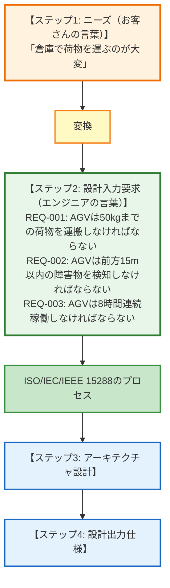

# 第3回: 要求定義の落とし穴 - ニーズから要求への変換で失敗しないために

## この記事を読んでほしい人

- 「ニーズは聞けたけど、そこから何を書けばいいか分からない」人
- 「要求」「要件」「仕様」の違いがよく分からない人
- 「shall」を使えと言われて困っている人

## はじめに: 「できること」と「しなければならない」は違う

前回、お客さんから「ニーズ（困りごと）」を引き出す方法を学びました。

例えば、こんなニーズが集まりました:

```
N-001: AGVは重い荷物（50kg）を運べること
N-002: AGVは障害物を検知できること
N-003: AGVは8時間連続稼働できること
```

さて、これをそのまま開発に渡していいでしょうか？

**答え: ダメです。**

なぜなら、これはまだ「ニーズ（お客さんの希望）」であって、**「要求（システムが満たすべき条件）」ではない**からです。

この記事では、ニーズを要求に変換する方法と、その過程でよくある落とし穴を解説します。

---

## 1. ニーズと要求の決定的な違い

### 言葉の整理: ニーズ vs 要求 vs 設計入力要求 vs 仕様

まず、この4つの言葉を整理します。

| 言葉 | 英語 | 意味 | 誰が書く | 例 |
|------|------|------|---------|---|
| **ニーズ** | Needs | お客さんの困りごと、希望 | お客さん | 「荷物運搬が楽になること」 |
| **要求** | Requirements | システムが満たすべき条件 | エンジニア | 「AGVは50kgの荷物を運べること」 |
| **設計入力要求** | Design Input Requirements | 設計・実装への入力となる要求 | システムエンジニア | 「AGVは50kgの荷物を時速3kmで運搬しなければならない」 |
| **仕様** | Specifications | 具体的な実装方法 | 開発者 | 「モーター200W×4、リチウム電池48V」 |

**重要な違い**:

| 項目 | ニーズ | 要求（設計入力要求） | 仕様 |
|------|--------|------------------|------|
| 使う言葉 | 「〜できること」 | 「〜しなければならない（shall）」 | 「〜を使う」 |
| 視点 | お客さんの希望 | システムの義務 | 実装の詳細 |
| 検証 | しない | する（テスト必須） | する（製造検証） |
| 変更 | 変わりやすい | 変わりにくい（承認必要） | 設計中に決まる |

### なぜ「しなければならない（shall）」を使うのか

**ニーズの例**:
「AGVは荷物を運べること」

**問題点**:
- 「運べる」= 努力目標？ それとも必須？
- 何kgまで？
- どれくらいの速度で？
- どんな環境でも？

**要求の例**:
「AGVは、50kgまでの荷物を、平坦な床面で、時速3kmで運搬**しなければならない**」

**明確になったこと**:
- **義務**: 「しなければならない」= 必ず満たす
- **数値**: 50kg、時速3km
- **条件**: 平坦な床面

**ポイント**:
「shall（しなければならない）」を使うことで、**義務であることを明確にする**

---

## 2. INCOSE NRMが警告する「用語の混乱」

### 混乱の原因: ISO/IEC/IEEE 15288の用語

実は、システムズエンジニアリングの国際規格（ISO/IEC/IEEE 15288）では、こんな用語を使います:

- **ステークホルダー要件（Stakeholder Requirements）**
- **システム要求（System Requirements）**

一見分かりやすそうですが、実はこれが**混乱の原因**です。

**INCOSE NRM（Needs and Requirements Manual）の警告**:

> 「ステークホルダー要件」と「システム要求」という用語を使うと、
> どちらも「要件」なので混乱する。
> そのため、INCOSEでは以下の用語を使う:
> - **ニーズ（Needs）**: ステークホルダーの視点
> - **設計入力要求（Design Input Requirements）**: システム要求のセット

### 正しい流れ: ニーズ → 設計入力要求



**ポイント**:
「ニーズ→システム要求→設計入力要求」という3段階ではなく、
**「ニーズ→設計入力要求」の2段階**

「システム要求」= 「設計入力要求」は同じものです。

---

## 3. ニーズを要求に変換する5つのステップ

### ステップ1: 「〜できること」を「〜しなければならない」に変える

**ニーズの例**:
```
N-001: AGVは重い荷物を運べること
```

**要求への変換**:
```
REQ-001: AGVは50kgまでの荷物を運搬しなければならない
```

**変換のポイント**:
- ✅ 「運べること」→「運搬しなければならない」（義務化）
- ✅ 「重い」→「50kgまで」（数値化）
- ✅ 「荷物」→「荷物」（そのまま）

### ステップ2: 曖昧な言葉を数値化する

**よくある曖昧な言葉**:

| 曖昧な言葉 | 数値化の例 | 確認方法 |
|----------|----------|---------|
| 「速い」 | 応答時間100ms以内 | お客さんに「何秒なら速いと感じますか？」 |
| 「大量」 | 同時100ユーザー | 「最大何人が使いますか？」 |
| 「安全」 | 障害物検知率99.9% | 「どれくらいの精度が必要ですか？」 |
| 「使いやすい」 | ボタン3クリック以内 | 「何ステップで完了すれば使いやすいですか？」 |

**AGVの例**:

| ニーズ | 曖昧な部分 | 質問 | 要求 |
|-------|----------|------|------|
| 「障害物を検知できること」 | どの距離から？ | 「何m先から検知が必要？」 | 「15m以内の障害物を検知しなければならない」 |
| 「長時間稼働できること」 | 何時間？ | 「1日何時間使いますか？」 | 「8時間連続稼働しなければならない」 |

### ステップ3: 「条件」を明記する

**悪い要求**:
```
REQ-002: AGVは障害物を検知しなければならない
```

**問題点**:
- どんな環境でも？（明るい / 暗い / 霧）
- どんな障害物でも？（人 / フォークリフト / 段ボール）
- どんな状態でも？（動いている / 止まっている）

**良い要求**:
```
REQ-002: AGVは、照明条件100ルクス以上の環境において、
         前方15m以内の高さ30cm以上の障害物を、
         検知率99%以上で検知しなければならない
```

**明確になったこと**:
- **環境**: 100ルクス以上（倉庫の通常照明）
- **対象**: 高さ30cm以上（小さい段ボールは無視）
- **性能**: 検知率99%以上（100%は無理）

### ステップ4: 「理由」を添える

**なぜ理由が必要か**:
- 後で変更が必要になったとき、判断できる
- 設計者が優先順位を理解できる
- テスト担当者が重要性を理解できる

**理由付き要求の例**:

| 要求ID | 要求内容 | 理由 |
|--------|---------|------|
| REQ-001 | AGVは50kgまでの荷物を運搬しなければならない | **倉庫の荷物の平均重量が30kg、最大が50kgであるため** |
| REQ-002 | AGVは前方15m以内の障害物を検知しなければならない | **フォークリフトとの衝突を回避するため。時速3kmで走行中、停止に必要な距離が10mであるため、余裕を持って15mとした** |
| REQ-003 | AGVは8時間連続稼働しなければならない | **作業シフトが8時間であるため。シフト中に充電のために停止することは許容できない** |

### ステップ5: 検証方法を決める

**要求と検証方法はセット**

要求を書いたら、「これ、どうやって確認する？」を必ず考える。

**検証方法の4種類（TAID）**:

| 方法 | 英語 | 説明 | 例 |
|------|------|------|---|
| **Test** | Test | 実際に動かして確認 | 50kg荷物を実際に運ばせる |
| **Analysis** | Analysis | 計算・シミュレーション | バッテリー容量から連続稼働時間を計算 |
| **Inspection** | Inspection | 目視・図面チェック | 設計図でセンサーの配置を確認 |
| **Demonstration** | Demonstration | デモで動作を見せる | お客さんの前で動かす |

**AGVの例**:

| 要求ID | 要求内容 | 検証方法 | 検証手順 |
|--------|---------|---------|---------|
| REQ-001 | 50kgまでの荷物を運搬 | **Test** | 50kg荷物を載せて10m走行、成功すればOK |
| REQ-002 | 15m以内の障害物検知 | **Test** | 障害物（高さ30cm）を15m先に置いて検知できるか確認 |
| REQ-003 | 8時間連続稼働 | **Analysis + Test** | バッテリー容量から計算、実際に8時間走行テスト |

---

## 4. よくある落とし穴と対策

### 落とし穴1: 「実装方法を書いてしまう」

**悪い要求（実装方法が混じっている）**:
```
❌ REQ-001: AGVは赤外線センサー3個を使って障害物を検知しなければならない
```

**問題点**:
- 「赤外線センサー」= 実装方法（仕様）
- 後でLiDARやカメラに変更できなくなる

**良い要求（実装方法を書かない）**:
```
✅ REQ-001: AGVは前方15m以内の障害物を検知しなければならない
```

**実装の自由度**:
- 赤外線センサーでもOK
- LiDARでもOK
- カメラ+画像認識でもOK

**ルール**:
要求には「What（何を）」だけを書く。「How（どうやって）」は書かない。

### 落とし穴2: 「検証不可能な要求を書いてしまう」

**悪い要求**:
```
❌ REQ-002: AGVは使いやすくなければならない
❌ REQ-003: AGVは十分に安全でなければならない
```

**問題点**:
- 「使いやすい」をどうやって確認する？
- 「十分に」って、どれくらい？

**良い要求**:
```
✅ REQ-002: AGVの操作は、ボタン3クリック以内で完了しなければならない
✅ REQ-003: AGVは障害物検知率99%以上を達成しなければならない
```

**ルール**:
「これ、どうやって確認する？」に答えられない要求は書かない。

### 落とし穴3: 「1つの要求に複数の条件を詰め込む」

**悪い要求**:
```
❌ REQ-001: AGVは50kgの荷物を運搬し、障害物を回避し、8時間稼働しなければならない
```

**問題点**:
- 3つの条件が1つの要求に混じっている
- 1つでも満たせなかったら、全体がNG？

**良い要求（分割する）**:
```
✅ REQ-001: AGVは50kgまでの荷物を運搬しなければならない
✅ REQ-002: AGVは障害物を回避しなければならない
✅ REQ-003: AGVは8時間連続稼働しなければならない
```

**ルール**:
1要求1条件。「〜し、かつ〜」は分割する。

### 落とし穴4: 「ニーズと要求を混同する」

**よくある間違い**:

| 間違った使い方 | 正しい使い方 |
|-------------|-------------|
| 「要求を聞く」 | ❌ → 「ニーズを聞く」 ✅ |
| 「お客さんの要求」 | ❌ → 「お客さんのニーズ」 ✅ |
| 「要求をヒアリング」 | ❌ → 「ニーズをヒアリング」 ✅ |

**覚え方**:
- **ニーズ**: お客さんが語る（「〜できること」）
- **要求**: エンジニアが書く（「〜しなければならない」）

---

## 5. Excel 1枚で管理できる要求テンプレート

### 最小限の要求管理表

| 列 | 内容 | 記入例 |
|----|------|--------|
| **要求ID** | 一意の識別子 | REQ-001 |
| **要求内容** | 「〜しなければならない」形式 | AGVは50kgまでの荷物を運搬しなければならない |
| **理由** | なぜ必要か | 倉庫の荷物の平均重量が30kg、最大が50kgであるため |
| **元ニーズID** | どのニーズから導出したか | N-001 |
| **優先度** | 必須/重要/後回し | 必須 |
| **検証方法** | Test/Analysis/Inspection/Demonstration | Test |
| **合格基準** | どうなればOKか | 50kg荷物を10m運搬できる |
| **ステータス** | 未着手/実装中/テスト中/完了 | 未着手 |

### 実際の記入例

| 要求ID | 要求内容 | 理由 | 元ニーズ | 優先度 | 検証方法 | 合格基準 |
|--------|---------|------|---------|--------|---------|---------|
| REQ-001 | AGVは50kgまでの荷物を運搬しなければならない | 倉庫の荷物の最大重量 | N-001 | 必須 | Test | 50kg荷物を10m運搬 |
| REQ-002 | AGVは前方15m以内の障害物を検知しなければならない | フォークリフトとの衝突回避 | N-002 | 必須 | Test | 15m先の障害物検知 |
| REQ-003 | AGVは8時間連続稼働しなければならない | 作業シフトが8時間 | N-003 | 必須 | Test | 8時間走行可能 |
| REQ-004 | AGVはバッテリー残量20%で警告を出さなければならない | 充電忘れ防止 | N-004 | 重要 | Test | 警告表示確認 |

---

## 6. 実践ポイント: 要求レビューチェックリスト

### 要求を書いたら、このチェックリストで確認

```
□ 「〜しなければならない（shall）」を使っているか？
□ 曖昧な言葉（速い、大量、安全）を数値化したか？
□ 「条件」を明記したか？（環境、対象、制約）
□ 「理由」を添えたか？
□ 検証方法（TAID）を決めたか？
□ 合格基準を書いたか？
□ 実装方法（How）を書いていないか？
□ 1要求1条件になっているか？
□ お客さんに確認してもらったか？
□ 優先順位を決めたか？
```

### 要求の品質チェック（3つの基準）

**1. 明確性（Clarity）**
- 誰が読んでも同じ意味に解釈できるか？
- 曖昧な言葉はないか？

**2. 検証可能性（Verifiability）**
- どうやって確認するか明確か？
- 合格基準が定義されているか？

**3. 実現可能性（Feasibility）**
- 技術的に実現可能か？
- コスト・納期的に現実的か？

---

## 7. まとめ: ニーズと要求は「翻訳」の関係

**この記事のポイント**:

1. **ニーズと要求は違う**
   - ニーズ: お客さんの言葉（「〜できること」）
   - 要求: エンジニアの言葉（「〜しなければならない」）

2. **「システム要求」=「設計入力要求」**
   - 3段階ではなく、2段階（ニーズ→設計入力要求）

3. **5つのステップで変換**
   - 「〜できること」→「〜しなければならない」
   - 曖昧な言葉を数値化
   - 条件を明記
   - 理由を添える
   - 検証方法を決める

4. **よくある落とし穴**
   - 実装方法を書かない（What だけ、How は書かない）
   - 検証不可能な要求を書かない
   - 1要求1条件

5. **Excel 1枚で管理できる**
   - 8列のテンプレートで十分

**次回予告**:

第4回では、「良い要求の書き方【基礎編】」を解説します。

- 曖昧さを排除する8つの原則
- ダメな要求の典型例
- 「〜すること」と「〜であること」の使い分け

実際に手を動かして、要求を書けるようになります。

---

## ダウンロード資料

### 1. 要求テンプレート Excel

```
【含まれる内容】
- 要求管理表（8列）
- ニーズ→要求変換シート
- 検証方法チェックリスト
```

### 2. 要求レビューチェックリスト PDF

```
【10項目チェックリスト】
□ shallを使っているか
□ 数値化したか
□ 条件を明記したか
...（全10項目）
```

---

## 参考資料

- INCOSE NRM 2.1.2: Design Input Requirements の定義
- INCOSE NRM 2.1.3: 用語の混乱に関する警告
- INCOSE Guide to Writing Requirements (GtWR)
- NASA SE Handbook Rev 2, Section 4.2: Requirements Flowdown

---

**執筆者より**:

ニーズと要求の違いは、「お客さんの言葉」と「エンジニアの言葉」の違いです。翻訳者になったつもりで、お客さんの「困りごと」を、開発チームが実装できる「要求」に変換しましょう。

次回は、要求の書き方をさらに深掘りします。お楽しみに！
