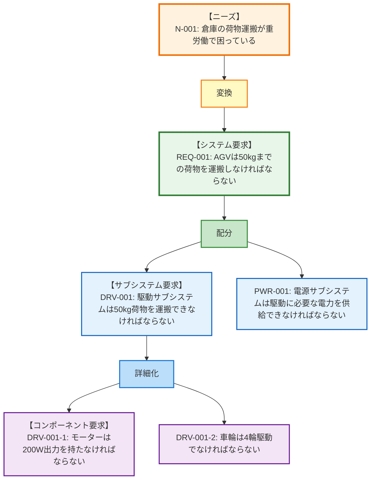

# 第5回: テストできる要求の書き方 ── 検証可能性とトレーサビリティの実践

## この記事を読んでほしい人

- 「要求は書けたけど、テストケースをどう作ればいいか分からない」人
- 「要求ID の採番ルールが統一されていなくて困っている」人
- 「トレーサビリティマトリクス」と言われて、何のことか分からなかった人

## はじめに: 「テストできない要求」は要求ではない

前回、曖昧さを排除する8つの原則を学びました。

でも、要求を書き終わった後、こんな問題に直面します:

**開発チームとの会話**:
```
開発者: 「この要求、どうやってテストするんですか？」
あなた: 「え、テストは後で考えればいいんじゃ…」
開発者: 「テストできないってことは、確認できないってことですよ？」
あなた: 「…（確かに）」
```

**テスト担当者との会話**:
```
テスター: 「REQ-001 とテストケース TC-045 の関係は？」
あなた: 「え、関係？ そんなの管理してないです」
テスター: 「じゃあ、このテストは何の要求を確認してるんですか？」
あなた: 「…（分からない）」
```

この記事では、**検証可能な要求の書き方**と、**要求とテストをつなぐトレーサビリティ**を実践的に解説します。

---

## 1. 検証可能性とは何か

### なぜ検証方法を最初に決めるのか

**よくある失敗**:
```
【開発後のテスト段階】
テスター: 「REQ-001『使いやすいこと』、どうテストします？」
エンジニア: 「え、使いやすさなんてテストできなくない？」
テスター: 「じゃあ、この要求はどうやって確認するんですか？」
エンジニア: 「…（詰んだ）」
```

**正しいやり方**:
```
【要求定義段階】
エンジニア: 「この要求、どうやって確認しよう？」
  ↓ テストできない → 要求を書き直す
エンジニア: 「REQ-001『ボタン3クリック以内』なら、実際に操作すればテストできる」
  ↓ 要求確定
  ↓ 開発
  ↓ テスト
テスター: 「ボタン3クリックで完了、OK！」
```

**ポイント**:
要求を書いた時点で、検証方法も決めておく

### 検証方法の4つの種類（TAID）

要求の検証には、**TAID**（Test / Analysis / Inspection / Demonstration）という4つの方法があります。

各方法の詳細は**第8回「検証と妥当性確認の実務」**で解説しますが、ここでは要求を書く際に意識すべきポイントを説明します。

**TAIDの概要**:

| 方法 | 簡単な説明 | AGVの例 |
|------|----------|--------|
| **Test** | 実機で動作確認 | 50kg荷物を運搬できるか実機テスト |
| **Analysis** | 計算で理論確認 | バッテリー容量から連続稼働時間を計算 |
| **Inspection** | 設計図で目視確認 | 設計図でセンサー配置を確認 |
| **Demonstration** | お客さんに実演 | 実際に障害物を回避する様子を見せる |

**要求定義段階でやること**:
1. 要求を書く
2. 「これ、どうやって確認する？」と自問
3. TAID のどれかで確認できるか考える
4. 確認できなければ、要求を書き直す

---

## 2. 検証可能な要求の書き方 - 5つのパターン

### パターン1: 数値で測定できる要求

**書き方テンプレート**:
```
[システム]は、[条件]において、[数値][単位]以内/以上で[動作]しなければならない
```

**例**:
```
✅ REQ-001: AGVは、平坦な床面において、時速3km以上で移動しなければならない
✅ REQ-002: AGVは、障害物検知後、1秒以内に停止しなければならない
✅ REQ-003: AGVは、8時間連続で稼働しなければならない
```

**検証方法**: 実測してOK/NGを判定

### パターン2: Yes/No で判定できる要求

**書き方テンプレート**:
```
[システム]は、[条件]の場合、[動作]しなければならない
```

**例**:
```
✅ REQ-004: AGVは、バッテリー残量20%以下の場合、警告を表示しなければならない
✅ REQ-005: AGVは、荷物を検知した場合、ピックアップ動作を開始しなければならない
✅ REQ-006: AGVは、緊急停止ボタンが押された場合、即座に停止しなければならない
```

**検証方法**:
1. 条件を作る（バッテリー20%にする）
2. 結果を確認（警告が出る？ Yes/No）

### パターン3: リストで列挙できる要求

**書き方テンプレート**:
```
[システム]は、以下の[項目]を[動作]しなければならない:
  - 項目1
  - 項目2
  - 項目3
```

**例**:
```
✅ REQ-007: AGVは、以下の障害物を検知しなければならない:
  - 人（高さ50cm以上）
  - フォークリフト
  - パレット（高さ15cm以上）
  - 段ボール箱（高さ30cm以上）
```

**検証方法**:
リストの各項目をテストして、全てOKなら合格

### パターン4: 状態遷移で確認できる要求

**書き方テンプレート**:
```
[システム]は、[状態A]から[イベント]により[状態B]に遷移しなければならない
```

**例**:
```
✅ REQ-008: AGVは、「待機」状態から「運搬指示」により「移動中」状態に遷移しなければならない
✅ REQ-009: AGVは、「移動中」状態から「障害物検知」により「停止」状態に遷移しなければならない
```

**検証方法**:
状態遷移図を作って、各遷移をテスト

### パターン5: 比較で確認できる要求

**書き方テンプレート**:
```
[システム]は、[基準]と比較して、[条件]でなければならない
```

**例**:
```
✅ REQ-010: AGVの消費電力は、前モデルと比較して、20%以上削減されなければならない
✅ REQ-011: AGVの重量は、競合製品Xと比較して、10%以上軽量でなければならない
```

**検証方法**:
基準値を測定し、比較してOK/NGを判定

---

## 3. 要求ID採番ルール - 管理しやすい体系を作る

### なぜ要求IDが重要か

**IDがないと起きる問題**:

```
【会議での会話】
エンジニアA: 「あの荷物運搬の要求、変更しましょう」
エンジニアB: 「どの要求？ 3つあるけど」
エンジニアA: 「ほら、50kgのやつ」
エンジニアB: 「50kgの要求も2つあるよ」
エンジニアA: 「…（どれだっけ）」
```

**IDがあると**:

```
エンジニアA: 「REQ-001を変更しましょう」
エンジニアB: 「了解、REQ-001ね」
  → Excelを開く
  → REQ-001: AGVは50kgまでの荷物を運搬しなければならない
  → 一発で特定
```

### 基本的な採番ルール

**パターン1: 連番方式（最もシンプル）**

```
REQ-001, REQ-002, REQ-003, ...
```

**メリット**:
- シンプル
- 覚えやすい

**デメリット**:
- 要求の種類が分からない
- 追加・削除で番号がずれる

**適用場面**: 小規模プロジェクト（要求100件以下）

**パターン2: カテゴリ別採番方式**

```
機能要求: FREQ-001, FREQ-002, ...
性能要求: PREQ-001, PREQ-002, ...
インターフェイス要求: IREQ-001, IREQ-002, ...
制約要求: CREQ-001, CREQ-002, ...
```

**メリット**:
- 要求の種類が一目で分かる
- カテゴリごとに管理しやすい

**デメリット**:
- プレフィックスが長い
- カテゴリ分類が難しい要求がある

**適用場面**: 中規模プロジェクト（要求100-500件）

**パターン3: 階層的採番方式**

```
REQ-1: 運搬機能
  REQ-1.1: 荷物ピックアップ
    REQ-1.1.1: 50kgまで対応
    REQ-1.1.2: 荷物検知
  REQ-1.2: 荷物運搬
    REQ-1.2.1: 時速3km
    REQ-1.2.2: 8時間稼働

REQ-2: 安全機能
  REQ-2.1: 障害物検知
    REQ-2.1.1: 検知距離15m
    REQ-2.1.2: 検知率99%
```

**メリット**:
- 要求の階層関係が分かる
- 親子関係が明確

**デメリット**:
- IDが長くなる
- 階層変更が面倒

**適用場面**: 大規模プロジェクト（要求500件以上）

### 推奨: ハイブリッド方式

**AGVプロジェクトの例**:

```
【レベル1: システム全体】
SYS-001: AGVシステム全体の要求

【レベル2: サブシステム】
SEN-001〜: センサーサブシステム
CTL-001〜: 制御サブシステム
DRV-001〜: 駆動サブシステム
PWR-001〜: 電源サブシステム

【レベル3: 詳細要求】
SEN-001: 障害物検知（親要求）
  SEN-001-1: 検知距離15m
  SEN-001-2: 検知率99%
  SEN-001-3: 応答時間100ms
```

**実際の採番例**:

| 要求ID | 要求内容 | 親要求 | サブシステム |
|--------|---------|--------|------------|
| SYS-001 | AGVは荷物を運搬しなければならない | - | 全体 |
| DRV-001 | 駆動サブシステムは50kg荷物を運搬できなければならない | SYS-001 | 駆動 |
| DRV-001-1 | モーターは200W出力を持たなければならない | DRV-001 | 駆動 |
| DRV-001-2 | 車輪は4輪駆動でなければならない | DRV-001 | 駆動 |
| SEN-001 | センサーサブシステムは障害物を検知しなければならない | SYS-001 | センサー |
| SEN-001-1 | 検知距離は15m以上でなければならない | SEN-001 | センサー |

---

## 4. トレーサビリティマトリクス - 要求とテストをつなぐ

### トレーサビリティとは

**定義**: 要求と、その要求に関連する成果物（設計、実装、テスト）の対応関係を追跡できること

**なぜ必要か**:

```
【トレーサビリティがないと】
- このテストは何の要求を確認してるの？ → 分からない
- REQ-001は誰がテストしたの？ → 分からない
- 要求変更したら、どのテストを直すの？ → 分からない

【トレーサビリティがあると】
- このテストはREQ-001を確認している → 明確
- REQ-001はTC-045でテストした → 明確
- REQ-001を変更したら、TC-045を直す → 明確
```

### 垂直トレーサビリティ（階層間）

**定義**: 上位要求から下位要求への対応関係

**AGVの例**:



**トレーサビリティマトリクス（垂直）**:

| ニーズID | システム要求ID | サブシステム要求ID | コンポーネント要求ID |
|---------|-------------|---------------|------------------|
| N-001 | REQ-001 | DRV-001 | DRV-001-1, DRV-001-2 |
| N-001 | REQ-001 | PWR-001 | PWR-001-1 |

### 水平トレーサビリティ（ライフサイクル）

**定義**: 要求 → 設計 → 実装 → テストの対応関係

**AGVの例**:



```mermaid
flowchart LR
    Req["【要求】<br/>REQ-001: AGVは50kgまでの荷物を運搬しなければならない"]
    
    Design_Arrow["設計"]
    
    Design["【設計】<br/>DESIGN-001: モーター200W×4、リチウム電池48V"]
    
    Impl_Arrow["実装"]
    
    Impl["【実装】<br/>CODE-001: motor_control.c (モーター制御プログラム)"]
    
    Test_Arrow["テスト"]
    
    Test["【テスト】<br/>TC-001: 50kg荷物を10m運搬するテスト"]

    Req --> Design_Arrow
    Design_Arrow --> Design
    Design --> Impl_Arrow
    Impl_Arrow --> Impl
    Impl --> Test_Arrow
    Test_Arrow --> Test

    style Req fill:#e8f5e9,stroke:#2e7d32,stroke-width:3px
    style Design_Arrow fill:#c8e6c9,stroke:#388e3c,stroke-width:2px
    style Design fill:#e3f2fd,stroke:#1565c0,stroke-width:3px
    style Impl_Arrow fill:#bbdefb,stroke:#1976d2,stroke-width:2px
    style Impl fill:#fff3e0,stroke:#ef6c00,stroke-width:3px
    style Test_Arrow fill:#fff9c4,stroke:#f57f17,stroke-width:2px
    style Test fill:#f3e5f5,stroke:#6a1b9a,stroke-width:3px
```

**トレーサビリティマトリクス（水平）**:

| 要求ID | 設計ID | 実装ID | テストID | ステータス |
|--------|--------|--------|---------|----------|
| REQ-001 | DESIGN-001 | CODE-001 | TC-001 | 完了 |
| REQ-002 | DESIGN-002 | CODE-002 | TC-002, TC-003 | テスト中 |
| REQ-003 | DESIGN-003 | - | - | 未着手 |

### 双方向トレーサビリティ

**定義**: 前方（要求→テスト）と後方（テスト→要求）の両方向で追跡できること

**前方トレーサビリティ（Forward Traceability）**:

```
質問: 「REQ-001は、どのテストで確認されますか？」
回答: 「TC-001, TC-002で確認されます」
```

**後方トレーサビリティ（Backward Traceability）**:

```
質問: 「TC-001は、どの要求を確認していますか？」
回答: 「REQ-001, REQ-002を確認しています」
```

### Excelで作るトレーサビリティマトリクス

**シート1: 要求一覧**

| 要求ID | 要求内容 | 優先度 | ステータス |
|--------|---------|--------|----------|
| REQ-001 | AGVは50kgまでの荷物を運搬しなければならない | 必須 | 完了 |
| REQ-002 | AGVは前方15m以内の障害物を検知しなければならない | 必須 | テスト中 |

**シート2: テストケース一覧**

| テストID | テスト内容 | 検証方法 | 合格基準 | 結果 |
|---------|----------|---------|---------|------|
| TC-001 | 50kg荷物運搬テスト | Test | 10m運搬完了 | Pass |
| TC-002 | 15m障害物検知テスト | Test | 検知信号あり | Pass |

**シート3: トレーサビリティマトリクス**

| 要求ID | テストID | 検証方法 | 結果 | 備考 |
|--------|---------|---------|------|------|
| REQ-001 | TC-001 | Test | Pass | - |
| REQ-001 | TC-005 | Analysis | Pass | バッテリー計算 |
| REQ-002 | TC-002 | Test | Pass | - |
| REQ-002 | TC-003 | Test | Pass | 複数障害物 |

**チェック項目**:

```
□ 全ての要求に、少なくとも1つのテストが紐付いているか？
□ 全てのテストが、少なくとも1つの要求に紐付いているか？
□ 優先度「必須」の要求は、全てテスト完了しているか？
```

---

## 5. 検証計画を要求定義と同時に作る方法

### なぜ同時に作るのか

**後からテストを考えると**:

```
【実装後】
開発者: 「実装完了しました！」
テスター: 「じゃあテストケース作ります」
  ↓ テストケース作成中
テスター: 「あれ、REQ-010ってどうテストするんだろう…」
  ↓ 要求を書いた人に確認
テスター: 「この要求、テストできないんですけど」
開発者: 「え、じゃあどうするんですか…」
  ↓ 手戻り発生
```

**要求定義と同時にテストを考えると**:

```
【要求定義段階】
エンジニア: 「REQ-010を書きました」
エンジニア: 「これ、どうテストしよう？」
  ↓ テストできない
エンジニア: 「要求を書き直そう」
  ↓ 要求修正
エンジニア: 「これならテストできる！」
  ↓ 開発
  ↓ テスト
テスター: 「計画通り、テスト実施します」
```

### 要求+検証計画のテンプレート

**1要求1行の拡張版**:

| 要求ID | 要求内容 | 優先度 | 検証方法 | 検証手順 | 合格基準 | 担当 | 予定工数 |
|--------|---------|--------|---------|---------|---------|------|---------|
| REQ-001 | AGVは50kgまでの荷物を運搬しなければならない | 必須 | Test | 50kg荷物を10m運搬 | 10m運搬完了 | 田中 | 1h |
| REQ-002 | AGVは15m以内の障害物を検知しなければならない | 必須 | Test | 15m先に障害物を置く | 検知信号あり | 鈴木 | 0.5h |
| REQ-003 | AGVは8時間連続稼働できなければならない | 必須 | Analysis + Test | バッテリー計算＋実走行 | 計算値8h以上、実測7h以上 | 佐藤 | 8h |

### 検証計画の作成手順（5ステップ）

**ステップ1: 要求を書く**

```
REQ-001: AGVは50kgまでの荷物を運搬しなければならない
```

**ステップ2: 「どうやって確認する？」を考える**

```
→ 実際に50kg荷物を載せて走らせる（Test）
```

**ステップ3: 具体的な手順を書く**

```
1. 50kgの荷物を用意
2. AGVに荷物を載せる
3. 10m先の目標地点を設定
4. 運搬指示を出す
5. 10m走行できるか確認
```

**ステップ4: 合格基準を決める**

```
合格: 10m走行完了、かつ荷物が落ちない
不合格: 途中で停止、または荷物が落ちる
```

**ステップ5: 工数を見積もる**

```
準備（荷物用意）: 0.5時間
テスト実施: 0.5時間
合計: 1時間
```

---

## 6. 実践ポイント: 検証計画チェックリスト

### 要求ごとにチェック（5項目）

```
□ 検証方法（TAID）を決めたか？
□ 検証手順を具体的に書いたか？
□ 合格基準を明確に書いたか？
□ 誰がテストするか決めたか？
□ テストに必要な工数を見積もったか？
```

### プロジェクト全体でチェック（5項目）

```
□ 全ての要求に検証方法が紐付いているか？
□ 優先度「必須」の要求は全て Test または Analysis があるか？
□ トレーサビリティマトリクスを作成したか？
□ 要求ID採番ルールを決めたか？
□ テスト工数の合計を見積もったか？
```

---

## 7. まとめ: 要求とテストはセットで考える

**この記事のポイント**:

1. **検証方法は要求を書く時に決める**
   - TAID: Test / Analysis / Inspection / Demonstration
   - 検証できない要求は書き直す

2. **検証可能な要求の5つのパターン**
   - 数値で測定できる
   - Yes/Noで判定できる
   - リストで列挙できる
   - 状態遷移で確認できる
   - 比較で確認できる

3. **要求ID採番ルールを決める**
   - 連番方式（小規模）
   - カテゴリ別方式（中規模）
   - 階層的方式（大規模）
   - ハイブリッド方式（推奨）

4. **トレーサビリティマトリクスを作る**
   - 垂直: ニーズ→要求→サブシステム要求
   - 水平: 要求→設計→実装→テスト
   - 双方向: 前方と後方の両方

5. **検証計画を同時に作る**
   - 手順・合格基準・工数を最初に決める

**次回予告**:

第6回では、「要求配分の実務」を解説します。

- システムをサブシステムに分解する方法
- 機能配分・性能配分・制約配分の実例
- 性能バジェットの作り方（応答時間1秒をどう分割するか）

1つのシステム要求を、複数のサブシステム要求に分解する技術を学びます。

---

## ダウンロード資料

### 1. TAID選択ガイド PDF

```
【要求の種類ごとの推奨検証方法】
- 機能要求 → Test
- 性能要求 → Test + Analysis
- インターフェイス要求 → Test + Inspection
- 制約要求 → Inspection
...（全20パターン）
```

### 2. トレーサビリティマトリクス Excelテンプレート

```
【3シート構成】
- シート1: 要求一覧
- シート2: テストケース一覧
- シート3: トレーサビリティマトリクス（自動集計付き）
```

### 3. 検証計画テンプレート Excel

```
【カラム】
- 要求ID
- 検証方法（TAID）
- 検証手順（1-5ステップ）
- 合格基準
- 担当者
- 予定工数
- 実績工数
- 結果（Pass/Fail）
```

---

## 参考資料

- INCOSE Guide to Writing Requirements (GtWR) - Chapter 5: Verification Methods
- NASA SE Handbook Rev 2, Section 6.2: Verification Planning
- IEEE Std 829-2008: Standard for Software Test Documentation
- INCOSE NRM Chapter 8: Requirements Verification

---

**執筆者より**:

要求とテストはセットです。要求を書いた瞬間に「これ、どうやって確認する？」と自問してください。答えられなかったら、その要求は書き直しが必要です。

次回は、システムを分解する技術を学びます。お楽しみに！
