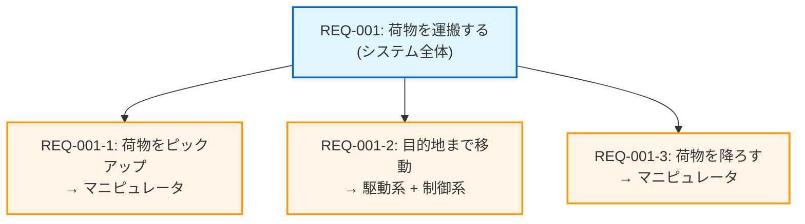

# 第6回: 要求配分の実務 - システムをサブシステムに分解する

## この記事を読んでほしい人

- 「この要求、どのモジュールが担当するの？」と悩んだことがある人
- 「応答時間1秒」を複数のモジュールにどう分割すればいいか分からない人
- システムアーキテクチャと要求の関係が理解できていない人

## はじめに: 「全部やれ」では開発できない

前回まで、良い要求の書き方を学びました。

例えば、こんな要求が書けるようになりました:

```
REQ-001: AGVは50kgまでの荷物を運搬しなければならない
REQ-002: AGVは前方15m以内の障害物を検知しなければならない
REQ-003: AGVは8時間連続稼働しなければならない
```

でも、これを開発チームに渡すと、こんな質問が返ってきます:

**開発者Aの質問**:
```
「REQ-001『50kg荷物を運搬』って、俺のモーター制御モジュールだけで実現するの？
 それとも、バッテリーモジュールも関係ある？」
```

**開発者Bの質問**:
```
「REQ-002『障害物検知』って、センサーモジュールが検知するだけでいいの？
 それとも、制御モジュールで判断処理も必要？」
```

**つまり、問題はこれです**:

> システム全体の要求は書けた。
> でも、**どのモジュール（サブシステム）が何をするか**が決まっていない。

この記事では、**システム要求をサブシステム要求に分解する「要求配分」**の実務を解説します。

---

## 1. 要求配分とは何か - 料理に例えると

### 料理で理解する要求配分

**シナリオ**: 「カレーを作る」

**全体の要求（システム要求）**:
```
「美味しいカレーを30分で4人分作る」
```

これだけでは、料理できません。なぜなら:
- 誰が何をするか分からない
- 各材料の量が分からない
- 各工程の時間が分からない

**配分後（サブシステム要求）**:

| 担当 | 要求 | 時間配分 |
|------|------|---------|
| **材料準備担当** | じゃがいも4個を切る | 10分 |
| **材料準備担当** | 玉ねぎ2個を切る | 5分 |
| **材料準備担当** | 肉200gを切る | 5分 |
| **調理担当** | 材料を炒める | 5分 |
| **調理担当** | 水とカレールーを入れて煮込む | 5分 |

**ポイント**:
- 全体30分を、各工程に配分した（10分+5分+5分+5分+5分=30分）
- 誰が何をするか明確になった
- 並行作業できる部分が見えた（材料切りながら、鍋を温めるなど）

**要求配分も同じです**:

```
システム全体の要求
  ↓ 配分
サブシステムA の要求
サブシステムB の要求
サブシステムC の要求
```

---

## 2. 要求配分の4つのパターン

### パターン1: 機能配分（Functional Allocation）

**定義**: 親機能を子機能へ分解し、サブシステムへ割り当てる

**AGVの例**:

**親要求（システムレベル）**:
```
REQ-001: AGVは荷物を倉庫からラインへ運搬しなければならない
```

**機能分解**:

```
「荷物を運搬する」を分解すると…

1. 荷物をピックアップする
2. 目的地まで移動する
3. 荷物を降ろす
```

**サブシステムへの配分**:

| 子機能 | 配分先サブシステム | 子要求 |
|-------|-----------------|-------|
| 荷物をピックアップする | **マニピュレータ** | REQ-001-1: マニピュレータは50kg荷物を把持しなければならない |
| 目的地まで移動する | **駆動系** + **制御系** | REQ-001-2: 駆動系は50kg荷物を載せて時速3kmで移動しなければならない |
| 荷物を降ろす | **マニピュレータ** | REQ-001-3: マニピュレータは荷物を指定位置に配置しなければならない |

**図解**:



### パターン2: 性能配分（Performance Allocation / Budgeting）

**定義**: 性能値を下位へバジェット配分する。合計が親要求を満たすこと。

**AGVの例: 応答時間のバジェット配分**

**親要求（システムレベル）**:
```
REQ-002: AGVは運搬指示受信から移動開始まで、1.0秒以内で完了しなければならない
```

**性能バジェット配分**:

```
1.0秒をどう分割する？

センサー処理時間:     0.3秒 (30%)
制御判断時間:         0.2秒 (20%)
駆動起動時間:         0.3秒 (30%)
マージン（予備）:     0.2秒 (20%)
━━━━━━━━━━━━━━━━━━━━━━━
合計:                 1.0秒 (100%)
```

**サブシステムへの配分**:

| サブシステム | 配分値 | マージン込み | 子要求 |
|------------|--------|-----------|-------|
| **センサー** | 0.3秒 | 0.3秒 | REQ-002-1: センサーは荷物検知を0.3秒以内で完了しなければならない |
| **制御系** | 0.2秒 | 0.2秒 | REQ-002-2: 制御系は移動判断を0.2秒以内で完了しなければならない |
| **駆動系** | 0.3秒 | 0.3秒 | REQ-002-3: 駆動系は移動開始を0.3秒以内で完了しなければならない |
| **マージン** | - | 0.2秒 | （予備。問題があった時の調整用） |

**重要な原則**:

1. **合計が親要求を超えない**: 0.3 + 0.2 + 0.3 = 0.8秒 < 1.0秒 ✅
2. **マージンを確保する**: 10-20%のマージンを残す（NASA推奨）
3. **実現可能性を確認**: 各配分値が技術的に実現可能か確認

**もう1つの例: 重量バジェット配分**

**親要求**:
```
REQ-003: AGVシステムの総重量は500kg以下でなければならない
```

**重量バジェット配分**:

| サブシステム | 配分重量 | 割合 | 子要求 |
|------------|---------|------|-------|
| フレーム・筐体 | 180kg | 36% | REQ-003-1: フレームは180kg以下でなければならない |
| 駆動系（モーター・車輪） | 100kg | 20% | REQ-003-2: 駆動系は100kg以下でなければならない |
| 電源（バッテリー） | 150kg | 30% | REQ-003-3: 電源系は150kg以下でなければならない |
| センサー・制御 | 50kg | 10% | REQ-003-4: センサー・制御系は50kg以下でなければならない |
| マージン | 20kg | 4% | （予備） |
| **合計** | **500kg** | **100%** | - |

### パターン3: 制約配分（Constraint Allocation）

**定義**: システム全体の制約を下位へ伝播させる

**AGVの例: 環境制約の配分**

**親制約（システムレベル）**:
```
REQ-004: AGVは動作環境温度-10℃〜+40℃で動作しなければならない
```

**問題**:
システム全体が-10℃〜+40℃で動作するためには、**全てのサブシステム**がこの温度範囲で動作する必要がある。

**サブシステムへの配分**:

| サブシステム | 子要求 | 注意点 |
|------------|-------|--------|
| **電源系** | REQ-004-1: 電源系は-10℃〜+40℃で定格出力を維持しなければならない | バッテリーは温度に敏感 |
| **制御系** | REQ-004-2: 制御系は-10℃〜+40℃で演算性能を維持しなければならない | CPUの動作温度範囲を確認 |
| **センサー系** | REQ-004-3: センサー系は-10℃〜+40℃で検知性能を維持しなければならない | 赤外線センサーは温度影響あり |
| **駆動系** | REQ-004-4: 駆動系は-10℃〜+40℃で駆動力を維持しなければならない | モーターの温度特性を確認 |

**制約配分の注意点**:

1. **親制約より厳しい子制約が必要な場合がある**:
   ```
   例: バッテリーは-10℃で性能が落ちる
   → バッテリーヒーターを追加
   → ヒーター用の電力バジェットが必要
   ```

2. **全サブシステムが満たす必要がある**:
   ```
   1つでも温度範囲外で動作不可 → システム全体が動作不可
   ```

### パターン4: インターフェイス配分（Interface Allocation）

**定義**: サブシステム間の境界を越える要求

**AGVの例: サブシステム間通信**

**シナリオ**: センサーが障害物を検知したら、制御系に通知する

**インターフェイス要求の派生**:

```
【親要求】
REQ-005: AGVは障害物を検知したら、1秒以内に停止しなければならない

↓ 機能配分

REQ-005-1: センサー系は障害物を検知しなければならない（センサー担当）
REQ-005-2: 制御系は停止判断をしなければならない（制御系担当）
REQ-005-3: 駆動系は停止動作を実行しなければならない（駆動系担当）

↓ インターフェイス要求が派生

REQ-005-IF1: センサー系は障害物座標を制御系に送信しなければならない
REQ-005-IF2: 制御系は停止指令を駆動系に送信しなければならない
```

**インターフェイス要求の詳細化**:

| IF要求ID | 内容 | 詳細仕様 |
|---------|------|---------|
| REQ-005-IF1 | センサー→制御 データ送信 | ・データ形式: JSON<br>・更新周期: 100Hz（10ms周期）<br>・遅延: 10ms以内<br>・通信方式: CAN |
| REQ-005-IF2 | 制御→駆動 停止指令 | ・コマンド形式: "STOP"<br>・応答確認: ACK必須<br>・遅延: 5ms以内<br>・通信方式: CAN |

**インターフェイス要求の図解**:


---

## 3. 要求配分の実践: 7ステップ手順

### ステップ1: システムアーキテクチャを決める

**最初に、システムをどう分割するか決める**

**AGVの例**:

```
AGVシステム
├── センサーサブシステム（障害物検知）
├── 制御サブシステム（判断・計画）
├── 駆動サブシステム（移動）
├── マニピュレータサブシステム（荷物操作）
├── 電源サブシステム（バッテリー管理）
└── 通信サブシステム（外部システム連携）
```

**アーキテクチャ決定の基準**:

| 基準 | 説明 | AGVの例 |
|------|------|--------|
| **機能の凝集度** | 関連する機能を1つにまとめる | 「検知」関連はセンサーサブシステムに集約 |
| **物理的な分離** | ハードウェアが分かれている | モーターは駆動サブシステム、センサーはセンサーサブシステム |
| **責任の明確化** | 誰が担当するか明確 | センサー担当チーム、制御担当チーム |

### ステップ2: 親要求リストを用意する

**システムレベルの要求一覧**:

| 要求ID | 要求内容 | 優先度 |
|--------|---------|--------|
| REQ-001 | AGVは50kgまでの荷物を運搬しなければならない | 必須 |
| REQ-002 | AGVは運搬指示から1秒以内に移動開始しなければならない | 必須 |
| REQ-003 | AGVは総重量500kg以下でなければならない | 必須 |
| REQ-004 | AGVは-10℃〜+40℃で動作しなければならない | 必須 |
| REQ-005 | AGVは障害物検知後1秒以内に停止しなければならない | 必須 |

### ステップ3: 各要求の配分タイプを判定する

| 要求ID | 配分タイプ | 理由 |
|--------|----------|------|
| REQ-001 | **機能配分** | 「運搬」という機能を分解 |
| REQ-002 | **性能配分** | 1秒を各サブシステムに配分 |
| REQ-003 | **性能配分** | 500kgを各サブシステムに配分 |
| REQ-004 | **制約配分** | 温度制約を全サブシステムに伝播 |
| REQ-005 | **機能配分** + **IF配分** | 機能分解 + インターフェイス派生 |

### ステップ4: 性能バジェット表を作成（性能配分の場合）

**Excel テンプレート**:

| 親要求ID | 性能項目 | 目標値 | サブシステム | 配分値 | マージン | 根拠 |
|---------|---------|--------|------------|--------|---------|------|
| REQ-002 | 応答時間 | 1.0秒 | センサー系 | 0.3秒 | - | センサー処理時間 |
| REQ-002 | 応答時間 | 1.0秒 | 制御系 | 0.2秒 | - | 制御判断時間 |
| REQ-002 | 応答時間 | 1.0秒 | 駆動系 | 0.3秒 | - | 駆動起動時間 |
| REQ-002 | 応答時間 | 1.0秒 | （マージン） | 0.2秒 | ✅ | 予備 |
| REQ-002 | 応答時間 | 1.0秒 | **合計** | **1.0秒** | - | - |

**チェック項目**:
```
□ 合計 + マージン ≤ 目標値 ？
□ マージンは10-20%か？
□ 各配分値は実現可能か？
```

### ステップ5: 子要求を記述する

**配分後の要求一覧**:

| 親要求ID | 子要求ID | サブシステム | 子要求内容 | 配分タイプ |
|---------|---------|------------|----------|----------|
| REQ-001 | REQ-001-1 | マニピュレータ | 50kg荷物を把持しなければならない | 機能配分 |
| REQ-001 | REQ-001-2 | 駆動系 | 50kg荷物を載せて時速3kmで移動しなければならない | 機能配分 |
| REQ-002 | REQ-002-1 | センサー系 | 荷物検知を0.3秒以内で完了しなければならない | 性能配分 |
| REQ-002 | REQ-002-2 | 制御系 | 移動判断を0.2秒以内で完了しなければならない | 性能配分 |
| REQ-003 | REQ-003-1 | 駆動系 | 100kg以下でなければならない | 性能配分 |
| REQ-003 | REQ-003-2 | 電源系 | 150kg以下でなければならない | 性能配分 |

### ステップ6: インターフェイス要求を識別する

**サブシステム間の接続を確認**:

```
【シナリオ】障害物検知→停止

センサー系 ──[障害物座標]──→ 制御系 ──[停止指令]──→ 駆動系

↓ インターフェイス要求

REQ-005-IF1: センサー系は障害物座標を制御系に100Hz周期で送信しなければならない
REQ-005-IF2: 制御系は停止指令を駆動系に5ms以内に送信しなければならない
```

### ステップ7: 配分の完全性をチェックする

**チェックリスト**:

```
□ 全ての親要求が子要求に配分されているか？
□ 性能バジェットの合計が親要求を満たしているか？
□ マージンは10-20%確保されているか？
□ 孤立した子要求（親がない）はないか？
□ 各子要求に検証方法が紐付いているか？
□ インターフェイス要求は全て識別されているか？
```

---

## 4. よくある失敗と対策

### 失敗1: 「性能バジェットの合計が目標値を超えている」

**ダメな例**:

| サブシステム | 配分値 | 合計 |
|------------|--------|------|
| センサー系 | 0.4秒 | |
| 制御系 | 0.3秒 | |
| 駆動系 | 0.4秒 | |
| **合計** | **1.1秒** | ❌ 目標1.0秒を超えている！ |

**対策**:

1. **各サブシステムに配分値を見直してもらう**:
   ```
   「0.1秒削減できませんか？」
   ```

2. **親要求を見直す**:
   ```
   「1.0秒は厳しすぎるかも。1.2秒に緩和できないか、お客さんに確認」
   ```

3. **アーキテクチャを見直す**:
   ```
   「センサー処理を専用ハードウェアにして高速化」
   ```

### 失敗2: 「マージンを確保していない」

**ダメな例**:

| サブシステム | 配分値 |
|------------|--------|
| センサー系 | 0.35秒 |
| 制御系 | 0.25秒 |
| 駆動系 | 0.40秒 |
| **合計** | **1.00秒** ← ピッタリ！マージンゼロ ❌ |

**問題**:
1つでも予定より時間がかかったら、全体が目標オーバー

**対策**:

```
目標値の10-20%はマージンとして残す

目標1.0秒の場合:
- 配分合計: 0.8-0.9秒
- マージン: 0.1-0.2秒
```

### 失敗3: 「インターフェイス要求を忘れている」

**よくあるパターン**:

```
【機能配分だけ】
REQ-001-1: センサー系は障害物を検知しなければならない ✅
REQ-001-2: 制御系は停止判断をしなければならない ✅

【インターフェイス要求が抜けている】
→ センサーが検知したデータを、どうやって制御系に渡す？ ❌
```

**対策**:

```
サブシステム間の矢印（データの流れ）を全て書き出す

センサー ──→ 制御 ──→ 駆動
   ↑ この矢印1本ごとに、インターフェイス要求を書く
```

### 失敗4: 「派生要求を記録していない」

**派生要求とは**: アーキテクチャを決めたことで新たに発生した要求

**例**:

```
【親要求】
REQ-001: AGVは50kg荷物を運搬しなければならない

【アーキテクチャ決定】
→ 駆動系とマニピュレータに分割

【派生要求】
REQ-001-D1: 駆動系とマニピュレータは通信できなければならない（新規！）
REQ-001-D2: 駆動系はマニピュレータの重量（20kg）を加味して設計しなければならない（新規！）
```

**対策**:

```
派生要求リストを作る

| 派生要求ID | 内容 | 派生元 | 理由 |
|----------|------|-------|------|
| REQ-001-D1 | 駆動-マニピュレータ通信 | REQ-001 | アーキテクチャ決定により必要 |
| REQ-001-D2 | マニピュレータ重量考慮 | REQ-001 | 物理的制約 |
```

---

## 5. 配分マトリクスをExcelで作る

### テンプレート構成

**シート1: 親要求一覧**

| 要求ID | 要求内容 | 優先度 |
|--------|---------|--------|
| REQ-001 | AGVは50kg荷物を運搬しなければならない | 必須 |
| REQ-002 | AGVは1秒以内に移動開始しなければならない | 必須 |

**シート2: 子要求一覧**

| 親要求ID | 子要求ID | サブシステム | 子要求内容 | 配分タイプ |
|---------|---------|------------|----------|----------|
| REQ-001 | REQ-001-1 | マニピュレータ | 50kg荷物を把持 | 機能配分 |
| REQ-001 | REQ-001-2 | 駆動系 | 50kg荷物を移動 | 機能配分 |

**シート3: 性能バジェット表**

| 親要求ID | 性能項目 | 目標値 | サブシステム | 配分値 | マージン | 合計チェック |
|---------|---------|--------|------------|--------|---------|------------|
| REQ-002 | 応答時間 | 1.0秒 | センサー系 | 0.3秒 | - | =SUM(...) ≤ 1.0 |

**シート4: トレーサビリティマトリクス**

| 親要求ID | 子要求ID | サブシステム | 検証方法 | テストID | 結果 |
|---------|---------|------------|---------|---------|------|
| REQ-001 | REQ-001-1 | マニピュレータ | Test | TC-010 | Pass |
| REQ-001 | REQ-001-2 | 駆動系 | Test | TC-011 | Pass |

---

## 6. 実践ポイント: 配分作業チェックリスト

### 配分前の準備（3項目）

```
□ システムアーキテクチャ（サブシステム分割）を決めたか？
□ 親要求リストを整理したか？
□ 各要求の配分タイプ（機能/性能/制約/IF）を判定したか？
```

### 配分中のチェック（5項目）

```
□ 性能バジェットの合計は目標値以内か？
□ マージンは10-20%確保したか？
□ 各配分値の実現可能性を確認したか？
□ インターフェイス要求を識別したか？
□ 派生要求を記録したか？
```

### 配分後のチェック（4項目）

```
□ 全ての親要求が配分されているか？
□ 孤立した子要求（親がない）はないか？
□ 各子要求に検証方法が紐付いているか？
□ お客さんまたはチームリーダーに確認してもらったか？
```

---

## 7. まとめ: 配分は「責任の明確化」

**この記事のポイント**:

1. **要求配分の4パターン**
   - 機能配分: 親機能を子機能へ分解
   - 性能配分: 数値をバジェット配分
   - 制約配分: システム制約を伝播
   - インターフェイス配分: サブシステム間の要求

2. **性能バジェットの原則**
   - 合計 + マージン ≤ 目標値
   - マージンは10-20%
   - 各配分値の実現可能性を確認

3. **配分の7ステップ**
   - アーキテクチャ決定 → 親要求整理 → タイプ判定 → バジェット表作成 → 子要求記述 → IF要求識別 → 完全性チェック

4. **よくある失敗**
   - バジェットオーバー → 見直しまたは目標緩和
   - マージンゼロ → 10-20%確保
   - IF要求忘れ → 矢印を全て書き出す
   - 派生要求未記録 → 派生要求リストを作る

**次回予告**:

第7回では、「システムアーキテクチャ設計の勘所」を解説します。

- ユースケースから機能を抽出する方法
- 機能をサブシステム（ブロック）にグループ化する判断基準
- インターフェイス要求の派生パターン

今回学んだ「配分」の前提となる「アーキテクチャ設計」を深掘りします。

---

## ダウンロード資料

### 1. 性能バジェット表 Excelテンプレート

```
【4シート構成】
- シート1: 親要求一覧
- シート2: 子要求一覧
- シート3: 性能バジェット表（自動合計チェック付き）
- シート4: トレーサビリティマトリクス
```

### 2. 配分作業チェックリスト PDF

```
【12項目チェックシート】
配分前: 3項目
配分中: 5項目
配分後: 4項目
```

### 3. インターフェイス要求テンプレート

```
【カラム】
- IF要求ID
- 送信元サブシステム
- 受信先サブシステム
- データ内容
- プロトコル
- 周期/遅延
- 根拠となる親要求
```

---

## 参考資料

- NASA SE Handbook Rev 2, Section 4.2: Requirements Flowdown
- NASA SE Handbook Rev 2, Section 4.3: Logical Decomposition
- INCOSE NRM Chapter 6: Requirements Allocation
- NASA SE Handbook Figure 2.5-1: Cost to Change（マージンの重要性）

---

**執筆者より**:

要求配分は「責任の明確化」です。「誰が何をするか」を明確にすることで、開発チーム全体が同じ方向を向けます。特に性能バジェットは、後で「足りない！」とならないよう、マージンを必ず確保してください。

次回は、配分の前提となるアーキテクチャ設計を学びます。お楽しみに！
