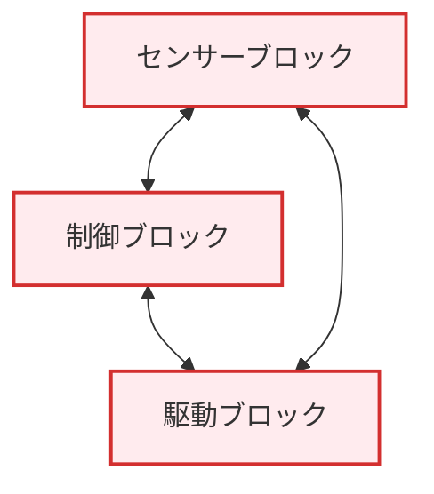
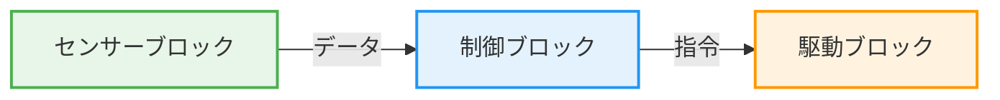
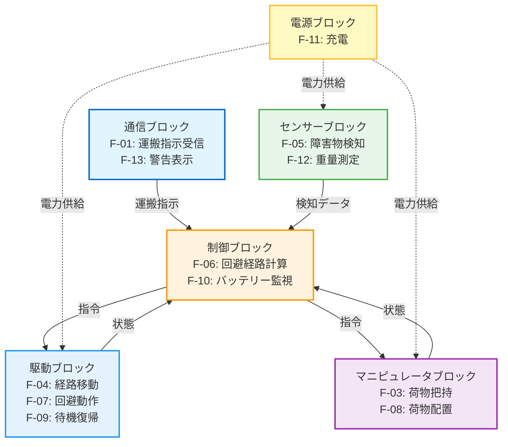

# 第7回: システムアーキテクチャ設計の勘所 - 機能から構造へ

## この記事を読んでほしい人

- 「システムをどう分割すればいいか分からない」人
- ユースケースから設計への繋げ方が分からない人
- 「なんとなく」でモジュール分割している人

## はじめに: 「とりあえずモジュール分け」の限界

前回、要求配分の方法を学びました。

でも、配分の前に**もっと重要な決定**があります:

> **システムをどう分割するか？（アーキテクチャ設計）**

**よくある失敗**:

```
【キックオフ】
リーダー: 「じゃあ、モジュール分けしようか」
開発者A: 「センサー処理モジュールと制御モジュールで」
開発者B: 「あと、通信モジュールも」
リーダー: 「OK、それで行こう」

【3ヶ月後】
開発者A: 「このセンサーデータ、制御モジュールと通信モジュール、どっちが処理するんだっけ？」
開発者B: 「え、両方じゃない？」
開発者A: 「じゃあ、データ共有どうする？」
  ↓ 設計見直し、大幅手戻り
```

**問題**: 「なんとなく」で分割すると、後で破綻する

この記事では、**ユースケース（お客さんの使い方）から、システムアーキテクチャ（構造）を導く方法**を解説します。

---

## 1. なぜ「ユースケース→機能→構造」の順番なのか

### 間違ったアプローチ: いきなり構造から考える

**ダメな例**:

```
エンジニア: 「AGVを作るには…
  - センサーモジュール
  - 制御モジュール
  - 通信モジュール
  が必要だな」

↓ 実装

お客さん: 「障害物を回避する機能がないんだけど」
エンジニア: 「え、どのモジュールに入れるんだ…」
```

**問題**:
- お客さんの使い方（ユースケース）を考えていない
- 必要な機能が何かを考えていない
- 「モジュール」が先に決まっているので、機能が後付けになる

### 正しいアプローチ: ユースケース→機能→構造

```
【ステップ1: ユースケース】
お客さんがどう使うか？
→ 「荷物を倉庫からラインへ運ぶ」

【ステップ2: 機能】
そのために必要な機能は？
→ 「運搬指示を受信する」
   「荷物をピックアップする」
   「目的地まで移動する」
   「障害物を回避する」
   「荷物を降ろす」

【ステップ3: 構造（モジュール）】
これらの機能を、どうグループ化する？
→ 「移動」関連 → 駆動モジュール
   「回避」関連 → センサーモジュール + 制御モジュール
   「通信」関連 → 通信モジュール
```

**ポイント**:
お客さんの使い方から逆算することで、**必要な機能**が見える。機能が見えれば、**適切なモジュール分割**ができる。

---

## 2. ステップ1: ユースケースから機能を抽出する

### ユースケースとは（復習）

**定義**: システムと人（または外部システム）のやり取り

**AGVの例**:

```
【ユースケース: 荷物を倉庫からラインへ運ぶ】

アクター: 作業員

正常フロー:
1. 作業員がタブレットで運搬指示を入力
2. AGVが指定場所に移動
3. AGVが荷物をピックアップ
4. AGVが目的地へ移動（障害物を回避しながら）
5. AGVが荷物を降ろす
6. AGVが待機位置へ戻る

例外フロー:
- 経路上に障害物がある → 回避ルートを選択
- バッテリー残量が20%以下 → 充電ステーションへ移動
- 荷物が重すぎる → 警告を表示、運搬中止
```

### 機能抽出の3ステップ

#### 抽出ステップ1: 正常フローから機能を読み取る

| ユースケースのステップ | 抽出される機能 | 機能ID |
|-------------------|------------|--------|
| 運搬指示を入力 | **運搬指示を受信する** | F-01 |
| 指定場所に移動 | **指定座標へ移動する** | F-02 |
| 荷物をピックアップ | **荷物を把持する** | F-03 |
| 目的地へ移動 | **経路に沿って移動する** | F-04 |
| （障害物を回避しながら） | **障害物を検知する** | F-05 |
| （障害物を回避しながら） | **回避経路を計算する** | F-06 |
| （障害物を回避しながら） | **回避動作を実行する** | F-07 |
| 荷物を降ろす | **荷物を配置する** | F-08 |
| 待機位置へ戻る | **待機位置へ移動する** | F-09 |

#### 抽出ステップ2: 例外フローから機能を追加

| 例外シナリオ | 抽出される機能 | 機能ID |
|-----------|------------|--------|
| バッテリー残量20%以下 | **バッテリー残量を監視する** | F-10 |
| 充電ステーションへ移動 | **充電ステーションへ移動する** | F-11 |
| 荷物が重すぎる | **荷物重量を測定する** | F-12 |
| 警告を表示 | **警告メッセージを表示する** | F-13 |

#### 抽出ステップ3: 機能階層を作る

```
AGVシステムの機能階層

F-01: 運搬指示受信機能
F-02: 移動機能
  ├─ F-04: 経路移動機能
  ├─ F-05: 障害物検知機能
  ├─ F-06: 回避経路計算機能
  ├─ F-07: 回避動作実行機能
  └─ F-09: 待機位置復帰機能
F-03: 荷物操作機能
  ├─ F-03: 荷物把持機能
  ├─ F-08: 荷物配置機能
  └─ F-12: 荷物重量測定機能
F-10: バッテリー管理機能
  ├─ F-10: バッテリー監視機能
  └─ F-11: 充電機能
F-13: 表示機能
  └─ F-13: 警告表示機能
```

---

## 3. ステップ2: 機能をブロック（モジュール）にグループ化する

### ブロック化の3つの基準

#### 基準1: 機能の凝集度（Cohesion）

**定義**: 関連する機能を同じブロックにまとめる

**AGVの例**:

| 機能グループ | ブロック名 | 含まれる機能 |
|-----------|----------|------------|
| 「移動」関連 | **駆動ブロック** | F-04（経路移動）、F-07（回避動作）、F-09（待機位置復帰） |
| 「検知」関連 | **センサーブロック** | F-05（障害物検知）、F-12（重量測定） |
| 「判断」関連 | **制御ブロック** | F-06（回避経路計算）、F-10（バッテリー監視） |
| 「荷物操作」関連 | **マニピュレータブロック** | F-03（荷物把持）、F-08（荷物配置） |
| 「電力」関連 | **電源ブロック** | F-11（充電） |
| 「通信」関連 | **通信ブロック** | F-01（運搬指示受信）、F-13（警告表示） |

**凝集度が高い（良い）**:
```
✅ センサーブロックには、「検知」関連の機能だけが集まっている
```

**凝集度が低い（悪い）**:
```
❌ センサーブロックに、「検知」と「充電」が混じっている
  → 関係ない機能が同居している
```

#### 基準2: 結合度（Coupling）

**定義**: ブロック間の依存関係を最小化する

**AGVの例**:

**悪い設計（結合度が高い）**:



**良い設計（結合度が低い）**:



**ポイント**:
- センサーは制御にデータを渡すだけ
- 制御は駆動に指令を出すだけ
- 双方向通信を避ける

#### 基準3: 責務の明確化（Single Responsibility）

**定義**: 各ブロックが1つの責務だけを持つ

**AGVの例**:

| ブロック | 責務（やること） | やらないこと |
|---------|----------------|------------|
| **センサーブロック** | 環境を認識する | ✅ 検知する / ❌ 判断しない |
| **制御ブロック** | 判断・計画する | ✅ 経路計算 / ❌ 実際に動かさない |
| **駆動ブロック** | 物理的に移動する | ✅ モーター制御 / ❌ 経路計算しない |

**悪い例（責務が不明確）**:

```
❌ センサーブロックが「検知」と「回避判断」の両方をする
  → センサーの仕事は「検知」だけ。「判断」は制御ブロックの仕事
```

### AGVのブロック図

**最終的なブロック構成**:



---

## 4. ステップ3: ブロック間のインターフェイスを定義する

### インターフェイスとは

**定義**: ブロック間でやり取りするデータ・指令

**AGVの例**:

```
【シナリオ: 障害物検知→停止】

センサーブロック ──[障害物座標]──→ 制御ブロック ──[停止指令]──→ 駆動ブロック
```

### インターフェイス定義の4要素

| 要素 | 説明 | AGVの例 |
|------|------|--------|
| **データ内容** | 何を送るか | 障害物の座標（X, Y, Z） |
| **データ形式** | どんな形式か | JSON形式: `{"x": 10.5, "y": 5.2, "z": 0.3}` |
| **通信方式** | どうやって送るか | CAN通信 |
| **タイミング** | いつ送るか | 100Hz周期（10msごと） |

### インターフェイス要求の作成

**シナリオ別のインターフェイス**:

#### IF1: センサー → 制御（障害物情報）

```
IF-001: センサーブロックは、障害物座標を制御ブロックに送信しなければならない

詳細仕様:
- データ内容: 障害物の3次元座標（X, Y, Z）[単位: m]
- データ形式: JSON形式
- 通信方式: CAN（500kbps）
- 更新周期: 100Hz（10ms周期）
- 遅延: 10ms以内
```

#### IF-002: 制御 → 駆動（速度指令）

```
IF-002: 制御ブロックは、速度指令を駆動ブロックに送信しなければならない

詳細仕様:
- データ内容: 目標速度（前後、左右、回転）[単位: m/s, rad/s]
- データ形式: バイナリ（12バイト）
- 通信方式: CAN（500kbps）
- 更新周期: 50Hz（20ms周期）
- 遅延: 5ms以内
```

#### IF-003: 電源 → 全ブロック（電力供給）

```
IF-003: 電源ブロックは、各ブロックに電力を供給しなければならない

詳細仕様:
- 供給電圧: 28V ± 4V
- 最大供給電力: 200W
- リップル: 100mV以下
- 過電流保護: 10A以上でシャットダウン
```

### インターフェイスマトリクス

**全インターフェイスの一覧**:

| IF ID | 送信元 | 受信先 | データ内容 | 周期 | 通信方式 | 関連要求 |
|-------|--------|--------|----------|------|---------|---------|
| IF-001 | センサー | 制御 | 障害物座標 | 100Hz | CAN | REQ-005 |
| IF-002 | 制御 | 駆動 | 速度指令 | 50Hz | CAN | REQ-002 |
| IF-003 | 電源 | 全ブロック | 電力供給 | - | 配線 | REQ-003 |
| IF-004 | 制御 | 通信 | 状態情報 | 10Hz | UART | REQ-013 |
| IF-005 | 通信 | 制御 | 運搬指示 | イベント駆動 | UART | REQ-001 |

---

## 5. よくある設計判断: ホワイトボード1枚で決める

### 設計判断1: 「この機能、どのブロックに入れる？」

**シナリオ**: 「荷物の重量測定」機能は、どこに入れるべきか？

**候補**:
- A案: センサーブロック（重量センサーがあるから）
- B案: マニピュレータブロック（荷物を扱うから）
- C案: 制御ブロック（判断に使うから）

**判断プロセス**:

```
【ステップ1: 責務を確認】
- センサーブロック: 環境を認識する → 重量も「検知」の一種 ✅
- マニピュレータブロック: 荷物を操作する → 「測定」は責務外 ❌
- 制御ブロック: 判断・計画する → 「測定」は責務外、判断で「使う」だけ ❌

【ステップ2: 物理的配置を確認】
- 重量センサーはどこに付ける？ → マニピュレータの下

【ステップ3: 結合度を確認】
- センサーブロックに入れた場合: センサー→制御への IF が1本増えるだけ ✅
- マニピュレータブロックに入れた場合: マニピュレータ→制御への IF が必要 △

【結論】
A案（センサーブロック）に決定
理由: 「検知」という責務に合致、結合度も低い
```

### 設計判断2: 「このブロック、さらに分割すべき？」

**シナリオ**: センサーブロックが大きすぎる気がする

**現状**:

```
センサーブロック
├── 障害物検知（LiDAR）
├── 床面検知（カメラ）
├── 荷物検知（重量センサー）
└── バッテリー残量検知
```

**判断プロセス**:

```
【ステップ1: 凝集度を確認】
- 障害物・床面・荷物検知: 全て「環境認識」 → 凝集度高い ✅
- バッテリー残量検知: 「環境認識」ではない → 凝集度低い ❌

【ステップ2: 物理的分離を確認】
- バッテリー残量検知は、電源ブロックの一部？ → Yes

【結論】
バッテリー残量検知を電源ブロックに移動
```

**修正後**:

```
センサーブロック（環境認識）
├── 障害物検知
├── 床面検知
└── 荷物検知

電源ブロック（電力管理）
├── バッテリー充電
├── バッテリー残量検知 ← 移動
└── 電力供給
```

### 設計会議の進め方（1時間版）

**タイムテーブル**:

| 時間 | 内容 | 成果物 |
|------|------|--------|
| **0-10分** | ユースケース確認 | ユースケース図（ホワイトボード） |
| **10-25分** | 機能抽出 | 機能リスト（付箋） |
| **25-40分** | ブロック化 | ブロック図（ホワイトボード） |
| **40-55分** | インターフェイス確認 | インターフェイス一覧（ホワイトボード） |
| **55-60分** | レビュー・合意 | 写真撮影→議事録 |

**必要なもの**:
- ホワイトボード or 模造紙
- 付箋（3色: 機能/ブロック/インターフェイス）
- マーカー
- スマホ（写真撮影用）

---

## 6. NASA理論との接続: 論理分解プロセス

### NASA SE Handbook の教え

**NASA SE Handbook Section 4.3.1.2.2 (p.76) からの引用**:

> "Three key steps in performing functional analysis are:
> 1. **Translate top-level requirements into functions** that should be performed to accomplish the requirements.
> 2. Decompose and allocate the functions to lower levels of the product breakdown structure.
> 3. Identify and describe functional and subsystem interfaces."

**翻訳**:

```
機能分析の3つのステップ:
1. トップレベル要求を、要求を達成するための「機能」に変換する
2. 機能を分解し、下位レベル（サブシステム）に配分する
3. 機能間・サブシステム間のインターフェイスを識別・記述する
```

**この記事との対応**:

| NASA のステップ | この記事のステップ |
|--------------|----------------|
| ステップ1: 要求→機能 | ユースケース→機能抽出 |
| ステップ2: 機能→サブシステム | 機能→ブロック化 |
| ステップ3: IF識別 | ブロック間IF定義 |

### NASA の警告: 早期決定の重要性

**NASA SE Handbook Figure 2.5-1 (p.14)**:

> "Design phase expends 15% of costs but commits 75% of life cycle costs."

**翻訳**:

```
設計段階で使われる予算は全体の15%だが、
この段階の決定が、ライフサイクル全体のコストの75%を決める
```

**つまり**:

```
【アーキテクチャ設計段階】
予算: 15%
決まること: 75%のコスト ← ここでミスると後で取り返しがつかない！

【実装・テスト段階】
予算: 85%
変更コスト: 設計時の500-1000倍
```

**教訓**: アーキテクチャ設計に時間をかけることは、後のコスト削減に直結する

---

## 7. 実践ポイント: アーキテクチャ設計チェックリスト

### ユースケースから機能抽出（5項目）

```
□ 正常フローから機能を全て抽出したか？
□ 例外フローから機能を全て抽出したか？
□ 機能を階層化したか？
□ 各機能に機能IDを付けたか？
□ お客さんまたはチームで確認したか？
```

### 機能からブロック化（5項目）

```
□ 関連する機能を同じブロックにまとめたか？（凝集度）
□ ブロック間の依存を最小化したか？（結合度）
□ 各ブロックの責務を明確に定義したか？
□ ブロック図を描いたか？
□ 物理的な配置と整合しているか？
```

### インターフェイス定義（5項目）

```
□ 全てのブロック間接続を洗い出したか？
□ 各IFのデータ内容を定義したか？
□ 各IFの通信方式・周期を決めたか？
□ インターフェイスマトリクスを作成したか？
□ 各IFに関連する要求を紐付けたか？
```

---

## 8. まとめ: アーキテクチャは「機能」から決まる

**この記事のポイント**:

1. **正しい順番: ユースケース→機能→構造**
   - いきなり「モジュール分け」しない
   - お客さんの使い方（ユースケース）から逆算

2. **機能抽出の3ステップ**
   - 正常フローから機能を読み取る
   - 例外フローから機能を追加
   - 機能階層を作る

3. **ブロック化の3つの基準**
   - 凝集度: 関連する機能をまとめる
   - 結合度: ブロック間の依存を最小化
   - 責務: 各ブロックが1つの責務だけを持つ

4. **インターフェイス定義の4要素**
   - データ内容・データ形式・通信方式・タイミング

5. **ホワイトボード1枚で1時間で決める**
   - 設計会議: ユースケース確認→機能抽出→ブロック化→IF確認

**次回予告**:

第8回では、「検証と妥当性確認の実務」を解説します。

- Verification（検証）と Validation（妥当性確認）の違い
- 「要求は満たすが使えないシステム」を避ける方法
- テストケースと要求のトレーサビリティ

作ったシステムが「正しく動く」だけでなく、「お客さんの問題を解決する」ことを確認する方法を学びます。

---

## ダウンロード資料

### 1. 機能抽出ワークシート Excel

```
【3シート構成】
- シート1: ユースケース記述
- シート2: 機能リスト（正常フロー由来）
- シート3: 機能リスト（例外フロー由来）
```

### 2. ブロック図テンプレート PowerPoint

```
【含まれる図】
- ブロック構成図（四角と矢印）
- インターフェイスマトリクス
- 責務定義表
```

### 3. アーキテクチャ設計チェックリスト PDF

```
【15項目チェックシート】
- ユースケース→機能: 5項目
- 機能→ブロック: 5項目
- インターフェイス定義: 5項目
```

---

## 参考資料

- NASA SE Handbook Rev 2, Section 4.3.1.2.1 (p.75): System Architecture Definition
- NASA SE Handbook Rev 2, Section 4.3.1.2.2 (p.76): Functional Analysis（機能分析の3ステップ）
- NASA SE Handbook Figure 2.5-1 (p.14): Cost to Change（早期決定の重要性）
- OOSEM (Object-Oriented Systems Engineering Method): Use Case駆動アプローチ

---

**執筆者より**:

アーキテクチャ設計は、プロジェクトの成否を決める最重要ポイントです。「なんとなく」で決めるのではなく、お客さんの使い方（ユースケース）から逆算して、機能→構造の順で考えてください。

ホワイトボード1枚と1時間あれば、チーム全員で合意できるアーキテクチャを作れます。

次回は、検証と妥当性確認の違いを学びます。お楽しみに！
