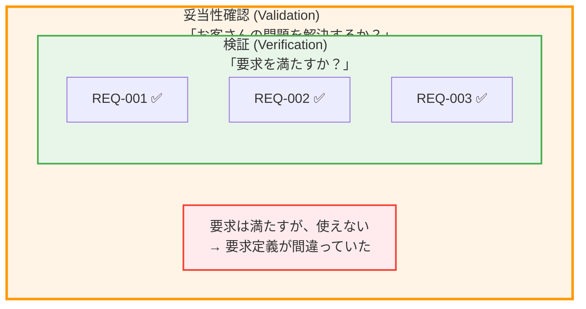
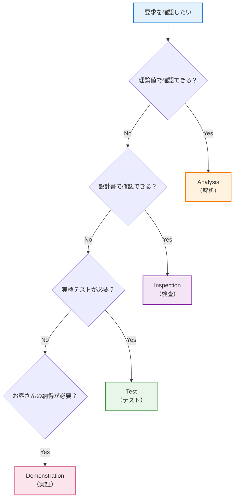
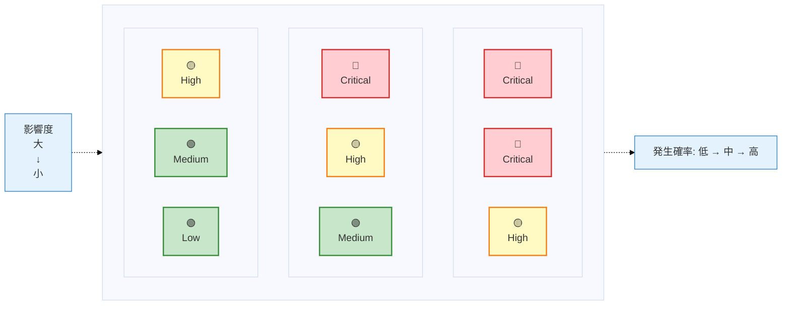

# 第8回: 検証と妥当性確認の実務 ── 「要求を満たす」と「使える」は違う

## よくある会話

**開発者A**: 「テスト全部パスしました！要求は全部満たしてます！」

**お客さん**: 「でも、使いにくいんだよね…こんなの現場で使えないよ」

**開発者A**: 「え、でも要求定義書には書いてなかったですよね…？」

**お客さん**: 「言わなくても分かるでしょ、普通…」

---

**開発者B**: 「検証計画、要求が100個あるから、テストケース100個作らないと…」

**上司**: 「納期まであと1ヶ月しかないんだけど？」

**開発者B**: 「でも全部テストしないと品質保証できません！」

**上司**: 「現実的に考えてよ…何が本当に重要なの？」

---

こんな経験、ありませんか？

「要求を満たしているのに使えない」「テストはパスしたのにクレームが来る」「検証に時間がかかりすぎて納期に間に合わない」──。

今回は、**検証（Verification）と妥当性確認（Validation）の実務**について解説します。

両者の違いを理解し、**限られた時間で効果的にテストする方法**を学びましょう。

---

## 1. 検証と妥当性確認の違い

### 1.1 定義の違い（INCOSE NRM 2.3.1）

| 用語 | 英語 | 定義 | 問い |
|------|------|------|------|
| **検証** | Verification | システムが**要求を満たしているか**を確認するプロセス | 「正しく作ったか？」 |
| **妥当性確認** | Validation | システムが**お客さんの問題を解決するか**を確認するプロセス | 「正しいものを作ったか？」 |

**NASA SE Handbook 4.4.1.1**も同様の定義:
- Verification: "Did we build the system right?"
- Validation: "Did we build the right system?"

---

### 1.2 具体例で理解する

#### 例1: AGV（倉庫ロボット）の最高速度

**要求**: REQ-005「AGVは最高速度2.0m/sで移動すること」

**検証（Verification）**:
- 実機テストで速度を測定
- 結果: 2.0m/s → ✅ 合格（要求を満たす）

**妥当性確認（Validation）**:
- 実際の倉庫で運用
- 結果: 「速すぎて作業者が怖がる。荷物も荷崩れする」 → ❌ 不合格（使えない）

**結論**: 検証はパスしたが、妥当性確認で問題が発覚。

---

#### 例2: スマホアプリのログイン機能

**要求**: REQ-012「ユーザーIDとパスワードでログインできること」

**検証（Verification）**:
- 正しいID/パスワードでログイン成功 → ✅
- 間違ったパスワードでログイン失敗 → ✅
- 要求を満たしている

**妥当性確認（Validation）**:
- 実際にユーザーに使ってもらう
- 結果: 「パスワードを忘れたときのリセット機能がない。使えない」 → ❌

**結論**: 要求には書いてなかったが、実用上は必須の機能が欠けていた。

---

### 1.3 両者の関係



**重要な教訓**:
- 検証だけでは不十分
- 妥当性確認で「本当に使えるか」を確認しないと、手戻りが発生する

---

## 2. 検証の4つの手法（TAID）

### 2.1 TAID法の全体像

**INCOSE NRM 2.3.2**で推奨されている4つの検証手法:

| 手法 | 英語 | いつ使う | コスト | AGVの例 |
|------|------|---------|--------|--------|
| **Test** | Testing | 動作・性能を実機で確認 | 高 | 50kg荷物を運搬できるか実機テスト |
| **Analysis** | Analysis | 理論値・計算で確認 | 低 | バッテリー容量から連続稼働時間を計算 |
| **Inspection** | Inspection | 設計書・図面を目視確認 | 中 | 設計図でセンサー配置を確認 |
| **Demonstration** | Demonstration | お客さんに動作を見せる | 中 | 実際に障害物を回避する様子を実演 |

---

### 2.2 各手法の詳細

#### (1) Test（テスト）

**使う場面**:
- 動作確認（ちゃんと動くか？）
- 性能確認（速度・精度は要求を満たすか？）

**AGVの例**:
- REQ-003「50kgの荷物を運搬できること」
  - **テスト内容**: 50kgのダミー荷物を載せて実機テスト
  - **合格基準**: 10m移動して荷物が落下しないこと
  - **結果**: ✅ 合格

**注意点**:
- コストが高い（実機が必要）
- 環境によって結果が変わる（温度、湿度など）
- 破壊テストは1回しかできない

---

#### (2) Analysis（解析）

**使う場面**:
- 理論値で確認できるもの
- 実機テストが難しい・危険なもの
- 早い段階で確認したいもの

**AGVの例**:
- REQ-007「連続稼働時間は8時間以上であること」
  - **解析内容**:
    - バッテリー容量: 100Wh
    - 平均消費電力: 10W
    - 計算: 100Wh ÷ 10W = 10時間
  - **合格基準**: 計算結果 ≥ 8時間
  - **結果**: ✅ 合格（10時間 > 8時間）

**メリット**:
- コストが低い（計算だけで済む）
- 設計段階で確認できる
- 再現性が高い

---

#### (3) Inspection（検査）

**使う場面**:
- 設計書・図面の確認
- 部品の外観確認
- 標準・規格への適合確認

**AGVの例**:
- REQ-015「障害物検知センサーを前後左右に配置すること」
  - **検査内容**: 設計図面を見てセンサー配置を確認
  - **合格基準**: 4方向すべてにセンサーが配置されている
  - **結果**: ✅ 合格

- REQ-018「防水規格IP54に準拠すること」
  - **検査内容**: 部品の仕様書を確認
  - **合格基準**: IP54の記載がある
  - **結果**: ✅ 合格

**注意点**:
- 目視確認なので見落としリスクがある
- 実際の動作は確認できない

---

#### (4) Demonstration（実証・デモンストレーション）

**使う場面**:
- お客さんに動作を見せる
- 定性的な機能（「使いやすさ」など）を確認
- 操作性・UI/UXの確認

**AGVの例**:
- REQ-010「障害物を検知したら安全に停止すること」
  - **実証内容**: お客さんの前で、障害物（段ボール箱）を置いてAGVが停止する様子を見せる
  - **合格基準**: お客さんが「安全だ」と納得する
  - **結果**: ✅ 合格

- REQ-022「運搬状況をタブレットで確認できること」
  - **実証内容**: タブレット画面を見せながら、リアルタイムで位置が更新される様子を実演
  - **合格基準**: お客さんが「これなら使える」と納得
  - **結果**: ✅ 合格

**メリット**:
- お客さんの納得感が得られる
- 定性的な要求の確認に有効
- 妥当性確認（Validation）も兼ねられる

---

### 2.3 どの手法を使うか？（選択基準）

**基本ルール**:
1. まず**Analysis**で理論確認（設計段階）
2. 次に**Inspection**で設計書確認（実装前）
3. 実装後に**Test**で実機確認（プロトタイプ）
4. 最後に**Demonstration**でお客さん確認（納品前）

**選択のフローチャート**:



---

### 2.4 検証マトリックスの作り方

**Excelテンプレート例**:

| 要求ID | 要求内容 | 検証方法 | テスト手順 | 合格基準 | 担当者 | 状態 |
|--------|---------|---------|----------|---------|--------|------|
| REQ-001 | AGVは荷物を受け取り、指定座標へ運搬すること | Test | TC-001参照 | 誤差±10cm以内 | 山田 | ✅合格 |
| REQ-002 | 1.0秒以内に移動を開始すること | Test | TC-002参照 | 平均≤1.0秒 | 田中 | ✅合格 |
| REQ-003 | 50kgの荷物を運搬できること | Test | TC-003参照 | 10m移動可能 | 山田 | ✅合格 |
| REQ-005 | 最高速度2.0m/sで移動すること | Test | TC-005参照 | 測定値≥2.0m/s | 田中 | ✅合格 |
| REQ-007 | 連続稼働時間は8時間以上であること | Analysis | 計算式参照 | 計算値≥8h | 鈴木 | ✅合格 |
| REQ-010 | 障害物を検知したら安全に停止すること | Demonstration | お客さんの前で実演 | お客さん承認 | 山田 | ✅合格 |
| REQ-015 | 障害物検知センサーを前後左右に配置すること | Inspection | 設計図確認 | 4方向配置 | 鈴木 | ✅合格 |
| REQ-018 | 防水規格IP54に準拠すること | Inspection | 仕様書確認 | IP54記載 | 鈴木 | ✅合格 |

**ポイント**:
- 要求IDと検証方法を1対1で紐付ける（トレーサビリティ）
- 合格基準は曖昧にしない（「適切に」ではなく「±10cm以内」）
- 状態を記録（未実施、実施中、合格、不合格）

---

## 3. 妥当性確認（Validation）の実務

### 3.1 妥当性確認の3つのタイミング

| タイミング | やること | AGVの例 |
|-----------|---------|--------|
| **要求定義後** | お客さんに要求定義書をレビューしてもらう | 「50kg運搬」「速度2.0m/s」でよいか確認 |
| **プロトタイプ完成後** | 実機をお客さんに見せて、使い勝手を確認 | 実際に動かして「速すぎる」などの意見を聞く |
| **納品前** | 本番環境でお客さんと一緒にテスト | 実際の倉庫で運用して問題ないか確認 |

---

### 3.2 「要求を満たすが使えない」を防ぐ5つのチェック

#### チェック1: 実際のユーザーに触ってもらったか？

**ダメな例**:
- 開発チーム内だけでテスト
- 「技術的には問題ない」と判断

**良い例**:
- 実際の倉庫作業者に操作してもらう
- 「ボタンが小さくて押しにくい」などのフィードバックを得る

---

#### チェック2: 本番環境で動かしたか？

**ダメな例**:
- 開発室の平らな床でしかテストしていない

**良い例**:
- 実際の倉庫（床が凸凹、照明が暗い、荷物が散乱）でテスト
- 環境による問題を発見

---

#### チェック3: 1日の業務フロー全体で使えるか？

**ダメな例**:
- 「荷物を運ぶ」機能だけをテスト

**良い例**:
- 1日の業務フロー全体をシミュレーション:
  - 朝: システム起動
  - 日中: 繰り返し運搬
  - 夕方: バッテリー残量低下時の動作
  - 夜: システム終了
- 「バッテリー残量低下時に警告が出ない」などの問題を発見

---

#### チェック4: エラー時の対応は現実的か？

**ダメな例**:
- エラーが出たら「システム管理者に連絡してください」と表示

**良い例**:
- 現場の作業者が自分で対処できる仕組み:
  - 「障害物を取り除いてリトライボタンを押してください」
  - 「バッテリーを交換してください」

---

#### チェック5: お客さんの「言ってないけど当然」を満たすか？

**例**:
- 要求には書いてないが、実用上は必須:
  - 「停止ボタン」（緊急時に止められる）
  - 「バッテリー残量表示」（いつ充電すべきか分かる）
  - 「エラーログ」（トラブル時に原因を調査できる）

**対策**:
- プロトタイプを早めに見せて、フィードバックをもらう

---

### 3.3 妥当性確認の記録

**フォーマット例**:

```
【妥当性確認報告書】

日時: 2024年12月15日
場所: お客さま倉庫（実環境）
参加者: お客さま（佐藤さん、田中さん）、開発チーム（山田、鈴木）

■ 確認内容
1. 実際の倉庫での運用テスト（2時間）
2. 作業者による操作テスト

■ お客さまのフィードバック
✅ 良かった点:
- 障害物回避がスムーズ
- タブレットの画面が見やすい

❌ 改善要望:
- 速度が速すぎて怖い（2.0m/s → 1.5m/sに下げてほしい）
- 停止ボタンがほしい（緊急時に止められない）
- バッテリー残量が分からない

■ 対応方針
- 速度: 1.5m/sに変更（要求を修正）
- 停止ボタン: 追加実装
- バッテリー残量: 画面に表示追加

■ 結論
条件付き合格（上記3点を修正後、再確認）
```

---

## 4. 「全部テストする時間がない」問題

### 4.1 よくある悩み

**開発者**: 「要求が100個あるのに、納期まで1ヶ月しかない…全部テストできません」

**現実**:
- 要求が多すぎる
- テストに時間がかかる
- でも品質は保証しないといけない

**どうする？** → **Phase 0戦略**

---

### 4.2 Phase 0戦略（NASA SE Handbook 4.4.2.2）

**考え方**:
- 100個の要求を全部テストするのは無理
- **本当に重要な要求だけ**を優先的にテストする

**Phase 0の3ステップ**:

#### ステップ1: 要求に優先度をつける

| 優先度 | 定義 | AGVの例 |
|--------|------|--------|
| **Critical** | これが壊れたら事故・大損害 | 障害物検知、緊急停止 |
| **High** | これが壊れたら業務が止まる | 運搬機能、バッテリー稼働時間 |
| **Medium** | 不便だが業務は続けられる | タブレット画面の見やすさ |
| **Low** | あると便利 | 運搬履歴のグラフ表示 |

---

#### ステップ2: Critical/Highだけをテストする

**Phase 0の範囲**:
- Critical: 10個（100%テスト）
- High: 30個（100%テスト）
- Medium: 40個（一部テスト or Inspection/Analysisで代用）
- Low: 20個（時間があればテスト）

**現実的な目標**:
- Phase 0: Critical/High の40個を確実にテスト（納期1ヶ月前）
- Phase 1: Mediumの一部をテスト（納期直前）
- Phase 2: Lowは納品後に改善（余裕があれば）

---

#### ステップ3: リスクベースでテストを設計

**考え方**:
- 「事故が起きやすい」 × 「影響が大きい」 = リスクが高い

**リスクマトリックス**:



- 🔴 Critical: 必ずテスト
- 🟡 High: できるだけテスト
- 🟢 Medium/Low: 時間があればテスト

**AGVの例**:

| 要求 | 発生確率 | 影響度 | リスク | 優先度 |
|------|---------|--------|--------|--------|
| 障害物検知失敗 | 中 | 大（事故） | 🔴 | Critical |
| バッテリー切れ | 高 | 中（業務停止） | 🟡 | High |
| 画面が見にくい | 高 | 小（不便） | 🟢 | Medium |
| ログのグラフ表示バグ | 低 | 小（影響なし） | 🟢 | Low |

---

### 4.3 優先度の決め方（2時間ワークショップ）

**参加者**:
- 開発チーム
- お客さん（可能であれば）

**手順**:

1. **要求リストを印刷**（10分）
2. **お客さんに聞く**（30分）:
   - 「どれが壊れたら一番困りますか？」
   - 「どれが事故につながりますか？」
3. **Critical/High/Medium/Lowに分類**（30分）
4. **Critical/Highの要求数を数える**（10分）
   - 目安: 全体の30-40%
5. **Phase 0の範囲を決定**（30分）
   - Critical: 100%テスト
   - High: 100%テスト
   - Medium: 一部テスト or Inspection/Analysis
   - Low: テストしない（納品後に改善）
6. **検証計画を更新**（10分）

**成果物**:
- 優先度付き要求リスト
- Phase 0テスト範囲

---

## 5. トレーサビリティ（追跡可能性）

### 5.1 なぜトレーサビリティが必要か？

**問題**:
- 「この要求、テストしたっけ？」
- 「テストケース50番は、どの要求を確認してるの？」
- 「要求が変更されたけど、どのテストを再実行すればいい？」

**解決策**: 要求 ↔ テストケースを紐付ける（トレーサビリティ）

---

### 5.2 トレーサビリティマトリックス

**Excelテンプレート例**:

| 要求ID | 要求内容 | テストケースID | テスト内容 | 状態 |
|--------|---------|---------------|----------|------|
| REQ-001 | AGVは荷物を受け取り、指定座標へ運搬すること | TC-001 | 座標(10,20)へ運搬 | ✅合格 |
| REQ-002 | 1.0秒以内に移動を開始すること | TC-002 | 起動から移動開始までの時間測定 | ✅合格 |
| REQ-003 | 50kgの荷物を運搬できること | TC-003 | 50kgダミー荷物で10m移動 | ✅合格 |
| REQ-005 | 最高速度2.0m/sで移動すること | TC-005 | 速度測定 | ✅合格 |
| REQ-007 | 連続稼働時間は8時間以上であること | TC-007 | バッテリー消費計算 | ✅合格 |
| REQ-010 | 障害物を検知したら安全に停止すること | TC-010 | 障害物を置いて停止確認 | ✅合格 |
| REQ-015 | 障害物検知センサーを前後左右に配置すること | TC-015 | 設計図確認 | ✅合格 |

**ポイント**:
- 要求ID 1つに対して、テストケースID 1つ以上
- 1つの要求を複数のテストケースで確認してもよい（例: 正常系、異常系）

---

### 5.3 カバレッジの測定

**テストカバレッジ** = テスト済み要求数 ÷ 全要求数 × 100%

**AGVの例**:
- 全要求数: 50個
- テスト済み: 40個
- カバレッジ: 40 ÷ 50 × 100% = **80%**

**目標**:
- Phase 0: Critical/High を100%カバー
- 全体: 80%以上（NASA推奨）

---

### 5.4 変更時のトレーサビリティ

**シナリオ**: REQ-005「最高速度2.0m/s」が「1.5m/s」に変更された

**トレーサビリティマトリックスを見る**:
- REQ-005 → TC-005（速度測定テスト）

**対応**:
1. TC-005のテストケースを修正（2.0m/s → 1.5m/s）
2. TC-005を再実行
3. 結果を記録

**メリット**:
- どのテストを再実行すればよいか、一目で分かる
- 変更の影響範囲が明確

---

## 6. よくある失敗と対策

### 失敗1: 「検証だけして、妥当性確認を忘れた」

**現象**:
- テストは全部パス
- でもお客さんから「使えない」とクレーム

**原因**:
- 要求を満たすことだけを確認
- お客さんが本当に必要としている機能を確認していない

**対策**:
- プロトタイプを早めにお客さんに見せる（要求定義後、1-2週間以内）
- 「言ってないけど当然」を引き出すための質問:
  - 「実際に使うときに、何があると便利ですか？」
  - 「逆に、何があると困りますか？」

---

### 失敗2: 「全部テストしようとして、納期に間に合わなかった」

**現象**:
- 要求が100個あるから、テストケース100個作った
- テストに時間がかかりすぎて納期オーバー

**原因**:
- 優先度をつけずに、全部テストしようとした

**対策**:
- Phase 0戦略を使う
- Critical/Highだけを確実にテスト
- Medium/Lowは時間があればテスト

---

### 失敗3: 「トレーサビリティがなくて、変更時に混乱」

**現象**:
- 要求が変更されたが、どのテストを再実行すればよいか分からない
- 全部テストし直す → 時間がかかる

**原因**:
- 要求とテストケースの紐付けがない

**対策**:
- トレーサビリティマトリックスを作る
- Excelで管理（要求ID ↔ テストケースID）

---

### 失敗4: 「Testだけに頼って、コストがかかりすぎた」

**現象**:
- すべての要求を実機テストで確認
- テストに時間とコストがかかりすぎた

**原因**:
- TAID（Test, Analysis, Inspection, Demonstration）を使い分けていない

**対策**:
- まずAnalysisやInspectionで確認できないか検討
- 実機テストは本当に必要なものだけに絞る

---

### 失敗5: 「合格基準が曖昧で、合格か不合格か判断できない」

**現象**:
- 要求: 「使いやすいこと」
- テスト: 「なんとなく使いやすい気がする…合格？」

**原因**:
- 合格基準が曖昧（「適切に」「十分に」「使いやすい」）

**対策**:
- 要求定義の段階で、検証可能な要求にする:
  - ダメな例: 「使いやすいこと」
  - 良い例: 「ボタン操作は3クリック以内で完了すること」

---

## 7. 実践ポイント: 明日から使える検証・妥当性確認チェックリスト

### 7.1 検証計画の作成（プロジェクト開始時）

□ 1. 要求リストに優先度をつけたか？（Critical/High/Medium/Low）
□ 2. Critical/Highの要求数を数えたか？（Phase 0の範囲）
□ 3. 各要求に検証方法（TAID）を割り当てたか？
□ 4. トレーサビリティマトリックス（要求 ↔ テストケース）を作ったか？
□ 5. 検証のスケジュールは現実的か？

---

### 7.2 検証の実施

□ 6. まずAnalysis/Inspectionで確認できないか検討したか？
□ 7. Testは本当に必要なものだけに絞ったか？
□ 8. 合格基準は曖昧でないか？（数値で定義されているか）
□ 9. テスト結果を記録したか？（Excel、ツールなど）
□ 10. 不合格の要求は、原因を分析したか？

---

### 7.3 妥当性確認の実施

□ 11. プロトタイプをお客さんに見せたか？（要求定義後、1-2週間以内）
□ 12. 実際のユーザーに触ってもらったか？
□ 13. 本番環境で動かしたか？
□ 14. 1日の業務フロー全体で使えるか確認したか？
□ 15. エラー時の対応は現実的か？
□ 16. お客さんの「言ってないけど当然」を引き出したか?
□ 17. 妥当性確認の結果を記録したか？（報告書）

---

### 7.4 変更管理

□ 18. 要求が変更されたとき、トレーサビリティマトリックスで影響範囲を確認したか？
□ 19. 影響のあるテストケースを再実行したか？
□ 20. 変更履歴を記録したか？

---

## 8. まとめ

### 今回学んだこと

1. **検証（Verification）と妥当性確認（Validation）の違い**:
   - 検証: 「要求を満たすか？」
   - 妥当性確認: 「お客さんの問題を解決するか？」
   - 両方やらないと「要求は満たすが使えない」システムになる

2. **TAID法（4つの検証手法）**:
   - Test: 実機テスト（動作・性能確認）
   - Analysis: 理論値・計算（設計段階で確認）
   - Inspection: 設計書・図面の目視確認
   - Demonstration: お客さんに見せる（納得感）

3. **Phase 0戦略（時間がないときの対処法）**:
   - 全部テストは無理
   - Critical/High を優先的にテスト
   - リスクベースで範囲を絞る

4. **トレーサビリティ（追跡可能性）**:
   - 要求 ↔ テストケースを紐付ける
   - 変更時の影響範囲が明確になる

---

### 次回予告

次回（第9回）は、**「要求管理の現実解」**です。

- ExcelとDOORS/Jama、どちらを使うべきか？
- 要求変更管理（CCB: Change Control Board）の回し方
- トレーサビリティ監査の実施方法
- プロジェクト規模別のツール選択ガイド

「要求管理ツールを導入したけど、誰も使わない」──こんな失敗を避けるために、現実的な要求管理の方法を解説します。

お楽しみに！

---

## 参考文献

- **INCOSE NRVV**: Needs, Requirements, Verification, and Validation (NRM v2.1)
  - 2.3.1: Verification and Validation定義
  - 2.3.2: TAID法
- **NASA Systems Engineering Handbook** (NASA/SP-2016-6105 Rev2)
  - Section 4.4: Verification（検証）
  - Section 4.5: Validation（妥当性確認）
  - Section 4.4.2.2: Phase 0戦略

---

## ダウンロード資料

以下のテンプレートを用意しました（実際にはGitHubやプロジェクトサイトで配布）:

1. **検証マトリックス テンプレート（Excel）**
   - 要求ID、検証方法、合格基準を一元管理

2. **トレーサビリティマトリックス テンプレート（Excel）**
   - 要求 ↔ テストケース の紐付け

3. **妥当性確認報告書 テンプレート（Word）**
   - お客さんとの確認結果を記録

4. **Phase 0 優先度付けワークシート（Excel）**
   - Critical/High/Medium/Low の分類

5. **検証・妥当性確認チェックリスト（Excel）**
   - 20項目のチェックリスト

---

**次回**: 第9回「要求管理の現実解」（2025年1月下旬公開予定）