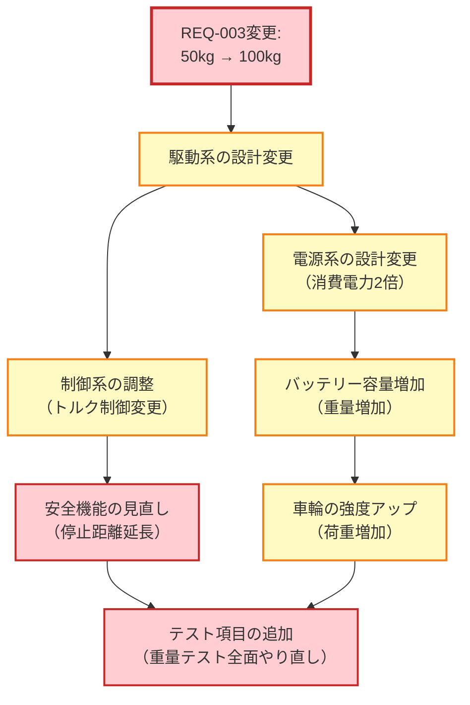
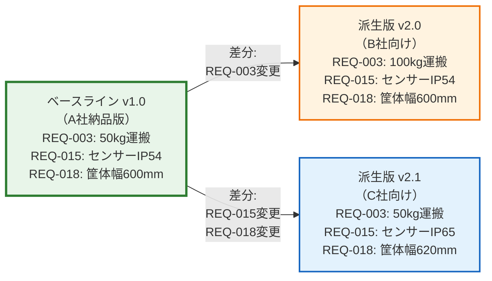
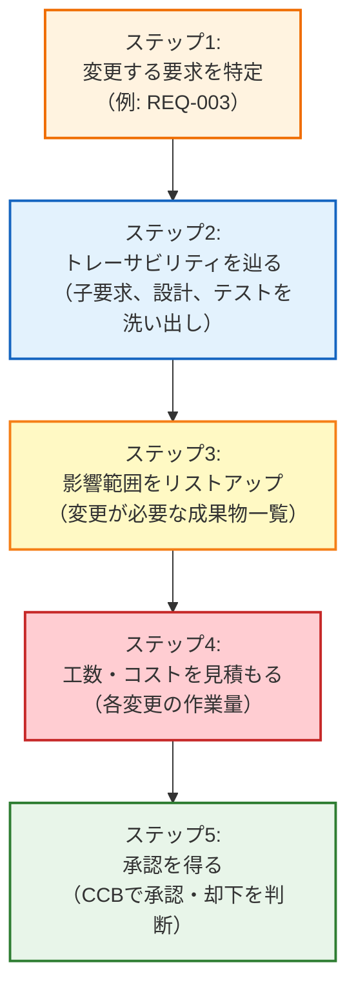

# 第11回: 派生開発という現実 ── 成功の後に訪れる新たな壁

## この記事を読んでほしい人

- 「第1弾が成功したから、第2弾は楽だろう」と思っているPM/エンジニア
- 派生開発で要求が膨らんで困っている開発チーム
- 既存システムの改修で手戻りが多発している人
- 「ちょっとした変更」のはずが大改修になった経験がある人

## はじめに: 成功の後に訪れる「嬉しい悲鳴」

第10回で、AGVプロジェクトは無事に納品できました。

**プロジェクト統計**:
- **期間**: 12週間（予定通り）
- **予算**: 予算内（オーバーなし）
- **手戻り**: 0件
- **顧客満足度**: 高評価

「これで一息つける...」

そう思った矢先、営業部から連絡が入ります。

```
営業: 「山田さん、朗報です！A社倉庫のAGVが評判になって、
      3社から追加受注が決まりました！」

PM（山田）: 「それは良かった！でも...」

営業: 「3社とも『基本は同じでいいけど、ウチの倉庫用に○○機能を追加して』
      って言ってます。ちょっとした変更だから、すぐできますよね？」

PM（山田）: 「...（嫌な予感しかしない）」
```

これが、**派生開発の始まり**です。

---

## 1. 派生開発とは何か

### 1.1 定義

**派生開発（Derivative Development）**:
既存の製品・システムをベースに、一部機能を追加・変更して新しいバリエーションを開発すること。

**例**:
- 自動車: 同じプラットフォームでセダン、SUV、ワゴンを展開
- スマートフォン: 同じOSで標準版、Pro版、Max版を展開
- AGV: 基本モデルをベースに、大型倉庫向け、防水仕様、高速仕様を展開

### 1.2 新規開発 vs 派生開発

| 項目 | 新規開発 | 派生開発 |
|------|---------|---------|
| 出発点 | ゼロから設計 | 既存システムをベース |
| 要求の自由度 | 高い | 低い（既存との整合性が必要） |
| 開発期間 | 長い | 短い（はず） |
| リスク | 未知の領域が多い | 既存部分は安全（はず） |
| 落とし穴 | 要求の曖昧さ | **既存との衝突、複雑化** |

**落とし穴**: 派生開発は「楽」だと思われがちだが、実は**新規開発とは違う難しさ**がある。

---

## 2. AGVプロジェクトの「その後」

### 2.1 3社からの受注内容

**B社（大型倉庫）**:
「基本は同じでいいけど、ウチの倉庫は荷物が重いから、100kgまで運べるようにして」

**C社（食品倉庫）**:
「基本は同じでいいけど、ウチの倉庫は水を使うから、防水（IP65）にして」

**D社（24時間稼働倉庫）**:
「基本は同じでいいけど、ウチは24時間稼働だから、バッテリー交換を自動化して」

### 2.2 PMの初期判断（甘すぎた見積もり）

```
PM（山田）: 「B社は駆動系を強化すれば済む → 2週間」
           「C社は防水加工すれば済む → 2週間」
           「D社はバッテリー交換機構を追加すれば済む → 3週間」

営業: 「じゃあ全部並行で進めて、7週間で3社に納品できますね！」

PM（山田）: 「...そうですね（不安しかない）」
```

**結果**: 12週間かかった。予算も1.5倍に膨らんだ。

**なぜか?**

---

## 3. 派生開発の3つの罠

### 罠1: 「ちょっとした変更」のはずが大改修に

**B社向け: 100kg対応**

```
【当初の想定】
「モーターを強化すれば済む」

【実際に起きたこと】
```



**影響範囲**:
- 駆動系: モーター200W → 400W（設計変更）
- 電源系: バッテリー48V 20Ah → 48V 40Ah（重量+5kg）
- 車輪: 耐荷重80kg → 150kg（部品変更）
- 制御系: トルク制御アルゴリズム変更
- 安全系: 停止距離1.5m → 3.0m（ブレーキ距離延長）
- テスト: 50kgテストケース → 全て100kgで再実施

**工数**: 当初見積もり2週間 → 実際5週間

**教訓**: 「ちょっとした変更」は存在しない。全ての変更には波及効果がある。

---

### 罠2: 元の要求との整合性が取れなくなる

**C社向け: 防水対応（IP65）**

```
【既存要求】
REQ-015: 障害物検知センサーを前後左右に配置すること

【新規要求（C社）】
REQ-015-v2: センサーは防水規格IP65に準拠すること

【問題発生】
既存センサー（IP54）では要求を満たせない
→ センサーを全て交換
→ センサーのサイズが変わる
→ 筐体設計が変わる
→ REQ-018（筐体サイズ）と衝突
```

**会話**:
```
エンジニアA: 「IP65対応センサーは既存より20mm大きいです」
エンジニアB: 「そのサイズだとREQ-018（筐体幅600mm以内）を満たせません」
PM: 「じゃあ筐体を広げるか、センサー配置を変えるか...」
エンジニアA: 「センサー配置を変えたら、REQ-005（障害物検知範囲15m）を満たせないかも」
PM: 「...（無限ループ）」
```

**問題の本質**:
- 既存要求（REQ-015, REQ-018, REQ-005）は互いに依存関係がある
- 1つ変えると、連鎖的に他の要求に影響
- **トレーサビリティがないと、影響範囲が見えない**

---

### 罠3: どのお客さん向けか分からなくなる

**プロジェクト開始から8週間後**

```
【会話】
テスター: 「REQ-003のテストケース、50kgと100kgどっちでテストしますか？」
エンジニアC: 「100kgはB社向けだけだから、50kgでいいんじゃない？」
テスター: 「でも要求書には100kgって書いてあるんですが...」
PM: 「...ちょっと待って、確認する」

【調査結果】
- 要求書には「REQ-003: 100kg運搬」と書いてある
- でも元々は「REQ-003: 50kg運搬」だった
- いつ誰が変更したか記録がない
- A社向けも100kgになってしまったのか、B社だけなのか不明

【結果】
- A社に電話確認 → 「50kgのままでいいです」
- でも設計書は100kgで進んでいた
- A社向けとB社向けで要求を分ける必要があった
```

**問題の本質**:
- 要求にバージョン情報がない
- どの顧客向けかの識別子がない
- 変更履歴が残っていない

---

## 4. 派生開発で必要な3つの視点

### 4.1 ベースライン管理: 「元の仕様」を守る

**ベースライン（Baseline）**:
ある時点での要求・設計の確定版。以降の変更はこのベースラインからの差分として管理する。

**AGVの例**:



**ベースライン管理のルール**:
1. ベースラインは正式に承認・凍結する
2. ベースライン後の変更は全て記録する
3. 派生版はベースラインからの差分として管理

**実装例（Excel）**:

| 要求ID | ベースライン<br/>v1.0 | 派生版<br/>v2.0（B社） | 派生版<br/>v2.1（C社） |
|--------|---------------------|---------------------|---------------------|
| REQ-003 | 50kg運搬 | **100kg運搬** | 50kg運搬 |
| REQ-015 | センサーIP54 | センサーIP54 | **センサーIP65** |
| REQ-018 | 筐体幅600mm | 筐体幅600mm | **筐体幅620mm** |

太字 = ベースラインからの変更点

---

### 4.2 変更影響分析: 「どこまで波及するか」を見極める

**変更影響分析（Change Impact Analysis）**:
要求を1つ変更したとき、他のどの要求・設計・テストに影響するかを分析すること。

**ツール: トレーサビリティマトリクス**

| システム要求 | サブシステム要求 | 設計 | テストケース | 影響度 |
|------------|---------------|------|------------|-------|
| REQ-003<br/>（50kg→100kg） | REQ-DRV-001<br/>REQ-PWR-001<br/>REQ-STR-001 | DESIGN-001<br/>DESIGN-005<br/>DESIGN-008 | TC-003<br/>TC-007<br/>TC-015 | **高** |

**影響分析の手順**:



**実例: REQ-003変更の影響分析**

```
【変更内容】
REQ-003: AGVは50kgまでの荷物を運搬すること
  ↓
REQ-003: AGVは100kgまでの荷物を運搬すること

【影響範囲】
1. サブシステム要求（3件）
   - REQ-DRV-001: 駆動系は50kg荷物を運搬できること → 100kgに変更
   - REQ-PWR-001: 電源系は駆動に必要な電力を供給できること → 消費電力2倍
   - REQ-STR-001: 車輪は80kg荷重に耐えること → 150kg荷重に変更

2. 設計（5件）
   - DESIGN-001: モーター仕様（200W → 400W）
   - DESIGN-005: バッテリー容量（20Ah → 40Ah）
   - DESIGN-008: 車輪強度（耐荷重80kg → 150kg）
   - DESIGN-010: 制御アルゴリズム（トルク制御変更）
   - DESIGN-015: 安全機能（停止距離1.5m → 3.0m）

3. テストケース（8件）
   - TC-003, TC-007, TC-015, TC-020, TC-025, TC-030, TC-035, TC-040
   - 全て50kg → 100kgで再実施

【工数見積もり】
- サブシステム要求変更: 1日（文書修正）
- 設計変更: 3週間（設計・レビュー・承認）
- 実装変更: 2週間（ハードウェア調達・組み立て）
- テスト変更: 1週間（テスト実施）
- 合計: **6週間**、**追加コスト: 200万円**

【承認判断】
CCB: 「B社の利益を考えると200万円は許容範囲。承認」
```

**教訓**: 変更前に影響分析をしないと、工数・コストが見えない。

---

### 4.3 構成管理: 「どのバージョンか」を明確にする

**構成管理（Configuration Management）**:
どの要求・設計・コードが、どの製品バージョンに含まれるかを管理すること。

**なぜ必要か?**

```
【悪い例: 構成管理がない場合】
エンジニアA: 「REQ-003って50kgだっけ? 100kgだっけ?」
エンジニアB: 「A社は50kg、B社は100kgだよ」
エンジニアA: 「じゃあ今作ってるのはどっち?」
エンジニアB: 「...分からない」

【良い例: 構成管理がある場合】
エンジニアA: 「今作ってるのはv2.0（B社向け）だから、REQ-003は100kgだね」
エンジニアB: 「OK、設計書もv2.0を見ればいいんだね」
```

**構成識別（Configuration Identification）**:
各成果物にバージョン番号と対象顧客を明記する。

**実装例**:

```
【要求書の表紙】
タイトル: AGV要求仕様書
バージョン: v2.0
対象顧客: B社（大型倉庫向け）
ベースライン: v1.0（A社納品版）
変更内容: REQ-003（50kg → 100kg）
承認者: PM 山田、B社担当 鈴木
承認日: 2025年2月1日
```

**要求IDの命名規則**:

```
【ベースライン】
REQ-003 v1.0: 50kg運搬（A社向け）

【派生版】
REQ-003 v2.0: 100kg運搬（B社向け）
REQ-003 v2.1: 50kg運搬、防水対応（C社向け）
REQ-003 v3.0: 50kg運搬、バッテリー交換自動化（D社向け）
```

**トレーサビリティマトリクスに顧客情報を追加**:

| 要求ID | バージョン | 対象顧客 | 内容 | サブシステム要求 |
|--------|----------|---------|------|---------------|
| REQ-003 | v1.0 | A社 | 50kg運搬 | REQ-DRV-001 v1.0 |
| REQ-003 | v2.0 | B社 | 100kg運搬 | REQ-DRV-001 v2.0 |
| REQ-003 | v2.1 | C社 | 50kg運搬 | REQ-DRV-001 v1.0 |

---

## 5. 派生開発の現実的な進め方

### 5.1 フェーズ1: ベースライン確立（新規開発）

**目的**: 最初の製品を完成させ、ベースラインとして確立する。

**AGVの例（第1〜10回）**:
- 期間: 12週間
- 成果物: AGV基本モデル（A社納品）
- ベースライン: v1.0

**ポイント**:
- この段階では派生を考えなくてもいい
- ただし、**トレーサビリティだけは徹底**する
- 理由: 後で派生開発するとき、影響分析ができないと地獄を見る

---

### 5.2 フェーズ2: 派生計画（受注後すぐ）

**目的**: 派生版の要求を整理し、影響分析を行う。

**手順**:

**ステップ1: 顧客ニーズの収集（1日）**
```
B社: 「100kg運搬したい」
C社: 「防水（IP65）にしたい」
D社: 「バッテリー交換を自動化したい」
```

**ステップ2: ベースラインとの差分洗い出し（2日）**
```
【B社向け】
変更: REQ-003（50kg → 100kg）
追加: なし
削除: なし

【C社向け】
変更: REQ-015（IP54 → IP65）、REQ-018（筐体幅600mm → 620mm）
追加: REQ-025（防水試験）
削除: なし

【D社向け】
変更: なし
追加: REQ-030（バッテリー交換機構）、REQ-031（自動充電ステーション）
削除: なし
```

**ステップ3: 影響分析（3日）**
- トレーサビリティマトリクスを使い、影響範囲を洗い出し
- 工数・コストを見積もり

**ステップ4: 派生版の要求書作成（2日）**
- ベースライン v1.0からの差分を明記
- バージョン番号を付ける（v2.0, v2.1, v3.0）

**ステップ5: 顧客への確認（1日）**
- 派生版の要求書を顧客に提示
- 変更内容、工数、コストの承認を得る

**所要時間**: 合計9日（約2週間）

**重要**: この段階で影響分析をしないと、後で手戻りが発生する。

---

### 5.3 フェーズ3: 派生開発実施

**並行開発の注意点**:

```
【悪い例: 全部並行で進める】
B社向け、C社向け、D社向けを同時に開発
→ 共通部分の変更が衝突
→ 誰がどのバージョンを作っているか分からなくなる

【良い例: 優先順位を付けて順次開発】
1. B社向け（v2.0）を先に完成させる
2. v2.0をベースラインとして確立
3. C社向け（v2.1）を開発（v2.0からの差分）
4. D社向け（v3.0）を開発（v1.0からの差分）
```

**ポイント**:
- 派生版ごとにベースラインを確立する
- 共通部分の変更は全ての派生版に影響するため、慎重に管理

---

## 6. 実践ポイント: 派生開発を始める前のチェックリスト

```
□ 1. ベースラインの要求は全てトレース可能か?
   → トレーサビリティマトリクスが完成しているか?

□ 2. ベースラインは正式に承認されているか?
   → 要求書に承認印があるか?

□ 3. 派生版の要求は差分として明記されているか?
   → 「ベースライン + 変更内容」の形式か?

□ 4. 影響分析は完了したか?
   → 工数・コストの見積もりはあるか?

□ 5. 変更管理プロセスは定義されているか?
   → 変更をどうやって承認するか決まっているか?

□ 6. 構成管理ツールは導入したか?
   → Excelでもいいが、バージョン管理ができるか?

□ 7. 顧客は派生版の内容を承認したか?
   → 要求書に顧客の承認印があるか?

□ 8. 開発チームは派生版の違いを理解しているか?
   → 「今作っているのはどのバージョン?」に即答できるか?

□ 9. テスト計画は派生版ごとに分かれているか?
   → どのバージョンを何でテストするか明確か?

□ 10. 納品物は派生版ごとに識別できるか?
    → ハードウェア、ソフトウェアにバージョン番号が付いているか?
```

**使い方**:
派生開発を開始する前に、このチェックリストを埋める。
1つでも✗があれば、開発を始めない。

---

## 7. まとめ: 派生開発は「楽」ではない

**この記事のポイント**:

1. **派生開発は新規開発とは違う難しさがある**
   - 「ちょっとした変更」は存在しない
   - 変更は必ず波及する

2. **派生開発の3つの罠**
   - 罠1: 「ちょっとした変更」のはずが大改修に
   - 罠2: 元の要求との整合性が取れなくなる
   - 罠3: どのお客さん向けか分からなくなる

3. **派生開発に必要な3つの視点**
   - ベースライン管理: 「元の仕様」を守る
   - 変更影響分析: 「どこまで波及するか」を見極める
   - 構成管理: 「どのバージョンか」を明確にする

4. **派生開発を始める前にやるべきこと**
   - ベースラインの確立
   - 影響分析
   - チェックリストの確認

**次回予告**:

第12回では、**メーカー（OEM）視点の要求管理**を解説します。

- サプライヤーに開発を委託するとき、どう要求を渡すか
- インターフェイス仕様をどう決めるか
- 変更管理委員会（CCB）の運用方法
- トレーサビリティをどう強制するか

AGVプロジェクトは、B社向けの大型モデル開発で、駆動系をサプライヤーA社に委託することになります。メーカーとサプライヤーの分業体制で、要求管理がどう変わるかを見ていきます。

---

## 参考資料

- INCOSE Guide to Needs and Requirements (Section 4.1.4: Configuration Management)
- NASA Systems Engineering Handbook (Section 6.4: Requirements Management)
- ISO/IEC/IEEE 15288:2023 (Configuration Management Process)

---

**執筆者より**:

この記事は、INCOSE Guide to Needs and Requirements（特にSection 4.1.4: Configuration Management）を基に、派生開発の現実を現場のエンジニアが理解できるレベルに落とし込んだものです。「成功の後に訪れる壁」を乗り越えるための実践的な内容を重視しています。

ご意見・ご質問は、コメント欄またはTwitter（@your_account）までお寄せください。
