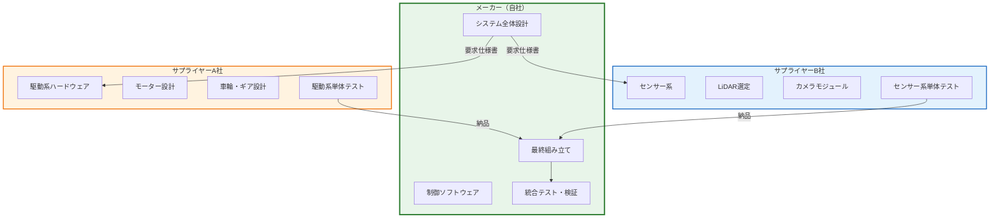
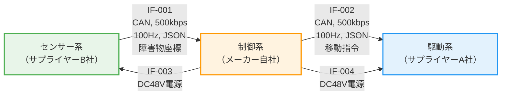
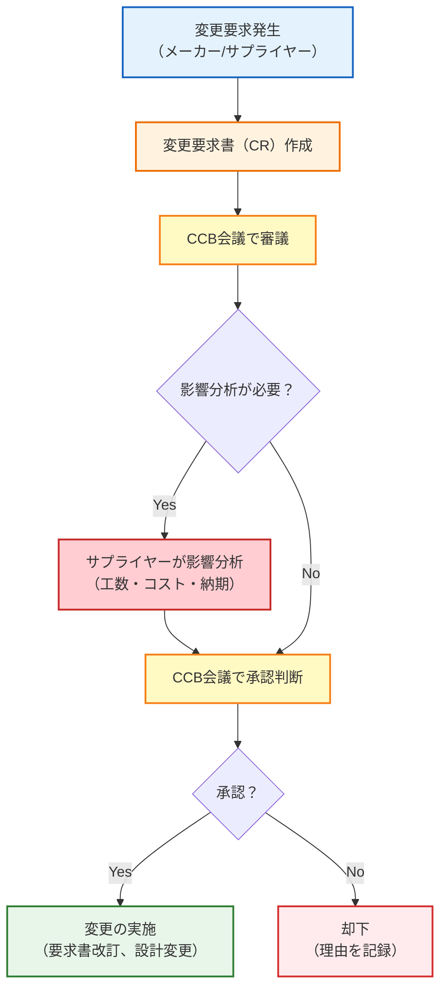
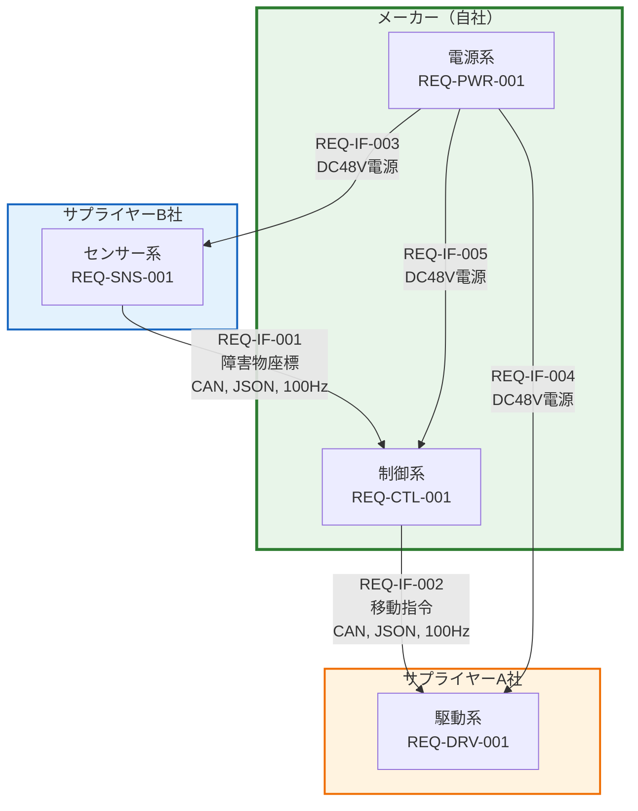
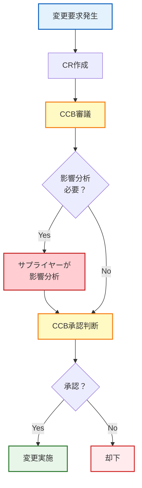

# 第12回: メーカー視点の要求管理 ── 発注側が守るべき5つの鉄則

## この記事を読んでほしい人

- OEM/元請けとしてサプライヤーに開発委託する立場
- 外注先とのコミュニケーションで苦労している人
- 「言った言わない」問題に悩んでいるPM
- 統合テストで初めて問題が発覚して慌てた経験がある人

## はじめに: 分業体制という現実

第11回で、AGVプロジェクトは3社から追加受注を獲得しました。

**B社向け: 大型モデル（100kg対応）**

```
PM（山田）: 「100kg対応は駆動系の大幅な設計変更が必要だ...
           うちのチームだけでは人手が足りない」

技術部長: 「サプライヤーA社に駆動系を委託したらどうだ？
          A社はモーター設計の実績が豊富だ」

PM（山田）: 「分かりました。A社に見積もり依頼します」
```

これが、**メーカーとサプライヤーの分業体制**の始まりです。

---

## 1. 分業体制の決定

### 1.1 AGV案件の役割分担



**分担内容**:

| 担当 | 役割 | 成果物 |
|------|------|--------|
| **メーカー（自社）** | システム統括 | システム要求仕様書<br/>統合テスト計画<br/>最終製品 |
| **サプライヤーA社** | 駆動系開発 | 駆動系サブシステム<br/>駆動系設計書<br/>単体テスト報告書 |
| **サプライヤーB社** | センサー系開発 | センサー系サブシステム<br/>センサー系設計書<br/>単体テスト報告書 |

---

## 2. メーカーが犯しがちな5つの失敗

### 失敗1: 曖昧な要求を丸投げ

**悪い例**:

```
【メーカーからサプライヤーA社への発注内容】

件名: AGV駆動系の開発依頼
本文:
弊社が開発中のAGVに搭載する駆動系を開発してください。
仕様は添付の要求書をご確認ください。
納期は8週間後でお願いします。

【添付: 要求書】
REQ-DRV-001: AGVを駆動できること
REQ-DRV-002: 十分な出力があること
REQ-DRV-003: 信頼性が高いこと
REQ-DRV-004: 制御系と通信できること

以上
```

**何が問題か?**

- 「駆動できる」: 何kg? 何m/s? 何時間?
- 「十分な出力」: 何W? 何Nm?
- 「信頼性が高い」: MTBF何時間? 故障率何%?
- 「通信できる」: 何のプロトコル? 何Hz?

**結果**:
```
サプライヤーA社: 「これでは設計できません。詳細な仕様を教えてください」
メーカー: 「そちらで適当に決めてください」
サプライヤーA社: 「...それはできません」
→ 要求定義に4週間かかる（当初見積もり: 1週間）
```

---

**良い例**:

```
【メーカーからサプライヤーA社への発注内容】

件名: AGV駆動系の開発依頼（要求仕様書 v2.0）

【添付: 要求書】

REQ-DRV-001: 駆動系は100kg荷物を載せたAGVを2.0m/sで移動させること
  - 検証方法: Test（実機測定）
  - 合格基準: AGV総重量200kg（本体100kg+荷物100kg）で2.0m/s達成
  - 環境条件: 平坦な床面、傾斜3°以下

REQ-DRV-002: モーターは400W出力、トルク0.64Nm、3000rpmであること
  - 検証方法: Test（電力計、トルクメーター測定）
  - 合格基準: 各測定値が仕様±5%以内

REQ-DRV-003: 駆動系はMTBF 10,000時間以上であること
  - 検証方法: Analysis（信頼性計算）
  - 合格基準: 計算値 ≥ 10,000時間

REQ-DRV-004: 駆動系はCAN通信（500kbps、100Hz、JSON形式）で制御信号を受信すること
  - 検証方法: Test（オシロスコープ確認）
  - 合格基準: 100Hz ±1Hzでデータ受信確認

REQ-DRV-005: 電源はDC48V供給、消費電力は平均300W、ピーク600Wであること
  - 検証方法: Test（電力計測定）
  - 合格基準: 平均≤300W、ピーク≤600W

REQ-DRV-006: 駆動系の重量は15kg以下であること
  - 検証方法: Inspection（実測）
  - 合格基準: 実測値≤15kg

REQ-DRV-007: 駆動系のサイズは600mm×400mm×200mm以内であること
  - 検証方法: Inspection（実測）
  - 合格基準: 各寸法が仕様以内

REQ-DRV-008: 動作環境温度は0〜40℃であること
  - 検証方法: Test（恒温槽試験）
  - 合格基準: 全温度範囲で動作確認

以上
```

**ポイント**:
- 全ての要求に数値が入っている
- 検証方法が明記されている
- 合格基準が曖昧ではない

---

### 失敗2: インターフェイス仕様が決まっていない

**悪い例**:

```
【8週間のプロジェクト計画】

Week 1-2: メーカーがシステム設計
Week 3-6: サプライヤーA社が駆動系開発（並行）
         サプライヤーB社がセンサー系開発（並行）
Week 7: メーカーが統合テスト
Week 8: 納品

【実際に起きたこと】

Week 6:
メーカー: 「統合テストの準備をします。A社とB社の成果物を送ってください」

サプライヤーA社: 「駆動系が完成しました。通信はCAN、500kbps、JSON形式です」
サプライヤーB社: 「センサー系が完成しました。通信はRS-485、115.2kbps、バイナリ形式です」

メーカー: 「...通信プロトコルが違う！統合できない！」

Week 7-12:
サプライヤーB社にCAN対応を依頼
→ ハードウェア再設計
→ 納期4週間遅延、追加費用100万円
```

**何が問題か?**
- インターフェイス仕様を最初に決めていなかった
- サプライヤーが独自に判断した
- 統合時に初めて問題が発覚

---

**良い例**:

```
【プロジェクト開始時にインターフェイス仕様を確定】

Week 0（プロジェクト開始前）:
メーカー、サプライヤーA社、B社で会議

議題: インターフェイス仕様の確定

【決定事項】
1. 全てのサブシステムはCAN通信を使用
2. 通信速度: 500kbps
3. データフォーマット: JSON
4. 更新頻度: 100Hz
5. 電源: DC48V供給（メーカー側で用意）

【合意】
全サプライヤーが上記仕様を承認
契約書に明記

【結果】
Week 7の統合テストで一発で動作
納期通りに納品
```

**インターフェイス要求の図解**:



**インターフェイス要求の詳細**:

| IF ID | From | To | プロトコル | データ | 頻度 | フォーマット |
|-------|------|-----|----------|-------|-----|------------|
| IF-001 | センサー系 | 制御系 | CAN, 500kbps | 障害物座標 | 100Hz | JSON |
| IF-002 | 制御系 | 駆動系 | CAN, 500kbps | 移動指令 | 100Hz | JSON |
| IF-003 | 制御系 | センサー系 | DC48V | 電源 | - | - |
| IF-004 | 制御系 | 駆動系 | DC48V | 電源 | - | - |

---

### 失敗3: 変更管理プロセスがない

**悪い例**:

```
【Week 3】
メーカー（エンジニア）: 「やっぱり最高速度を2.5m/sに変更したい」
→ サプライヤーA社に口頭で連絡
→ A社は聞き逃す

【Week 5】
サプライヤーA社: 「駆動系が完成しました。最高速度2.0m/sです」
メーカー: 「2.5m/sって言ったはずですけど？」
サプライヤーA社: 「聞いてません！要求書には2.0m/sと書いてあります！」
→ 「言った言わない」問題

【Week 6-8】
サプライヤーA社に再設計を依頼
→ モーター出力500Wに変更
→ 納期2週間遅延、追加費用50万円
```

**何が問題か?**
- 変更を口頭で伝えた（記録がない）
- 変更の影響分析をしていない
- サプライヤーが承認していない

---

**良い例**:

```
【Week 3】
メーカー（エンジニア）: 「最高速度を2.5m/sに変更したい」

【変更管理プロセス】

ステップ1: 変更要求書（CR）を作成
---
変更要求書 CR-001
提案者: メーカー エンジニア 佐藤
日付: 2025年2月15日

【変更内容】
REQ-DRV-001: 最高速度 2.0m/s → 2.5m/s

【理由】
顧客（B社）から「もっと速く運びたい」と要望あり

【影響範囲（暫定）】
- 駆動系: モーター出力増加が必要？
- 電源系: 消費電力増加？
- 安全系: 停止距離延長？
---

ステップ2: CCB（変更管理委員会）で審議
参加者: メーカーPM、サプライヤーA社PM、B社PM

サプライヤーA社: 「影響分析します。3営業日ください」

ステップ3: サプライヤーA社が影響分析
---
影響分析報告書（サプライヤーA社）

【変更内容】
REQ-DRV-001: 最高速度 2.0m/s → 2.5m/s

【影響範囲】
1. モーター: 400W → 500W（部品変更）
2. ギア比: 調整必要
3. 消費電力: 平均300W → 375W
4. 重量: 変更なし

【工数】
- 設計変更: 1週間
- 部品調達: 2週間
- テスト: 1週間
- 合計: 4週間

【追加費用】
- 部品差額: 30万円
- 設計工数: 20万円
- 合計: 50万円

【納期への影響】
当初納期（Week 8）→ 延期（Week 12）
---

ステップ4: CCBで承認判断
メーカーPM: 「B社の要望なら、追加費用50万円はB社負担で交渉可能。承認」
サプライヤーA社PM: 「了解、Week 12納品で進めます」

ステップ5: 変更の実施
- 要求書を正式に改訂（v2.1）
- サプライヤーA社が設計変更を実施
- トレーサビリティマトリクスを更新

【結果】
Week 12に納品（計画通り）
追加費用50万円はB社が負担
「言った言わない」問題は発生せず
```

**CCBプロセスフロー**:



---

### 失敗4: 検証方法を合意していない

**悪い例**:

```
【Week 7: 納品時】

サプライヤーA社: 「駆動系が完成しました。REQ-DRV-002（400W出力）は満たしています」

メーカー: 「どうやって確認したんですか？」

サプライヤーA社: 「計算で確認しました。モーター仕様書には400Wと書いてあります」

メーカー: 「実機でテストしたんですか？」

サプライヤーA社: 「いえ、計算で十分だと思いましたが...」

メーカー: 「実機でテストしてください。それが要求です」

サプライヤーA社: 「...テスト環境がないので、できません」

→ メーカー側でテストを実施
→ 結果: 380Wしか出ない（不合格）
→ サプライヤーA社に再設計を依頼
→ 納期2週間遅延
```

**何が問題か?**
- 検証方法（Test vs Analysis）を合意していなかった
- サプライヤーは「計算で済む」と思っていた
- メーカーは「実機テスト必須」と思っていた

---

**良い例**:

```
【Week 0: プロジェクト開始時】

メーカーとサプライヤーA社で会議

【議題】
各要求の検証方法と責任分担を決める

【決定事項】

| 要求ID | 内容 | 検証方法 | 検証責任 | 検証時期 | 合格基準 |
|--------|------|---------|---------|---------|---------|
| REQ-DRV-001 | 2.0m/s移動 | Test（実機） | **サプライヤーA** | PDR前 | 実測≥2.0m/s |
| REQ-DRV-002 | 400W出力 | **Test（電力計）** | **サプライヤーA** | PDR前 | 実測≥400W |
| REQ-DRV-003 | MTBF 10,000h | Analysis（計算） | サプライヤーA | PDR前 | 計算値≥10,000h |
| REQ-DRV-004 | CAN通信 | Test（オシロスコープ） | サプライヤーA | PDR前 | 100Hz±1Hz確認 |
| REQ-DRV-005 | 消費電力 | Test（電力計） | **メーカー** | 統合テスト時 | 平均≤300W |
| REQ-DRV-006 | 重量15kg以下 | Inspection（実測） | サプライヤーA | 納品時 | 実測≤15kg |
| REQ-DRV-007 | サイズ | Inspection（実測） | サプライヤーA | 納品時 | 各寸法≤仕様 |
| REQ-DRV-008 | 動作温度 | Test（恒温槽） | **メーカー** | 統合テスト時 | 全温度範囲OK |

【合意】
- サプライヤーA社は、自社責任の検証を全て実施して納品
- メーカーは、統合テスト時にメーカー責任の検証を実施
- 検証結果は報告書として提出

【結果】
Week 7の納品時: サプライヤーA社が全ての単体テスト報告書を提出
メーカーは報告書を確認して受領
統合テストもスムーズに完了
```

---

### 失敗5: トレーサビリティがない

**悪い例**:

```
【Week 7: 統合テスト中】

メーカー（テスター）: 「駆動系のモーター制御コード、どこですか？」

サプライヤーA社: 「motor_control.cです」

メーカー: 「このコードはどの要求を満たすためのものですか？」

サプライヤーA社: 「...えーと、確認します」

→ サプライヤーA社の設計書には要求IDが書かれていない
→ どのコードがどの要求を満たすか追跡不可能
→ 不具合が発生しても、原因となる要求が特定できない
```

**何が問題か?**
- 設計書に要求IDが記載されていない
- コードに要求IDがコメントされていない
- トレーサビリティマトリクスがない

---

**良い例**:

```
【Week 0: プロジェクト開始時】

メーカーがサプライヤーA社に指示

【トレーサビリティ要件】
1. 設計書には必ず要求IDを記載する
2. コードには要求IDをコメントで記載する
3. テストケースには要求IDを紐付ける
4. トレーサビリティマトリクスを納品時に提出する

【実装例】

---
【設計書（サプライヤーA社）】

3.2 モーター制御部
（対応要求: REQ-DRV-001, REQ-DRV-002）

モーター制御部は、制御系からのCAN通信で移動指令を受信し、
モーターに400W出力を供給する。
...

---

【コード（サプライヤーA社）】

// REQ-DRV-001: 駆動系は100kg荷物を載せたAGVを2.0m/sで移動させること
// REQ-DRV-002: モーターは400W出力、トルク0.64Nm、3000rpmであること
void motor_control() {
    set_power(400); // 400W出力
    set_torque(0.64); // 0.64Nm
    set_rpm(3000); // 3000rpm
}

---

【テストケース（サプライヤーA社）】

TC-DRV-001: REQ-DRV-001の検証
目的: 100kg荷物を載せたAGVが2.0m/sで移動できることを確認
手順:
1. AGVに100kg荷物を載せる
2. 10m直進させる
3. 速度を測定する
合格基準: 実測速度 ≥ 2.0m/s

---

【トレーサビリティマトリクス（サプライヤーA社）】

| システム要求 | サブシステム要求 | 設計 | コード | テストケース |
|------------|---------------|------|-------|------------|
| REQ-003 | REQ-DRV-001 | DESIGN-001 | motor_control.c | TC-DRV-001 |
| REQ-005 | REQ-DRV-002 | DESIGN-002 | motor_control.c | TC-DRV-002 |
| REQ-007 | REQ-DRV-003 | DESIGN-003 | battery.c | TC-DRV-003 |

---

【結果】
Week 7の統合テスト: 不具合が発生
→ トレーサビリティマトリクスで原因をすぐ特定
→ REQ-DRV-002に起因することが判明
→ motor_control.cの該当箇所を修正
→ 1日で修正完了
```

---

## 3. メーカーがやるべき5つの鉄則

### 鉄則1: 要求仕様書（SRS）を正式に発行する

**SRS（System Requirements Specification）**:
システム全体の要求をまとめた正式文書。サプライヤーへの委託の基準となる。

**SRSに含めるべき内容**:

1. **システム概要**
   - 目的、スコープ、ステークホルダー

2. **システム要求**
   - 機能要求、性能要求、制約要求、インターフェイス要求

3. **検証要件**
   - 各要求の検証方法、合格基準、検証責任

4. **トレーサビリティ要件**
   - ニーズ → システム要求 → サブシステム要求のトレース

5. **変更管理プロセス**
   - 変更要求の提出方法、CCBの運用ルール

6. **承認**
   - 承認者の署名、承認日

**SRSの表紙例**:

```
-------------------------------------------
AGVシステム要求仕様書
（System Requirements Specification）

文書番号: SRS-AGV-v2.0
バージョン: 2.0
対象: B社向け大型モデル
ベースライン: v1.0（A社納品版）

作成者: PM 山田太郎
承認者: 技術部長 鈴木一郎
承認日: 2025年2月1日

配布先:
- メーカー開発チーム
- サプライヤーA社
- サプライヤーB社
- 顧客（B社）
-------------------------------------------
```

---

### 鉄則2: インターフェイス要求を先に固める

**インターフェイス要求定義書（ICD: Interface Control Document）**:
サブシステム間のインターフェイスを詳細に定義した文書。

**ICDに含めるべき内容**:

1. **物理インターフェイス**
   - コネクタ形状、ピン配置、電圧、電流

2. **通信インターフェイス**
   - プロトコル、データフォーマット、通信速度、タイミング

3. **データ定義**
   - 各データ項目の型、範囲、単位

4. **エラーハンドリング**
   - タイムアウト処理、再送ロジック

**ICD例（CAN通信）**:

```
-------------------------------------------
AGV CAN通信インターフェイス定義書
（Interface Control Document）

文書番号: ICD-CAN-v1.0
対象: 制御系 ⇔ 駆動系

【物理層】
- バスタイプ: CAN 2.0B
- 通信速度: 500kbps
- コネクタ: D-Sub 9ピン
- 終端抵抗: 120Ω

【データリンク層】
- CAN ID: 0x100（制御系 → 駆動系）
- 更新頻度: 100Hz（10msごと）
- データ長: 8バイト

【アプリケーション層】
- データフォーマット: JSON

【メッセージ定義】
{
  "cmd": "move",        // 移動指令（文字列）
  "speed": 2.0,         // 速度（float, m/s）
  "direction": 0,       // 方向（int, 度）
  "timestamp": 123456   // タイムスタンプ（int, ms）
}

【エラーハンドリング】
- タイムアウト: 100ms以内に応答がない場合、警告
- 再送: 3回まで
- 異常検知: CAN IDが不正な場合、無視
-------------------------------------------
```

---

### 鉄則3: 変更管理委員会（CCB）を設置

**CCB（Change Control Board）**:
要求変更を審議・承認する会議体。メーカーと全サプライヤーが参加。

**CCBの構成**:
- 議長: メーカーPM
- メンバー: メーカーエンジニア、サプライヤーA社PM、サプライヤーB社PM、顧客代表（必要に応じて）

**CCBの運用ルール**:

1. **定期開催**: 隔週、毎週水曜10:00〜11:00

2. **議題**:
   - 新規変更要求の審議
   - 影響分析結果の報告
   - 承認/却下の判断

3. **議事録**:
   - 決定事項を記録
   - 全参加者に配布

4. **変更要求書（CR）のテンプレート**:

```
-------------------------------------------
変更要求書（Change Request）

CR番号: CR-012
提案者: サプライヤーA社 田中
提案日: 2025年2月20日

【変更内容】
REQ-DRV-002: モーター出力 400W → 500W

【理由】
現在のモーター（400W）では、100kg荷物+3°傾斜で2.0m/sが出ない。
500Wモーターに変更すれば余裕を持って達成可能。

【影響分析】
- 工数: 2週間（部品調達1週間、組立・テスト1週間）
- 追加費用: 30万円（部品差額）
- 納期への影響: +2週間

【承認】
CCB議長: ________________
承認日: ________________
-------------------------------------------
```

---

### 鉄則4: 検証計画を要求と同時に渡す

**検証計画書（Verification Plan）**:
各要求をどうやって検証するかを定義した文書。

**検証計画書に含めるべき内容**:

1. **検証マトリクス**:

| 要求ID | 検証方法 | 検証責任 | 検証時期 | 合格基準 | テストケースID |
|--------|---------|---------|---------|---------|--------------|
| REQ-DRV-001 | Test（実機） | サプライヤーA | PDR前 | 実測≥2.0m/s | TC-DRV-001 |
| REQ-DRV-002 | Test（電力計） | サプライヤーA | PDR前 | 実測≥400W | TC-DRV-002 |
| REQ-DRV-003 | Analysis | サプライヤーA | PDR前 | 計算値≥10,000h | - |
| REQ-DRV-004 | Test（オシロ） | サプライヤーA | PDR前 | 100Hz±1Hz | TC-DRV-004 |
| REQ-DRV-005 | Test（電力計） | メーカー | 統合テスト | 平均≤300W | TC-SYS-010 |

2. **検証環境**:
   - 必要な測定器（電力計、オシロスコープ、恒温槽など）
   - テスト治具

3. **検証スケジュール**:
   - いつ、誰が、何を検証するか

**ポイント**:
- 検証計画をプロジェクト開始時にサプライヤーに渡す
- サプライヤーは検証計画に基づいて設計・実装する
- 検証方法に疑問があれば、早期にCCBで議論

---

### 鉄則5: トレーサビリティマトリクスを共有

**トレーサビリティマトリクス（Traceability Matrix）**:
要求 ↔ 設計 ↔ 実装 ↔ テストの対応関係を示す表。

**マトリクスのフォーマット例**:

| ニーズID | システム要求ID | サブシステム要求ID | 設計ID | 実装（ファイル） | テストケースID | 状態 |
|---------|-------------|---------------|-------|---------------|--------------|-----|
| N-001 | REQ-003 | REQ-DRV-001 | DESIGN-001 | motor_control.c:120 | TC-DRV-001 | ✅合格 |
| N-001 | REQ-003 | REQ-DRV-002 | DESIGN-002 | motor_control.c:145 | TC-DRV-002 | ✅合格 |
| N-002 | REQ-007 | REQ-PWR-001 | DESIGN-005 | battery.c:80 | TC-DRV-003 | 🔄テスト中 |

**トレーサビリティの運用**:

1. **メーカーが作成**:
   - システム要求 → サブシステム要求の配分表

2. **サプライヤーが更新**:
   - サブシステム要求 → 設計 → 実装 → テストの紐付け

3. **定期レビュー**:
   - CCB会議でトレーサビリティマトリクスをレビュー
   - 抜け漏れがないか確認

4. **変更時の更新**:
   - 要求変更があった場合、マトリクスを更新
   - 影響範囲を全員で確認

---

## 4. 実例: AGVプロジェクトB社向けの要求配分

### 4.1 システム要求 → サブシステム要求への配分

**配分表**:

| システム要求ID | 内容 | 配分先 | サブシステム要求ID | 備考 |
|--------------|------|--------|------------------|------|
| REQ-003 | 100kg荷物を運搬 | 駆動系（A社） | REQ-DRV-001 | モーター強化 |
| REQ-005 | 障害物検知15m | センサー系（B社） | REQ-SNS-001 | LiDAR仕様 |
| REQ-007 | 8時間連続稼働 | 電源系（自社） | REQ-PWR-001 | バッテリー容量 |
| REQ-010 | 障害物回避 | 制御系（自社） | REQ-CTL-001 | 経路計画アルゴリズム |
| REQ-015 | センサー4方向配置 | センサー系（B社） | REQ-SNS-002 | センサー配置 |
| REQ-018 | 筐体幅600mm以内 | 構造系（自社） | REQ-STR-001 | フレーム設計 |

**配分のルール**:
1. 1つのシステム要求は、1つまたは複数のサブシステム要求に配分される
2. サブシステム要求は、担当組織（自社/サプライヤー）が明確
3. 配分理由を備考に記載

---

### 4.2 インターフェイス要求の定義

**インターフェイス要求一覧**:

| IF要求ID | 内容 | From | To | 詳細（ICD参照） |
|---------|------|------|-----|---------------|
| REQ-IF-001 | CAN通信（障害物座標） | センサー系 | 制御系 | ICD-CAN-v1.0 |
| REQ-IF-002 | CAN通信（移動指令） | 制御系 | 駆動系 | ICD-CAN-v1.0 |
| REQ-IF-003 | DC48V電源供給 | 電源系 | センサー系 | ICD-PWR-v1.0 |
| REQ-IF-004 | DC48V電源供給 | 電源系 | 駆動系 | ICD-PWR-v1.0 |
| REQ-IF-005 | DC48V電源供給 | 電源系 | 制御系 | ICD-PWR-v1.0 |

**インターフェイス要求の配置図**:



---

## 5. NRDM Plan（要求管理計画）のメーカー視点

**NRDM Plan（Needs and Requirements Definition and Management Plan）**:
要求定義・管理の方法を定義した計画書（INCOSE Appendix B準拠）。

**メーカーが作成すべきNRDM Planの要点**:

### 5.1 役割分担

| 役割 | 担当組織 | 責任範囲 |
|------|---------|---------|
| システム要求定義 | メーカー | SRS作成、システムアーキテクチャ設計 |
| サブシステム要求定義 | サプライヤーA社 | 駆動系要求の詳細化 |
| サブシステム要求定義 | サプライヤーB社 | センサー系要求の詳細化 |
| インターフェイス要求定義 | メーカー | ICD作成、全サプライヤーと合意 |
| 変更管理 | CCB（全員） | 変更要求の審議・承認 |
| トレーサビリティ管理 | メーカー | システム全体のマトリクス管理 |

### 5.2 要求のベースライン設定

| マイルストーン | ベースライン | 承認者 | 凍結内容 |
|-------------|------------|--------|---------|
| キックオフ | - | - | - |
| システム要求レビュー（SRR） | v1.0 | メーカー技術部長 | システム要求仕様書 |
| 予備設計レビュー（PDR） | v1.1 | CCB | サブシステム要求仕様書 |
| 詳細設計レビュー（CDR） | v1.2 | CCB | インターフェイス仕様書 |

**ベースライン設定のルール**:
- ベースライン設定後は、CCBの承認なしに変更不可
- 変更がある場合は、新しいバージョン番号を付ける

### 5.3 変更管理プロセス

**変更管理のフロー**（再掲）:



### 5.4 トレーサビリティ要件

**メーカーが要求するトレーサビリティ**:

1. **垂直トレーサビリティ**（階層間）:
   - ニーズ → システム要求 → サブシステム要求 → 設計 → 実装 → テスト

2. **水平トレーサビリティ**（ライフサイクル）:
   - 要求 → 設計 → 実装 → テスト

3. **サプライヤーへの要求**:
   - 設計書に要求IDを記載
   - コードに要求IDをコメント
   - テストケースに要求IDを紐付け
   - トレーサビリティマトリクスを納品時に提出

---

## 6. まとめ: メーカーの5つの鉄則

**この記事のポイント**:

1. **鉄則1: 要求仕様書（SRS）を正式に発行する**
   - 曖昧な要求を丸投げしない
   - 全ての要求に数値、検証方法、合格基準を明記

2. **鉄則2: インターフェイス要求を先に固める**
   - プロジェクト開始前にインターフェイス仕様を確定
   - ICD（Interface Control Document）を作成・共有

3. **鉄則3: 変更管理委員会（CCB）を設置**
   - 変更要求は全てCCBで審議・承認
   - 口頭での変更依頼は受け付けない

4. **鉄則4: 検証計画を要求と同時に渡す**
   - 検証方法、検証責任、検証時期を明確にする
   - サプライヤーに「どうやってテストするか」を最初に伝える

5. **鉄則5: トレーサビリティマトリクスを共有**
   - 要求 ↔ 設計 ↔ 実装 ↔ テストの対応関係を見える化
   - サプライヤーに要求IDの記載を強制

**次回予告**:

第13回では、**サプライヤー視点の要求管理**を解説します。

- 曖昧な要求をどう明確化するか
- 無茶な納期・予算からどう身を守るか
- 「言った言わない」問題をどう防ぐか
- 変更要求の嵐にどう対応するか

AGVプロジェクトで、サプライヤーA社がメーカーから受け取った要求書をどう扱ったか、リアルな現場の視点で解説します。

---

## 参考資料

- INCOSE Guide to Needs and Requirements (Appendix B: NRDM Plan Content)
- ISO/IEC/IEEE 15288:2023 (System and Software Engineering)
- NASA Systems Engineering Handbook (Section 5.3: Requirements Management)
- INCOSE Systems Engineering Handbook (Section 4.2: Requirements Definition Process)

---

**執筆者より**:

この記事は、INCOSE Guide to Needs and Requirements（特にAppendix B: NRDM Plan Content）を基に、メーカー（OEM）視点での要求管理の実践を現場のエンジニアが理解できるレベルに落とし込んだものです。「発注側がやるべきこと」を具体的に示すことを重視しています。

ご意見・ご質問は、コメント欄またはTwitter（@your_account）までお寄せください。
