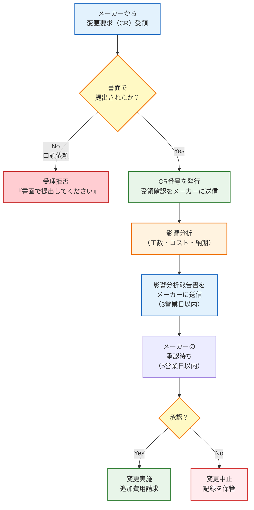

# 第13回: サプライヤー視点の要求管理 ── 受注側が生き残るための防衛術

## この記事を読んでほしい人

- サプライヤー/下請けとしてOEMから開発を受注する立場
- 「後から要求が増える」「仕様が二転三転する」に困っている人
- 無茶な納期・予算で苦しんでいるエンジニア
- 「言った言わない」問題で責任を押し付けられた経験がある人

## はじめに: サプライヤーという立場

第12回で、メーカー側の視点を解説しました。今回はその裏側、**サプライヤー側の視点**です。

**サプライヤーA社の受注**

```
【メーカーからのRFQ（見積依頼）】
件名: AGV駆動系サブシステム開発の見積依頼

弊社が開発中のAGV（B社向け大型モデル）に搭載する
駆動系サブシステムの開発をお願いしたく、見積をお願いします。

要求仕様書を添付しますので、ご確認ください。
希望納期: 8週間後
希望予算: 300万円程度

【サプライヤーA社 営業部長】
「やったー！大型案件だ！受注しよう！」

【サプライヤーA社 技術部長（田中）】
「...ちょっと待ってください。要求書を確認させてください」
```

---

## 1. サプライヤーが直面する5つの地獄

### 地獄1: 要求が曖昧すぎる

**受け取った要求書**:

```
---
AGV駆動系要求仕様書 v1.0
発行元: メーカー株式会社
発行日: 2025年2月1日

【要求】
REQ-DRV-001: AGVを駆動できること
REQ-DRV-002: 十分な出力があること
REQ-DRV-003: 信頼性が高いこと
REQ-DRV-004: 制御系と通信できること
REQ-DRV-005: 消費電力が適切であること
REQ-DRV-006: サイズが適切であること
REQ-DRV-007: 重量が適切であること

以上
---
```

**技術部長（田中）の反応**:

```
田中: 「...これでは設計できない」

【問題点リスト】
REQ-DRV-001: 「駆動できる」
→ 何kg運ぶの? 最高速度は? 連続稼働時間は? 傾斜は?

REQ-DRV-002: 「十分な出力」
→ 何W? 何Nm? 何rpm?

REQ-DRV-003: 「信頼性が高い」
→ MTBF何時間? 故障率何%? 保証期間は?

REQ-DRV-004: 「通信できる」
→ プロトコルは? CAN? RS-485? I2C?
→ 通信速度は? データフォーマットは?

REQ-DRV-005: 「消費電力が適切」
→ 平均何W? ピーク何W? 電源電圧は?

REQ-DRV-006: 「サイズが適切」
→ 何mm×何mm×何mm?

REQ-DRV-007: 「重量が適切」
→ 何kg以下?
```

**営業部長の対応**:

```
営業: 「まあ、とりあえず受注して、後で聞けばいいでしょ」

田中: 「それはダメです。後で『そんなこと聞いてない』と言われます」

営業: 「じゃあ見積もりできないじゃないですか」

田中: 「だから、契約前に要求を明確化する必要があるんです」
```

---

### 地獄2: インターフェイスが決まっていない

**Week 1: 設計開始時**

```
エンジニア（佐藤）: 「制御系との通信は何を使いますか？」

田中: 「要求書には『通信できること』としか書いてない...
     メーカーに確認します」

【メーカーへの問い合わせ】
件名: REQ-DRV-004の詳細確認

REQ-DRV-004「制御系と通信できること」について、
以下を確認させてください。

Q1: 通信プロトコルは何ですか？（CAN, RS-485, etc.）
Q2: 通信速度は何bpsですか？
Q3: データフォーマットは何ですか？（JSON, バイナリ, etc.）
Q4: 更新頻度は何Hzですか？
Q5: 電源電圧は何Vですか？

【メーカーからの回答（3日後）】
「検討中です。追って連絡します」

佐藤: 「...設計が進められません」
```

**Week 3: まだ決まらない**

```
田中: 「メーカーさん、インターフェイス仕様はいつ決まりますか？
     もう3週間経っています」

メーカー: 「すみません、制御系の設計がまだ終わっていなくて...
          もう少し待ってもらえますか？」

田中: 「8週間納期なのに、3週間待つと設計が5週間しかありません。
     間に合わない可能性があります」

メーカー: 「何とかお願いします」

田中: 「...（無理だと分かっているが、言えない）」
```

**Week 4: ようやく決定**

```
【メーカーからの連絡】
インターフェイス仕様が決まりました。
- プロトコル: CAN
- 通信速度: 500kbps
- データフォーマット: JSON
- 更新頻度: 100Hz
- 電源電圧: DC48V

よろしくお願いします。

【サプライヤーA社の状況】
- 残り4週間
- 設計、実装、テストを全て4週間でやる必要がある
- 当初計画では設計3週間、実装2週間、テスト3週間だった
- 明らかに間に合わない
```

---

### 地獄3: 要求がコロコロ変わる

**Week 1: 最初の要求**

```
REQ-DRV-001: AGVは50kg荷物を運搬できること
→ モーター200W、ギア比1:10で設計開始
```

**Week 3: 変更1回目**

```
【メーカーからの連絡（口頭、電話）】
「やっぱり100kgに変更してください」

田中: 「それは大きな変更です。工数とコストの見積もりが必要です」

メーカー: 「急ぎなので、とりあえず進めてもらえますか？」

田中: 「...（承認なしで進めるのは危険だが、断れない）」

→ モーター400Wに変更、設計やり直し（3日ロス）
```

**Week 5: 変更2回目**

```
【メーカーからの連絡（メール）】
「お客さんと相談した結果、やっぱり50kgに戻します」

田中: 「...今から戻すと、また設計やり直しです」

メーカー: 「すみません、お願いします」

→ モーター200Wに戻す、設計やり直し（3日ロス）
```

**Week 7: 変更3回目**

```
【メーカーからの連絡（メール）】
「75kgで妥協することになりました」

田中: 「...もう無理です。納期に間に合いません」

メーカー: 「何とかお願いします」

田中: 「分かりました。ただし、納期を2週間延長してください」

メーカー: 「...検討します」

【結果】
- 設計4回やり直し
- 納期2週間延長
- 追加費用50万円請求（メーカーが渋々承認）
```

---

### 地獄4: 「言った言わない」問題

**Week 7: 納品直前**

```
【メーカーからのクレーム】
「REQ-DRV-001の最高速度、2.5m/sって言いましたよね？
 でも実測したら2.0m/sしか出ません」

田中: 「要求書には2.0m/sと書いてあります。
     2.5m/sなんて聞いていません」

メーカー: 「Week 3の電話で言いましたよ！」

田中: 「そんな話は聞いていません。記録もありません」

メーカー: 「こちらの議事録には書いてあります」

田中: 「こちらには議事録がありません。
     正式な変更要求書（CR）も受け取っていません」

メーカー: 「じゃあ、どうするんですか！」

田中: 「2.5m/sにするには、モーターを500Wに変更する必要があります。
     追加費用30万円、納期1週間延長です」

メーカー: 「...（納得できないが、選択肢がない）」
```

**問題の本質**:
- 口頭での変更依頼（証拠がない）
- メーカー側の議事録はあるが、サプライヤー側にはない
- 正式な変更要求書（CR）がない

---

### 地獄5: 検証責任の押し付け合い

**Week 8: 納品時**

```
【サプライヤーA社の納品内容】
- 駆動系ハードウェア
- 設計書
- 単体テスト報告書（モーター単体、200W出力確認）

【メーカーの受領検査】
メーカー: 「REQ-DRV-001（75kg荷物を運搬）のテストはしましたか？」

田中: 「モーター単体では200W出力を確認しました。
     AGV実機での動作確認はそちらでお願いします」

メーカー: 「いやいや、REQ-DRV-001はそちらの責任ですよね？
          実機で動くか確認してください」

田中: 「実機がないのでテストできません。
     単体テストは完了しています」

メーカー: 「それでは受領できません」

【膠着状態】
- サプライヤー: 「実機がないからテストできない」
- メーカー: 「テストしないと受領できない」
- 誰が実機テストをやるのか、契約で決まっていなかった
```

**問題の本質**:
- 検証責任が契約で明確になっていない
- サプライヤー: 単体テストのみと思っていた
- メーカー: 統合テストもサプライヤーがやると思っていた

---

## 2. サプライヤーが身を守る5つの防衛術

### 防衛術1: 要求レビューを契約前に実施

**契約前チェックリスト**:

```
□ 1. 全ての要求に数値が入っているか?
   ❌ 「十分な出力」→ 曖昧
   ✅ 「400W出力」→ 明確

□ 2. 検証方法は定義されているか?
   ❌ 「信頼性が高いこと」→ どうやって確認する？
   ✅ 「MTBF 10,000時間以上（Analysis）」→ 明確

□ 3. インターフェイス仕様は決まっているか?
   ❌ 「通信できること」→ 何のプロトコル？
   ✅ 「CAN, 500kbps, JSON, 100Hz」→ 明確

□ 4. 前提条件・制約条件は明記されているか?
   ❌ 記載なし
   ✅ 「動作環境温度: 0〜40℃」→ 明確

□ 5. TBD（To Be Determined）が残っていないか?
   ❌ 「電源電圧: TBD」→ 決まっていない
   ✅ 「電源電圧: DC48V」→ 決まっている

□ 6. 検証責任は明確か?
   ❌ 記載なし
   ✅ 「単体テスト: サプライヤー、統合テスト: メーカー」→ 明確

□ 7. 納品物は明確か?
   ❌ 「駆動系」→ 何を納品する？
   ✅ 「ハードウェア、設計書、テスト報告書、トレーサビリティマトリクス」→ 明確
```

**チェックリストの使い方**:

```
【受注判断会議】
営業: 「この案件、受注していいですか？」

技術部長（田中）: 「チェックリストを確認します」

【結果】
□ 1. ❌ 数値が入っていない要求が5件
□ 2. ❌ 検証方法が未定義
□ 3. ❌ インターフェイス仕様が未決定
□ 4. ❌ 前提条件が未記載
□ 5. ❌ TBDが3件残っている
□ 6. ❌ 検証責任が不明
□ 7. ❌ 納品物が不明確

田中: 「このままでは受注できません。
     メーカーに要求の明確化を依頼してください」

営業: 「でも、競合他社に取られちゃいますよ」

田中: 「後でトラブルになるより、今断る方がマシです」
```

**契約前に要求を明確化する**:

```
【サプライヤーA社からメーカーへの質問リスト】

件名: 要求仕様書の明確化依頼

貴社からの要求仕様書を確認しましたが、
以下の点が不明確ですので、明確化をお願いします。

【質問リスト】
Q1: REQ-DRV-001「AGVを駆動できること」
   → 運搬重量は何kgですか？ 50kg? 100kg?
   → 最高速度は何m/sですか？ 2.0m/s? 2.5m/s?
   → 連続稼働時間は何時間ですか？ 8時間?
   → 傾斜は何度まで対応しますか？ 3°?

Q2: REQ-DRV-002「十分な出力があること」
   → モーター出力は何Wですか？ 400W?
   → トルクは何Nmですか？ 0.64Nm?
   → 回転数は何rpmですか？ 3000rpm?

Q3: REQ-DRV-004「制御系と通信できること」
   → 通信プロトコルは何ですか？ CAN? RS-485?
   → 通信速度は何bpsですか？ 500kbps?
   → データフォーマットは何ですか？ JSON? バイナリ?
   → 更新頻度は何Hzですか？ 100Hz?

...（全20問）

回答期限: 2025年2月10日
回答がない場合、受注を見送らせていただきます。

---

【メーカーからの回答（5日後）】
全ての質問に回答しました。添付ファイルをご確認ください。

【サプライヤーA社の対応】
田中: 「これなら設計できます。受注しましょう」
```

---

### 防衛術2: 「前提条件」を明文化

**前提条件書（Assumption Document）**:

```
---
駆動系開発プロジェクトの前提条件

文書番号: ASM-DRV-v1.0
発行元: サプライヤーA社
発行日: 2025年2月15日
承認者: メーカー PM 山田（署名）

【前提条件】

1. 運搬重量
   - 前提: 75kg以下
   - 根拠: メーカーからの回答（2025年2月10日）
   - 変更時: モーター出力、ギア比の再設計が必要
           追加費用30万円、納期+2週間

2. 電源
   - 前提: DC48V供給（メーカー側で用意）
   - 根拠: 要求書 REQ-DRV-005
   - 変更時: 電源回路の再設計が必要
           追加費用20万円、納期+1週間

3. 制御信号
   - 前提: CAN通信（500kbps、100Hz、JSON形式）
   - 根拠: ICD-CAN-v1.0
   - 変更時: 通信モジュールの再設計が必要
           追加費用50万円、納期+3週間

4. 動作環境
   - 前提: 温度0〜40℃、湿度20〜80%、屋内使用
   - 根拠: 要求書 REQ-DRV-008
   - 変更時: 耐環境試験が必要
           追加費用100万円、納期+4週間

5. テスト環境
   - 前提: 単体テストはサプライヤーA社が実施
           統合テストはメーカーが実施
   - 根拠: 検証計画書 VER-PLAN-v1.0
   - 変更時: 協議の上、追加費用・納期を再見積もり

【重要】
上記前提条件が変わる場合、工数・費用・納期の再見積もりが必要です。
変更要求は正式な変更要求書（CR）を提出してください。
口頭での変更依頼は受け付けません。

承認:
メーカー PM 山田太郎 ________________ 2025年2月15日
サプライヤーA社 技術部長 田中次郎 __________ 2025年2月15日
---
```

**前提条件書のポイント**:
1. 全ての前提を明記
2. 前提が変わったときの影響を記載（追加費用、納期延長）
3. メーカーの承認印をもらう
4. 契約書に添付

---

### 防衛術3: 変更管理ルールを契約に盛り込む

**契約書（抜粋）**:

```
---
AGV駆動系開発業務委託契約書

第10条（変更管理）

1. 要求の変更
   発注者（メーカー）が要求を変更する場合、
   書面（メール可）で正式に変更要求書（CR）を提出すること。

2. 影響分析
   受注者（サプライヤーA社）は、変更要求を受領後
   3営業日以内に影響分析を実施し、
   追加工数、追加費用、納期への影響を発注者に報告すること。

3. 承認
   発注者は、影響分析を確認後、
   5営業日以内に承認/却下を決定すること。

4. 実施
   承認された変更のみ実施する。
   追加費用は発注者が負担する。
   納期は影響分析の結果に基づき延長する。

5. 口頭での変更依頼の禁止
   口頭（電話、会議）での変更依頼は受け付けない。
   必ず書面で提出すること。

6. 変更履歴の記録
   全ての変更要求、影響分析、承認記録を文書化し、
   双方で保管すること。

---
```

**変更管理フロー（サプライヤー視点）**:



---

### 防衛術4: トレーサビリティを徹底

**設計書に要求IDを記載**:

```
---
駆動系設計書

3.2 モーター制御部
（対応要求: REQ-DRV-001, REQ-DRV-002）

モーター制御部は、制御系からのCAN通信で移動指令を受信し、
モーターに300W出力を供給する。

【設計仕様】
- モーター: 300W、トルク0.48Nm、3000rpm（対応: REQ-DRV-002）
- ギア比: 1:10（対応: REQ-DRV-001）
- 制御方式: PWM制御、周波数20kHz

【設計根拠】
REQ-DRV-001: 75kg荷物を2.0m/sで運搬
→ 必要トルク: 0.48Nm × 10（ギア比）= 4.8Nm
→ 必要出力: 300W

REQ-DRV-002: モーター仕様
→ 300W出力、3000rpm
---
```

**コードに要求IDをコメント**:

```c
// REQ-DRV-001: 駆動系は75kg荷物を載せたAGVを2.0m/sで移動させること
// REQ-DRV-002: モーターは300W出力、トルク0.48Nm、3000rpmであること
void motor_control() {
    set_power(300); // 300W出力（REQ-DRV-002）
    set_torque(0.48); // 0.48Nm（REQ-DRV-002）
    set_rpm(3000); // 3000rpm（REQ-DRV-002）

    // ギア比1:10で減速（REQ-DRV-001）
    set_gear_ratio(10);
}

// REQ-DRV-004: CAN通信で制御信号を受信
void can_receive() {
    // CAN通信、500kbps、100Hz、JSON形式（REQ-DRV-004）
    uint8_t data[8];
    can_read(0x100, data, 8);

    // JSONパース
    parse_json(data);
}
```

**テストケースに要求IDを紐付け**:

```
---
単体テスト仕様書

TC-DRV-001: REQ-DRV-001の検証
目的: 75kg荷物を載せたAGVが2.0m/sで移動できることを確認

前提条件:
- AGV総重量: 175kg（本体100kg + 荷物75kg）
- 平坦な床面

手順:
1. AGVに75kg荷物を載せる
2. 10m直進させる
3. 速度を測定する

合格基準:
- 実測速度 ≥ 2.0m/s

結果:
- 実測速度: 2.1m/s
- 判定: ✅ 合格
---
```

**トレーサビリティマトリクスを納品**:

| システム要求 | サブシステム要求 | 設計 | コード | テストケース | 状態 |
|------------|---------------|------|-------|------------|-----|
| REQ-003 | REQ-DRV-001 | DESIGN-001 | motor_control.c:15 | TC-DRV-001 | ✅合格 |
| REQ-005 | REQ-DRV-002 | DESIGN-002 | motor_control.c:20 | TC-DRV-002 | ✅合格 |
| REQ-007 | REQ-DRV-003 | DESIGN-003 | battery.c:50 | TC-DRV-003 | ✅合格 |

**トレーサビリティのメリット**:
- 不具合が発生しても、原因となる要求をすぐ特定できる
- 「この設計はどの要求を満たすためか」を常に証明できる
- メーカーからの無茶な要求に対して、「それは契約外です」と反論できる

---

### 防衛術5: 検証責任を明確に

**検証責任分担表（契約書に添付）**:

| 要求ID | 内容 | 検証方法 | 検証責任 | 検証時期 | 検証環境 | 合格基準 |
|--------|------|---------|---------|---------|---------|---------|
| REQ-DRV-001 | 75kg荷物を運搬 | Test（実機） | **メーカー** | 統合テスト | AGV実機 | 実測≥2.0m/s |
| REQ-DRV-002 | 300W出力 | **Test（電力計）** | **サプライヤーA** | PDR前 | 単体テスト環境 | 実測≥300W |
| REQ-DRV-003 | MTBF 10,000h | Analysis | サプライヤーA | PDR前 | - | 計算値≥10,000h |
| REQ-DRV-004 | CAN通信 | Test（オシロ） | サプライヤーA | PDR前 | 単体テスト環境 | 100Hz±1Hz |
| REQ-DRV-005 | 消費電力 | Test（電力計） | **メーカー** | 統合テスト | AGV実機 | 平均≤300W |

**重要な区別**:
- **サプライヤー責任**: 単体テスト（モーター単体、通信単体など）
- **メーカー責任**: 統合テスト（AGV実機での動作確認）

**検証責任の明確化が重要な理由**:

```
【悪い例: 検証責任が不明】
メーカー: 「REQ-DRV-001（75kg荷物を運搬）のテストはしましたか？」
サプライヤー: 「モーター単体では確認しました」
メーカー: 「AGV実機で確認してください」
サプライヤー: 「実機がないのでできません」
→ 膠着状態

【良い例: 検証責任が明確】
メーカー: 「REQ-DRV-001のテストはしましたか？」
サプライヤー: 「検証責任分担表によれば、REQ-DRV-001はメーカー責任です。
             サプライヤーはREQ-DRV-002（モーター単体、300W出力）を確認済みです。
             テスト報告書を提出します」
メーカー: 「了解しました。REQ-DRV-001はこちらで統合テスト時に確認します」
→ スムーズに進行
```

---

## 3. 実例: サプライヤーA社の要求明確化プロセス

### ステップ1: メーカーから受領した要求書レビュー（1日目）

**受領要求書（初版）**:

```
REQ-DRV-001: AGVを駆動できること
REQ-DRV-002: 十分な出力があること
REQ-DRV-003: 信頼性が高いこと
REQ-DRV-004: 制御系と通信できること
...
```

**レビュー結果（チェックリスト）**:

```
□ 1. 数値が入っているか? → ❌ 0件/7件
□ 2. 検証方法は定義されているか? → ❌ 0件/7件
□ 3. インターフェイス仕様は決まっているか? → ❌
□ 4. 前提条件は明記されているか? → ❌
□ 5. TBDが残っていないか? → ❌ TBD 3件
□ 6. 検証責任は明確か? → ❌
□ 7. 納品物は明確か? → ❌

結論: このままでは受注不可
```

---

### ステップ2: 質問リスト作成・メーカーへ送付（2日目）

**質問リスト（20問）**:

```
Q1: REQ-DRV-001「AGVを駆動できること」
   → 運搬重量は何kgですか? → A: 75kg

Q2: REQ-DRV-001「AGVを駆動できること」
   → 最高速度は何m/sですか? → A: 2.0m/s

Q3: REQ-DRV-001「AGVを駆動できること」
   → 連続稼働時間は何時間ですか? → A: 8時間

Q4: REQ-DRV-001「AGVを駆動できること」
   → 傾斜は何度まで対応しますか? → A: 3°

Q5: REQ-DRV-002「十分な出力があること」
   → モーター出力は何Wですか? → A: 300W

Q6: REQ-DRV-002「十分な出力があること」
   → トルクは何Nmですか? → A: 0.48Nm

Q7: REQ-DRV-002「十分な出力があること」
   → 回転数は何rpmですか? → A: 3000rpm

...

Q20: 納品物は何ですか?
    → A: ハードウェア、設計書、テスト報告書、トレーサビリティマトリクス
```

**メーカーからの回答（5日後）**:
全20問に回答。添付ファイル参照。

---

### ステップ3: 要求を具体化・メーカーの承認取得（7日目）

**具体化した要求書（サプライヤーA社が作成）**:

```
---
駆動系サブシステム要求仕様書 v1.0
（メーカーからの回答を基に作成）

REQ-DRV-001: 駆動系は75kg荷物を載せたAGVを2.0m/sで移動させること
  - 検証方法: Test（AGV実機での測定）
  - 検証責任: メーカー
  - 合格基準: 実測速度 ≥ 2.0m/s
  - 環境条件: 平坦な床面、傾斜3°以下

REQ-DRV-002: モーターは300W出力、トルク0.48Nm、3000rpmであること
  - 検証方法: Test（電力計、トルクメーター測定）
  - 検証責任: サプライヤーA社
  - 合格基準: 各測定値が仕様±5%以内

REQ-DRV-003: 駆動系はMTBF 10,000時間以上であること
  - 検証方法: Analysis（信頼性計算）
  - 検証責任: サプライヤーA社
  - 合格基準: 計算値 ≥ 10,000時間

REQ-DRV-004: 駆動系はCAN通信（500kbps、100Hz、JSON形式）で制御信号を受信すること
  - 検証方法: Test（オシロスコープ確認）
  - 検証責任: サプライヤーA社
  - 合格基準: 100Hz ±1Hzでデータ受信確認

...

承認:
メーカー PM 山田太郎 ________________ 2025年2月20日
サプライヤーA社 技術部長 田中次郎 __________ 2025年2月20日
---
```

**承認プロセス**:
1. サプライヤーA社が具体化した要求書を作成
2. メーカーPMに提出
3. メーカーPMが確認・承認（署名）
4. 契約書に添付

---

### ステップ4: 開発開始（8日目〜）

**開発計画**:
- Week 2-4: 設計（具体化した要求を基に）
- Week 5-6: 実装
- Week 7: 単体テスト
- Week 8: 納品

**変更があった場合**:
- 変更要求書（CR）を受領
- 影響分析（3営業日）
- メーカーの承認取得
- 変更実施

**結果**:
- Week 8に計画通り納品
- 「言った言わない」問題は発生せず
- 追加費用の請求もスムーズ

---

## 4. まとめ: サプライヤーの5つの防衛術

**この記事のポイント**:

1. **防衛術1: 要求レビューを契約前に実施**
   - チェックリストで要求の完成度を確認
   - 不明点は全てメーカーに質問
   - 曖昧な要求では受注しない

2. **防衛術2: 「前提条件」を明文化**
   - 全ての前提を文書化
   - 前提が変わったときの影響を明記（追加費用、納期延長）
   - メーカーの承認印をもらう

3. **防衛術3: 変更管理ルールを契約に盛り込む**
   - 変更は書面（CR）で受領
   - 影響分析を必ず実施
   - 口頭での変更依頼は拒否

4. **防衛術4: トレーサビリティを徹底**
   - 設計書、コード、テストに要求IDを記載
   - トレーサビリティマトリクスを納品
   - 「この設計は契約外です」と反論可能に

5. **防衛術5: 検証責任を明確に**
   - 単体テスト vs 統合テストを区別
   - 検証責任分担表を契約書に添付
   - 「実機がないからテストできない」問題を回避

**次回予告**:

第14回では、**構成管理とベースライン**を詳しく解説します。

- バージョン管理の実践方法
- ベースラインの設定タイミング
- 変更影響分析の詳細プロセス
- CCB（変更管理委員会）の運用実例

AGVプロジェクトが複数のバリエーション（基本モデル、大型モデル、防水モデル）に派生していく中で、どのように構成管理を行うかを見ていきます。

---

## 参考資料

- INCOSE Guide to Needs and Requirements (Section 4.1.4: Configuration Management)
- ISO/IEC/IEEE 15288:2023 (Acquisition Process, Supply Process)
- NASA Systems Engineering Handbook (Section 5.3: Requirements Management)

---

**執筆者より**:

この記事は、サプライヤー（下請け）の立場で要求管理の現実を描いたものです。「防衛術」という表現を使いましたが、これは決してメーカーと対立するためのものではありません。双方が健全な契約関係を築き、プロジェクトを成功させるための実践的な方法です。

ご意見・ご質問は、コメント欄またはTwitter（@your_account）までお寄せください。
